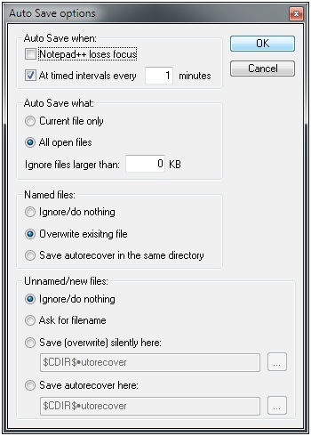
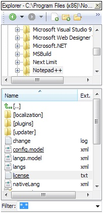
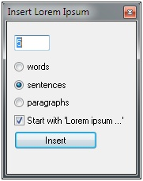

Notepad++ est un éditeur de code source gratuit. On peut installer des plugins sur ce logiciel afin de le compléter et rendre l'usage de coder plus intéressant. Les plugins s'installent en interne. Pour ce faire, lancez Notepad++ puis allez dans "Compléments" > "Plugin manager" > "Show plugin manager" > cochez le ou les plugins désiré(s) et cliquez sur "Install". Le logiciel va vous demander de redémarrer pour prendre en compte les nouveaux paramètres, cliquez sur "Oui".

## Autosave

Oubliez d'enregistrer vos fichiers, autosave est un gestionnaire de sauvegarde qui permet de sauvegarder toutes les tant de minutes vos fichiers.
Allez dans "Compléments" > "Autosave" > cochez "At timed intervaks every" et tapez le nombre de minutes que vous désirez puis validez.

## Explorer

Un explorateur de fichiers, rien de plus simple. Cliquez sur l'icone représentant une loupe sur un dossier ou bien par le raccourci clavier Ctrl+Alt+Shift+E.

## InsertLoremIpsum

Vous avez toujours eu un faible pour le latin mais n'étant pas une flèche dans cette langue vous préférez vous servir d'un générateur de lorem ipsum.  
Allez dans "Compléments" >  "InsertLoremIpsum" > "View Insert Dialog". La boite de dialogue apparait sur la droite. Vous pouvez sélectionner le nombre de mots, de phrases ou de paragraphes puis cliquez sur "Insert".

## TextFX

De base, avec Notepad++, lorsque que vous faites Ctrl + Space, vous avez la liste des balises disponibles en sélection.  
TextFX a une option qui permet de faire de l'autocomplétion sur du code html.  
Allez dans "TextFx" > "TextFX Settings" cliquez sur "+Autoclose XHTML/XML <Tag>".

## NppExport

Permet d'exporter le code avec la colorisation syntaxique vers du format RTF (idéal pour Word).  
Allez dans "Compléments" >  "NppExport" > "Copy RTF to Clipboard" pour copier coller sinon "Export to RTF" pour générer le fichier au format Wordpad.

## NppDocShare

2 machines connectées sur un réseau local travaillant en même temps sur Notepad++ (comme sur Google Doc), c'est possible.  
Allez dans "Complément" > "NppDocShare" et cliquez sur "Serve" pour devenir hôte et "Connect" si vous êtes le client. Malheureusement, à l'heure actuelle, le plugin ne supporte pas plus d'une machine cliente :(