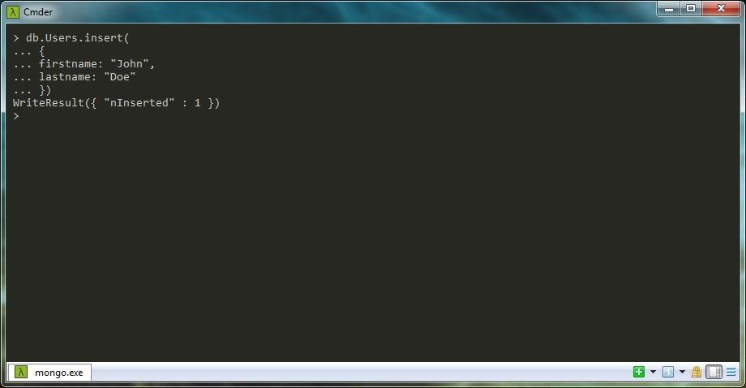
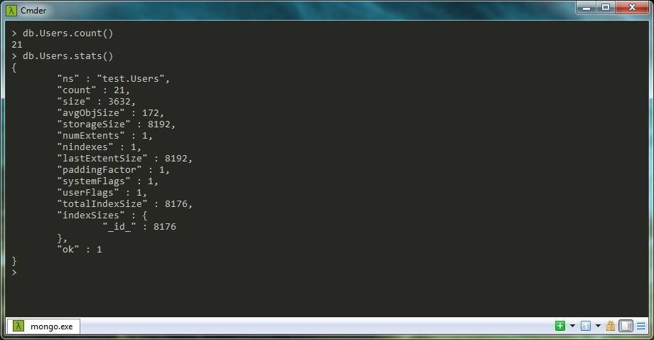
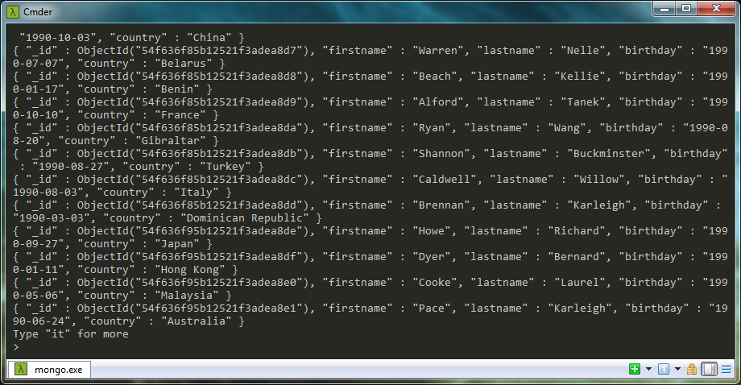

MongoDB est un base de données orientée documents. Il appartient à la catégorie des SGBD qualifiés NoSQL (Not only SQL). Autrement dit, MongoDB n'est pas un SGBDR (Sytème de Gestion de Base de Données Relationnelles) que sont MySQL, Oracle, Postgres, etc... Les documents sont stockés au format BSON (JSON binaire). Quant aux reqûetes, elles sont effectuées en Javascript.


## Vocabulaire

Avant de commencer, il faut savoir que MongoDB n'utilise pas le mème vocabulaire que les SGBD traditionnels.
Ci-dessous, un tableau pour vous y retrouver plus facilement.

| SGBD  | MongoDB |
| - | - |
| table 			 | collection      |
| colonne ("column") | champ ("field") |
| ligne ("row") 	 | document 	   |
| "offset" 			 | "skip" 		   |

Ce dernier terme est souvent utilisé pour les paginations.

## Installation

Rendez-vous sur le site officiel de MongoDB et installez la version adéquate pour votre système d'exploitation : http://www.mongodb.org/downloads  
Puis, suivez les instructions d'installation : http://docs.mongodb.org/manual/installation  
Une fois installé correctement, allez dans la ligne de console et tapez la commande suivante :  
`mongo`

Pour afficher les bases de données disponibles :  
`show dbs`

## Création de la base de données

On créé	notre BDD de test "Test" ~~car c'est original~~ :  
`use Test`  
Cette fonction permet de créer une BDD si elle n'existe pas. Si elle est déja existante, de se placer à l'intérieur.

A noter : vous pouvez vous connecter directement sur votre BDD lors de la connexion à Mongo  :  
`mongo test`

## Insertion des données

On établit notre première collection "Users" lors de l'insertion des données dans la commande ci-dessous :

```javascript
db.Users.insert(
{
	firstname: "John",
	lastname: "Doe"
})
```
ou :
```javascript
db.Users.save(
{
	firstname: "John",
	lastname: "Doe"
})
```

* `db` : on se place dans la base utilisée Test" (tapez `db` dans votre ligne de console, MongoDB affiche "Test").
* `Users` : le nom de notre future collection.
* `insert` ou `save` : on utilise la fonction d'insertion de données.
* Dans les accolades, on indique le nom du champs suivie de 2 points, puis on indique nos données (double ou simple quote pour une chaine de caractères).



Remarque : lors de l'insertion des données un id est généré automatiquement. Cet id est nommé "_id", de type **ObjectId**. C'est une chaine de caractère en héxadécimal.

On peut lister toutes les collections disponibles dans notre base avec :  
`show collections`

Afin de pouvoir procéder à des tests plus approfondis par la suite, on insère plus de données dans notre collection :

```javascript
db.Users.insert( {firstname: "Valdez", lastname: "Tatiana", birthday: "1990-07-05", country: "Liberia"} );
db.Users.insert( {firstname: "Hayes", lastname: "Willow", birthday: "1990-09-18", country: "Luxembourg"} );
db.Users.insert( {firstname: "Ward", lastname: "Hanae", birthday: "1990-07-30", country: "Egypt"} );
db.Users.insert( {firstname: "Cleveland", lastname: "Jescie", birthday: "1990-05-20", country: "Montenegro"} );
db.Users.insert( {firstname: "Whitfield", lastname: "Britanni", birthday: "1990-10-07", country: "Belgium"} );
db.Users.insert( {firstname: "Howard", lastname: "Cecilia", birthday: "1990-11-19", country: "India"} );
db.Users.insert( {firstname: "Olson", lastname: "Xavier", birthday: "1990-06-21", country: "Venezuela"} );
db.Users.insert( {firstname: "Cardenas", lastname: "Cathleen", birthday: "1990-10-03", country: "China"} );
db.Users.insert( {firstname: "Warren", lastname: "Nelle", birthday: "1990-07-07", country: "Belarus"} );
db.Users.insert( {firstname: "Beach", lastname: "Kellie", birthday: "1990-01-17", country: "Benin"} );
db.Users.insert( {firstname: "Alford", lastname: "Tanek", birthday: "1990-10-10", country: "France"} );
db.Users.insert( {firstname: "Ryan", lastname: "Wang", birthday: "1990-08-20", country: "Gibraltar"} );
db.Users.insert( {firstname: "Shannon", lastname: "Buckminster", birthday: "1990-08-27", country: "Turkey"} );
db.Users.insert( {firstname: "Caldwell", lastname: "Willow", birthday: "1990-08-03", country: "Italy"} );
db.Users.insert( {firstname: "Brennan", lastname: "Karleigh", birthday: "1990-03-03", country: "Dominican Republic"} );
db.Users.insert( {firstname: "Howe", lastname: "Richard", birthday: "1990-09-27", country: "Japan"} );
db.Users.insert( {firstname: "Dyer", lastname: "Bernard", birthday: "1990-01-11", country: "Hong Kong"} );
db.Users.insert( {firstname: "Cooke", lastname: "Laurel", birthday: "1990-05-06", country: "Malaysia"} );
db.Users.insert( {firstname: "Pace", lastname: "Karleigh", birthday: "1990-06-24", country: "Australia"}) ;
db.Users.insert( {firstname: "Price", lastname: "Grady", birthday: "1990-04-18", country: "Belgium"} );
```

Pour connaitre le nombre de documents présents dans la collection "Users" :

```javascript
db.Users.count()
```

Pour plus de détails sur cette collection :

```javascript
db.Users.stats()
```



## Lecture des données

Ci-dessous une liste non exhaustive de commandes.

### Afficher toutes les données

```javascript
db.Users.find()
```

### Données en particulier

```javascript
db.Users.find({country: "Belgium"})
```



### Recherche multiple

"or" :

```javascript
db.Users.find({$or: [ {country: "Belgium"}, {firstname: "Alford"} ]})
```
Retourne toutes les données dont le pays vaut "Belgium" ou bien où le prénom vaut "Alford".

"and" :

```javascript
db.Users.find({$and: [ {country: "Belgium"}, {birthday: "1990-10-07"} ]})
```
Retourne toutes les données dont le pays vaut "Belgium" et où la date de naissance vaut "1990-10-07".

"not" :
```javascript
db.Users.find( { country: { $ne: "Belgium" } } )
```
Retourne toutes les données dont le pays ne vaut pas "Belgium".

"like" :
```javascript
db.Users.find({country: /in/ })
```

Retourne toutes les données dont le pays contient "in".

```javascript
db.Users.find({country: {$regex: /^be/i} })
```

Retourne toutes les données dont le pays commence par "be".

```javascript
db.Users.find({country: {$regex: /ia$/} })
```
Retourne toutes les données dont le pays termine par "ia".

Remarque : MongoDB est sensible à la casse.

### Limitation

Limitation unique (1 seul résultat) avec `findOne()`.

```javascript
db.Users.findOne({_id: ObjectId("54df6bf34403b474fc1df363")})
```
Affiche uniquement les données pour le document dont l'ObjectId vaut "54df6bf34403b474fc1df363".

```javascript
db.Users.findOne({country: "Belgium"})
```
Retourne uniquement le 1er résultat dont le pays vaut "Belgium" dans la liste des documents.

### Limitation définie

```javascript
db.Users.find().limit(3)
```

Affiche uniquement les 3 premiers documents.

### Offset

```javascript
db.Users.find().limit(10).skip(5)
```

Affiche les 10 résultats après les 5 premiers documents.

### Ordre d'affichage

Croissant :

```javascript
db.Users.find().sort({country: 1})
```
Affiche tous les résultats de la collection "Users" en classant les données pas pays en ordre alphabétique croissant.

Décroissant :

```javascript
db.Users.find().sort({country: -1})
```
Affiche tous les résultats de la collection "Users" en classant les données pas pays en ordre alphabétique décroissant.

## Modification des données

On choisit notre document à modifier :

```javascript
db.Users.update({_id: ObjectId("54df6bf54403b474fc1df374")}, { $set: {firstname: "Martine"} })
```

On peut également choisir plusieurs champs :

```javascript
db.Users.update({firstname: "Pace", lastname: "Karleigh"}, {$set: {country: "England"}})
```

## Suppression des données

Un document en particulier :
```javascript
db.Users.remove({_id: ObjectId("54f6342cc6dd3b2aef142568")})
```

Plusieurs documents avec un opérateur logique :
```javascript
db.Users.remove({$or: [ {firstname: "Alford"}, {lastname: "Laurel"} ]})
```

Supprimer toute la collection :
```javascript
db.Users.drop()
```

## Un peu de relationnel

### Relation 0,N ou 1,N

Une relation 1,N est définie par le fait qu'une collection possède une clef étrangère dans un champ qui peut se retrouver dans un ou plusieurs document d'une autre collection.  
Dans l'exemple suivant, on va mettre en relation des **articles** avec une **rubrique**. Un **article** appartient à une et une seul **rubrique**. A l'inverse, une **rubrique** appartient à un ou plusieurs **articles**.

On créé d'abord notre collection **rubrique** :

```javascript
db.rubric.insert( {rubric_name: "MongoDB"} )
db.rubric.insert( {rubric_name: "MySQL"} )
```

L'inseration renvoie l'ObjectId suivant "54c4dfa24b4453f4eb85f70b" pour "MongoDB" et "54c4dfa24b4453f4eb85f70c" pour "MySQL" que l'on va avoir besoin pour l'injecter comme clef étrangère dans la seconde collection **article** :

```javascript
db.article.insert( 
{
    article_title: "Mon premier article sur MongoDB",
    article_content: "Lorem Ipsum 1",
    rubric_id: ObjectId("54c4dfa24b4453f4eb85f70b")
});

db.article.insert( 
{
    article_title: "Mon premier article sur MySQL",
    article_content: "Lorem Ipsum 2",
    rubric_id: ObjectId("54c4dfa24b4453f4eb85f70c")
});
```

Contrairement à un SGBDR qui utilise un système de jointures dans une seule requête, sur MongoDB, il faudra effectuer 2 requetes. Une première pour afficher les infos de la **rubrique** afin de récupérer son ObjectId et une seconde pour afficher les **articles** concernés.

Les informations sur la **rubrique** :

```javascript
db.rubric.findOne({_id: ObjectId("54c4dfa24b4453f4eb85f70b")})
```

Les **articles** de cette utilisateur via son id :

```javascript
db.article.find({rubric_id: ObjectId("54c4dfa24b4453f4eb85f70b")})
```

A noter : en cas de suppression d'une **rubrique**, cela ne supprimera pas le champ "rubric_id" présent dans la collection **article** (pas de "Cascade delete").

### Relation M,N (Many to Many)

Un peu plus complexe, une relation M,N est un cas dans laquel, une collection doit stocker plusieurs clefs étrangères au minium de 2 autres collections.  
Prenons en exemple, un système de messagerie quelconque, composé de 3 collections.

Un **utilisateur** peut converser avec 1 ou plusieurs autre(s) **utilisateur(s)** en créant une **conversation** unique composée d'un ou plusieur(s) **message(s)**.

On commence par la collection la plus simple, celle de l'**utilisateur** :
```javascript
db.user.insert(
{
	name_user: "User1"
})

db.user.insert(
{
	name_user: "User2"
})
```

Cette dernière renvoie les ObjectId : "54cd613880ae1a574dc812d2" et "54cd613880ae1a574dc812d3".

On continue avec la seconde collection concerant la **conversation** entre 2 (ou plus) **utilisateurs** en stockant les ObjectId des **utilisateurs** concernés.

```javascript
db.conversation.insert(
{
	users_id: [
				{user_id: ObjectId("54cd613880ae1a574dc812d2")},
				{user_id: ObjectId("54cd613d80ae1a574dc812d3")}
			  ]
})
```

Et, on fini par la fameuse collection qui va accueillir les 2 clefs étrangères des 2 collections créez ci-dessus. C'est la collection pour stocker les **messages** de l'**utilisateur** dans la **conversation** dédiée.

```javascript
db.message.insert(
{
	content_message: "Mon premier message de User1",
	user_id: ObjectId("54cd613880ae1a574dc812d2"),
	conversation_id: ObjectId("54cd627f80ae1a574dc812d4")
})

db.message.insert(
{
	content_message: "Mon premier message de User2",
	user_id: ObjectId("54cd613d80ae1a574dc812d3"),
	conversation_id: ObjectId("54cd627f80ae1a574dc812d4")
})

db.message.insert(
{
	content_message: "Mon second message de User2",
	user_id: ObjectId("54cd613d80ae1a574dc812d3"),
	conversation_id: ObjectId("54cd627f80ae1a574dc812d4")
})
```

## Exporter

### Mongodump

Avec Mongodump vous pouvez sauvegarder toutes vos bases et collections aux formats BSON et JSON.  
Dans votre console, tapez : `mongodbump`  
Un dossier "dump" sera créé à l'emplacement de votre invité de commandes.  
On veut seulement exporter une base de donnée, "test" : `mongodump --db test` ou `mongodump -d test`  
Ou plus précisement, une collection : `mongodump --db test --collection Users` ou `mongodump -d test -c User`  
Il est également possible d'indiquer le répertoire d'extraction en ajoutant le paramètre `--out` ou `-o`.

### Mongoexport

Contrairement à Mongodump, Mongoexport permet d'exporter une collection à la fois, dans un fichier JSON.
`mongoexport --db test --collection Users --out Users.json`  
Il est possible d'indiquer le répertoire d'extraction en ajoutant le paramètre `--dpath`.  
Pour plus d'options, tapez `mongoexport`.

## Importer

### Mongorestore

Permet de restaurer l'ensemble des fichiers sauvegardés avec Mongodump.

### Mongoimport

Permet d'importer des données d'une collection dans une base de donnée existante ou non : `mongoimport -d test2 -c Users --file Users.json`  
Si vous insérez ou modifier des données sur des documents déja existants dans votre collection, ajoutez le paramètre `--upsert`.  
Pour plus d'options, tapez `mongoimport`.

## Bonus

Afficher vos données au format JSON non formaté :

```javascript
db.Users.find().pretty()
```

## Conclusion

MongoDB est une base de données NoSQL légère, rapide et simple à prendre en main pour vos futures applications. Pour aller ~~beaucoup~~ plus loin sur Mongo, consultez la documentation officielle (voir liens ci-dessous) pour notamment des requêtes plus complexe et sécuriser l'accès à la base de données (en production).

## Sources

* Documentation officielle : http://docs.mongodb.org/manual
* Liste des commandes pour travailler dans les collections : http://docs.mongodb.org/manual/reference/method/js-collection
* Comparaison entre le SQL et MongoDB : http://docs.mongodb.org/manual/reference/sql-comparison
* http://docs.mongodb.org/manual/reference/command
* Robomongo est une interface graphique : http://robomongo.org
* Traducteur de requête SQL vers MongoDB : http://www.querymongo.com