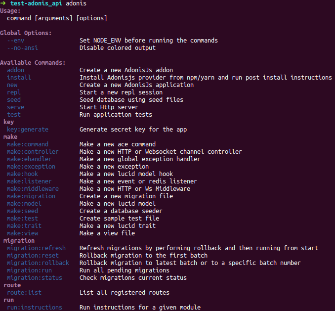
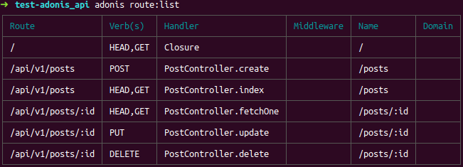
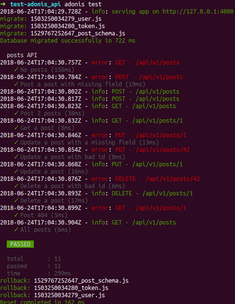

Adonis est un framework Node.js orienté MVC. Contrairement à Express, il n'est pas monolitique. Il offre une solution assez complète allant de l'ORM aux tests unitaires en passant par la gestion des logs et d'autres choses...

Dans ce tutoriel, nous allons créer une API RESTful avec une base de données Postgres (vous pouvez utiliser SQLite, MySQL, MariaDB et d'autres SGBDR SQL avec Adonis).

A noter : ce tutoriel a été rédigé avec Adonis en version 4.1.

## Préparatifs

Dans cette première partie, nous allons installer Adonis et préparer (rapidement) le serveur Postgres.

### Installation d'Adonis

Pour installer Adonis vous aurez besoin d'avoir une version supérieure à égale à Node.js 8.

```bash
npm i -g @adonisjs/cli
```



### Génération du projet

Ensuite, lancez la commande ci-dessous.

```bash
# adonis-api est le nom du projet
$ adonis new adonis-api --api-only
```

Dès que l'installation est terminée, vous pouvez démarrer le serveur.

```bash
cd adonis-api
adonis serve --dev
```

Pour vous connecter à votre application sur [http://localhost:3333](http://localhost:3333) qui renvoit un message en JSON `{"greeting":"Hello world in JSON"}`.

### Configuration de la base de données

```bash
docker run --name adonis-postgres -p 5432:5432 -e POSTGRES_USER=admin -e POSTGRES_PASSWORD=mysecretpassword -e -d postgres
```

Après création du container.

```bash
docker run -it --rm --link adonis-postgres:postgres postgres psql -h postgres -U admin
```

Dans votre SGBDR, créez 2 bases de données. La première pour l'API et la seconde pour faire les tests unitaires.

```sql
CREATE DATABASE adonis_api;
CREATE DATABASE adonis_api_test;
```

Dans le fichier de configuration ".env", modifiez les lignes ci-dessous en fonction de la configuration de votre SGBD (ci-dessous avec la configuration du container Docker).

```bash
DB_CONNECTION=pg
DB_HOST=127.0.0.1
DB_PORT=5432
DB_USER=admin
DB_PASSWORD=mysecretpassword
DB_DATABASE=adonis_api
```

Remarque : si vous utilisez Git, ajoutez le fichier ".env" dans le fichier ".gitignore" (en plus du dossier "node_modules").

## Modèle et migration

Dans cette seconde partie, nous allons générer un modèle et configurer la migration des données. Adonis utilise le générateur de requête Knex.js.

Tout d'abord le modèle que nous générons en ligne de commande.

```bash
adonis make:model Post --migration
```

Afin d'écrire les instructions de migration pour créer ou pour détruire le schéma de la table dans le fichier "database/migrations/\_post_schema.js".

```javascript
//database/migrations/\<timestamp>\_post_schema.js

'use strict'

const Schema = use('Schema')

class PostSchema extends Schema {
  up () {
    this.create('posts', (table) => {
      table.increments()
      table.string('title', 255)
      table.text('content')
      table.timestamps()
    })
  }

  down () {
    this.drop('posts')
  }
}

module.exports = PostSchema
```

La ligne table.increments() correspond au champ "id" incrémenté et la ligne table.timestamps() à 2 champs générés de type "datetime" nommés "created_at" et "updated_at".

Pour communiquer avec le SGBD, il faut installer le module concerné. Avec Postgres.

```bash
npm install pg --save
```

On peut désormais lancer la migration.

```bash
adonis migration:run
```

A la suite de cette commande, vous pouvez vérifier l'état de la table "posts" dans votre SGBD.

```bash
adonis_api=# \d+ posts
                                                           Table "public.posts"
   Column   |           Type           | Collation | Nullable |              Default              | Storage  | Stats target | Description
------------+--------------------------+-----------+----------+-----------------------------------+----------+--------------+-------------
 id         | integer                  |           | not null | nextval('posts_id_seq'::regclass) | plain    |              |
 title      | character varying(255)   |           |          |                                   | extended |              |
 content    | text                     |           |          |                                   | extended |              |
 created_at | timestamp with time zone |           |          |                                   | plain    |              |
 updated_at | timestamp with time zone |           |          |                                   | plain    |              |
Indexes:
    "posts_pkey" PRIMARY KEY, btree (id)
```

Remarque : si vous avez fait une erreur dans l'écriture de votre migration, tapez la commande `adonis migration:reset` pour annuler et revenir à 0.

## Création des routes

Dans cette troisième partie, nous allons créer nos routes. On part sur une base CRUD (Create Read Update Delete) classique.

### Schéma des routes

| Verb | URL | Action | Vérifier ID | Vérifier champs |
| - | - | - | - | - |
| POST | /api/v1/posts | Ajouter une ligne | Non | Oui |
| GET | /api/v1/posts | Lister les lignes | Non | Non |
| GET | /api/v1/posts/:id | Obtenir une ligne | Oui | Non |
| PUT | /api/v1/posts/:id | Modifier une ligne  | Oui | Oui |
| DELETE | /api/v1/posts/:id | Supprimer une ligne | Oui | Non |

Pour les requêtes de type GET (la seconde), PUT et DELETE, nous aurons besoin de récupérer l'id de la ligne concerné. Et verifier les champs des requêtes de type POST et PUT.

### Stockage des messages génériques

On va créer un fichier avec nos messages génériques que l'on affiche en JSON. Cela va nous permettre de ne pas nous répéter lors de la création des tests automatisés dans la prochaine partie. Dans le dossier "app", créez un nouveau dossier "app/helpers" dans lequel vous créez un nouveau fichier "Messages.js".

```javscript
// app/Helpers/Messages.js

module.exports = {
  post: {
    errorNotFound: 'Post not found',
    errorBadRequest: 'Fields error',
    okNothing: 'No posts available',
    okDeleted: 'Post deleted'
  }
}
```

### Création d'un contrôleur

Avec une ligne de commande, on génère notre contrôleur "postController".

```bash
adonis make:controller postController
> Select controller type
‣ For HTTP requests
  For Websocket channel
```

Dans ce contrôleur, on charger le modèle, la database, le fichier contenant les messages génériques et l'outil de log intégré "logger". Chaque fonction représente une route.

```javascript
// app/Controllers/Http/postControllers.js

'use strict'

const Post = use('App/Models/Post')
const Database = use('Database')
const Messages = use('App/Helpers/Message')
const Logger = use('Logger')

class PostController {
  // Ajouter une ligne
  async create ({ request, response }) {
  }

  // Lister les lignes
  async index ({ request, response }) {
  }

  // Obtenir une ligne
  async fetchOne ({ params, request, response }) {
  }

  // Modifier une ligne
  async update ({ params, request, response }) {
  }

  // Supprimer une ligne
  async delete ({ params, request, response }) {
  }
}

module.exports = postController
```

Dans le fichier `start/routes.js`, on déclare nos routes groupées avec le préfixe "api/v1".

```javascript
// start/routes.js

'use strict'

const Route = use('Route')

Route.get('/', ({ request }) => {
  return { greeting: 'Hello world in JSON' }
})

Route.group(() => {
  Route.post('posts', 'PostController.create')
  Route.get('posts', 'PostController.index')
  Route.get('posts/:id', 'PostController.fetchOne')
  Route.put('posts/:id', 'PostController.update')
  Route.delete('posts/:id', 'PostController.delete')
}).prefix('api/v1')
```

Chaque route à son contrôleur et sa fonction attribuée séparée par un point.



### Ajouter une ligne

Pour ajouter une ligne, on doit récupérer son contenu.

```javscript
// app/Controllers/Http/postControllers.js (extrait)

// Ajouter une ligne
async create ({ request, response }) {
  const body = request.only(['title', 'content'])

  if (body.title && body.content) {
    const newPost = new Post()
    newPost.title = body.title
    newPost.content = body.content
    await newPost.save()

    Logger.info('%s - %s', request.method(), request.url())
    return response.status(201).json(newPost)
  }

  Logger.error('%s - %s', request.method(), request.url())
  return response.status(400).json({ message: Messages.post.errorBadRequest })
}
```

On récupère les valeurs rentrées par l'utilisateur dans la constante `body`. Puis on vérifie que les champs "title" et "content" ont été saisi. Puis on instancie une autre constante en se basant sur le schéma d'un nouveau "Post". Et pour finir, on enregistre dans la base et on retourne le résultat avec la valeur de la nouvelle ligne.

### Lister les lignes

On veut retouner la liste des lignes présentes dans la table.

```javascript
// app/Controllers/Http/postControllers.js (extrait)

// Lister les lignes
async index ({ request, response }) {
  const posts = await Database
  .table('posts')
  .orderBy('id', 'desc')

  if (Object.keys(posts).length === 0) {
    Logger.error('%s - %s', request.method(), request.url())
    return response.json({ message: Messages.post.okNothing })
  }

  Logger.info('%s - %s', request.method(), request.url())
  return posts
}
```

Pour cela, on utilise la fonction `all()`.

### Afficher une ligne

Pour afficher une ligne, on doit récupérer son id en paramêtre.

```javascript
// app/Controllers/Http/postControllers.js (extrait)

/* Obtenir une ligne */
async fetchOne ({ params, request, response }) {
  const post = await Post.find(params.id)

  if (!post) {
    Logger.error('%s - %s', request.method(), request.url())
    return response.status(404).json({ message: Messages.post.errorNotFound })
  }

  Logger.info('%s - %s', request.method(), request.url())
  return post
}
```

La fonction `find` retourne toujours une seule ligne.

### Modifier une ligne

Pour modifier une ligne, on doit récupérer son contenu dans le body et son id en paramêtre.

```javascript
// app/Controllers/Http/postControllers.js (extrait)

/* Modifier une ligne */
async update ({ params, request, response }) {
  const body = request.only(['title', 'content'])
  const post = await Post.find(params.id)

  if (!post) {
    Logger.error('%s - %s', request.method(), request.url())
    return response.status(404).json({ message: Messages.post.errorNotFound })
  }

  if (body.title && body.content) {
    post.title = body.title
    post.content = body.content
    await post.save()

    Logger.info('%s - %s', request.method(), request.url())
    return post
  }

  Logger.error('%s - %s', request.method(), request.url())
  return response.status(400).json({ message: Messages.post.errorBadRequest })
}
```

### Supprimer une ligne

Pour supprimer une ligne, on doit récupérer son id.

```javascript
// app/Controllers/Http/postControllers.js (extrait)

/* Supprimer une ligne */
async delete ({ params, request, response }) {
  const post = await Post.find(params.id)

  if (!post) {
    Logger.error('%s - %s', request.method(), request.url())
    return response.status(404).json({ message: Messages.post.errorNotFound })
  }

  await post.delete()

  Logger.info('%s - %s', request.method(), request.url())
  return response.json({ message: Messages.post.okDeleted })
}
```

On supprime le post concerné (s'il existe) et on affiche un message personnalisé.

### Activation du CORS

L'activation du CORS permet d'écouter l'API sur un autre port ou domaine que celui du serveur (3333 par défaut) depuis un navigateur Web.

Ouvrez le fichier "config/cors.js" et modifiez les 3 lignes ci-dessous.

```javascript

origin: '*',
methods: ['GET', 'PUT', 'POST', 'DELETE'],
headers: true,
```

## Tests automatisés

Dans cette troisième et dernière partie, nous allons automatiser nos tests. Il existe 2 manières de tester son API. La première, de façon manuelle avec un logiciel comme Postman. Quant à la seconde, elle consiste à écrire soit même les tests qui se réveleront indispensables dans le cas d'un développement en intégration continue, les tests automatisés.

### Installation du package Vow

Tapez la commande ci-dessous.

```bash
adonis install @adonisjs/vow
create: vowfile.js
create: test/unit/example.spec.js
create: .env.testing
```

Vous pouvez supprimez le fichier "test/unit/example.spec.js".

Dans le fichier "start/app.js", ajoutez la dépendance de Vow.

```javascript
// start/app.js (extrait)

const aceProviders = [
  '@adonisjs/lucid/providers/MigrationsProvider',
  '@adonisjs/vow/providers/VowProvider'
]
```

On peut désormais générér le fichier de test ("test/unit/post.spec.js") avec la commande ci-dessous.

```bash
adonis make:test post
```

### Isolation des tests

Avant de continuer, on va demander à Adonis de travailler sur une autre base. Cette dernière sera utilisée uniquement dans le cadre des tests. Par défaut, elle sera tout le temps vide sauf au moment des tests. On appel cette dernière dans le fichier ".env.testing" (ci-dessous avec la configuration du container Docker).

```bash
HOST=127.0.0.1
PORT=4000
NODE_ENV=testing
DB_CONNECTION=pg
DB_HOST=127.0.0.1
DB_PORT=5432
DB_USER=admin
DB_PASSWORD=mysecretpassword
DB_DATABASE=adonis_api_test
```

Remarque : si vous utilisez Git, ajoutez le fichier ".env.testing" dans le fichier ".gitignore".

### Configuration de Vow

Il faut indiquer que l'on souhaite faire la migration des données dans le fichier "vowfile.js". Décommentez les lignes 14, 37 et 60 pour exécuter la migration au début des tests et réinitialiser la migration en fin des tests ("up" et "rollback"). De cette façon, on a toujours une base de données vide en début et à la fin des tests.

### Ecriture des tests

On va donc travailler dans le fichier précédement généré "test/unit/post.spec.js".

```javascript
// test/unit/post.spec.js
'use strict'

const { test, trait } = use('Test/Suite')('posts API')
const API_URL = 'api/v1/posts'
const Messages = use('App/Helpers/Messages')

trait('Test/ApiClient')
```

#### Vérification d'un message d'erreur

```javascript
// test/unit/post.spec.js (extrait)

test('No posts', async ({ client }) => {
  const response = await client
  .get(API_URL)
  .end()

  response.assertHeader('content-type', 'application/json; charset=utf-8')
  response.assertStatus(200)
  response.assertJSONSubset({
    message: Messages.post.okNothing
  })
})
```

- URL concernée : api/v1/posts (GET) ;
- Code HTTP attendu : 200 ;
- Message attendu : oui (object).

#### Ajout d'une ligne incomplète

```javascript
// test/unit/post.spec.js (extrait)

test('Post a post with missing field', async ({ client }) => {
  const a = await client
  .post(API_URL)
  .send({
    title: 'test'
  })
  .end()

  a.assertHeader('content-type', 'application/json; charset=utf-8')
  a.assertStatus(400)
  a.assertJSONSubset({
    message: Messages.post.errorBadRequest
  })
})
```

- URL concernée : api/v1/posts (POST) ;
- Code HTTP attendu : 400 ;
- Message attendu : oui (object).

#### Ajout de 2 lignes

```javascript
// test/unit/post.spec.js (extrait)

test('Post 2 posts', async ({ client }) => {
  const a = await client
  .post(API_URL)
  .send({
    title: 'My First Post',
    content: 'Lorem Ipsum'
  }).end()

  a.assertHeader('content-type', 'application/json; charset=utf-8')
  a.assertStatus(201)
  a.assertJSONSubset({
    id: 1,
    title: 'My First Post',
    content: 'Lorem Ipsum'
  })

  const b = await client
  .post(API_URL)
  .send({
    id: 2,
    title: 'My Second Post',
    content: 'Rosa Rosae'
  }).end()

  b.assertHeader('content-type', 'application/json; charset=utf-8')
  b.assertStatus(201)
  b.assertJSONSubset({
    title: 'My Second Post',
    content: 'Rosa Rosae'
  })

  const response = await client
  .get(API_URL)
  .end()

  response.assertHeader('content-type', 'application/json; charset=utf-8')
  response.assertStatus(200)
  response.assertJSONSubset([{
    id: 1,
    title: 'My First Post',
    content: 'Lorem Ipsum'
  },
  {
    id: 2,
    title: 'My Second Post',
    content: 'Rosa Rosae'
  }])
})
```

Ajout de 2 lignes :

- URL concernée : api/v1/posts (POST) ;
- Code HTTP attendu : 201 ;
- Message attendu : oui.

Vérification de l'ajout

- URL concernée : api/v1/posts (GET) ;
- Code HTTP attendu : 200 ;
- Message attendu : oui (array object).

#### Vérification de l'existence d'un post

```javascript
// test/unit/post.spec.js (extrait)

test('Get a post', async ({ client }) => {
  const response = await client
  .get(`${API_URL}/1`)
  .end()

  response.assertHeader('content-type', 'application/json; charset=utf-8')
  response.assertStatus(200)
  response.assertJSONSubset({
    title: 'My First Post',
    content: 'Lorem Ipsum'
  })
})
```

- URL concernée : api/v1/posts/1 (GET) ;
- Code HTTP attendu : 200 ;
- Message attendu : Oui (object).

#### Modification d'un post avec un champ manquant

```javascript
// test/unit/post.spec.js (extrait)

test('Update a post with a missing field', async ({ client }) => {
  const response = await client
  .put(`${API_URL}/1`)
  .field('title', 'test2')
  .end()

  response.assertHeader('content-type', 'application/json; charset=utf-8')
  response.assertStatus(400)
  response.assertJSONSubset({
    message: Messages.post.errorBadRequest
  })
})
```

- URL concernée : api/v1/posts/1 (PUT) ;
- Code HTTP attendu : 400 ;
- Message attendu : Oui (object).

#### Modification d'un post avec un mauvais id

```javascript
// test/unit/post.spec.js (extrait)

test('Update a post with bad id', async ({ client }) => {
  const response = await client
  .put(`${API_URL}/42`)
  .field('title', 'test2')
  .field('content', 'adonis')
  .end()

  response.assertHeader('content-type', 'application/json; charset=utf-8')
  response.assertStatus(404)
  response.assertJSONSubset({
    message: Messages.post.errorNotFound
  })
})
```

- URL concernée : api/v1/posts/42 (PUT) ;
- Code HTTP attendu : 404 ;
- Message attendu : Oui (object).

#### Modification d'un post

```javascript
// test/unit/post.spec.js (extrait)

test('Update a post', async ({ client }) => {
  const response = await client
  .put(`${API_URL}/1`)
  .field('title', 'My First Post')
  .field('content', 'Updated')
  .end()

  response.assertHeader('content-type', 'application/json; charset=utf-8')
  response.assertStatus(200)
  response.assertJSONSubset({
    title: 'My First Post',
    content: 'Updated'
  })
})
```

- URL concernée : api/v1/posts/1 (PUT) ;
- Code HTTP attendu : 200 ;
- Message attendu : Oui (object).

#### Suppression d'un post avec un mauvais id

```javascript
// test/unit/post.spec.js (extrait)

test('Delete a post with bad id', async ({ client }) => {
  const response = await client
  .delete(`${API_URL}/42`)
  .end()

  response.assertHeader('content-type', 'application/json; charset=utf-8')
  response.assertStatus(404)
  response.assertJSONSubset({
    message: Messages.post.errorNotFound
  })
})
```

- URL concernée : api/v1/posts/42 (DELETE) ;
- Code HTTP attendu : 404 ;
- Message attendu : Oui (object).

#### Suppression d'un post

```javascript
// test/unit/post.spec.js (extrait)

test('Delete a post', async ({ client }) => {
  const response = await client
  .delete(`${API_URL}/1`)
  .end()

  response.assertHeader('content-type', 'application/json; charset=utf-8')
  response.assertStatus(200)
  response.assertJSONSubset({
    message: Messages.post.okDeleted
  })
})
```

- URL concernée : api/v1/posts/1 (DELETE) ;
- Code HTTP attendu : 200 ;
- Message attendu : Oui (object).

#### Vérification de l'existence d'une 404

```javascript
// test/unit/post.spec.js (extrait)

test('Post 404', async ({ client }) => {
  const response = await client
  .get(`${API_URL}/1`)
  .end()

  response.assertHeader('content-type', 'application/json; charset=utf-8')
  response.assertStatus(404)
  response.assertJSONSubset({
    message: Messages.post.errorNotFound
  })
})
```

- URL concernée : api/v1/posts/1 (GET) ;
- Code HTTP attendu : 404 ;
- Message attendu : Oui (object).

#### Vérification de la ligne restante

```javascript
// test/unit/post.spec.js (extrait)

test('All posts', async ({ client }) => {
  const response = await client
  .get(API_URL)
  .end()

  response.assertHeader('content-type', 'application/json; charset=utf-8')
  response.assertStatus(200)
  response.assertJSONSubset([{
    title: 'My Second Post',
    content: 'Rosa Rosae'
  }])
})
```

- URL concernée : api/v1/posts (GET) ;
- Code HTTP attendu : 200 ;
- Message attendu : Oui (object).

Lancez les tests avec la commande `adonis test`.



Remarque : les tests étant exécutés sur un autre port (4000 par défaut), il n'est pas nécessaire de faire tourner le serveur de l'API (3333 par défaut).

## Conclusion

La mise en place d'une API RESTful avec Adonis se révèle assez rapide en gagnant du temps avec la migration. Le seul bémol à l'heure de l'écriture de ce tutoriel est l'absence d'un watcher sur les tests unitaires contrairement à Jest. Un point qui n'a pas été abordé ici, est l'authentification et d'autre choses à voir sur la documentation officielle.

### Sources

- Site officiel d'AdonisJS : [https://www.adonisjs.com](https://www.adonisjs.com)
- DockerHub Postgres : [https://hub.docker.com/_/postgres](https://hub.docker.com/_/postgres)
- Site officiel de Knex : [https://knexjs.org](https://knexjs.org)
