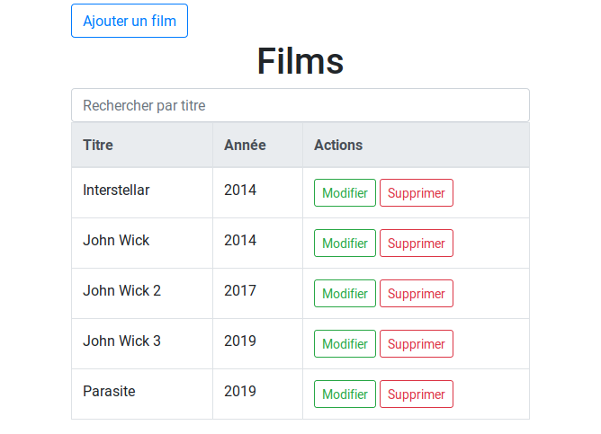
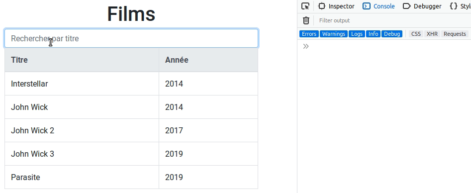
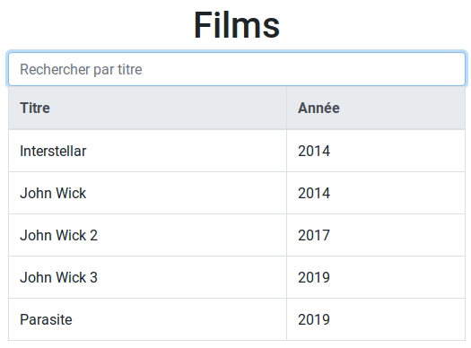
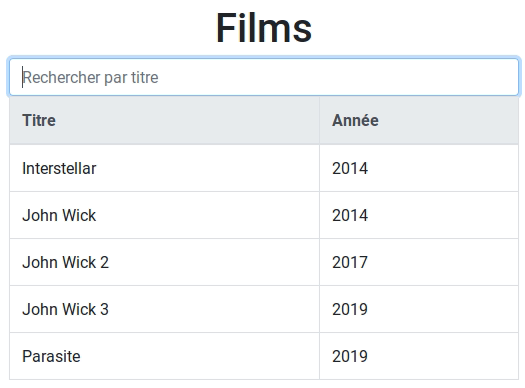
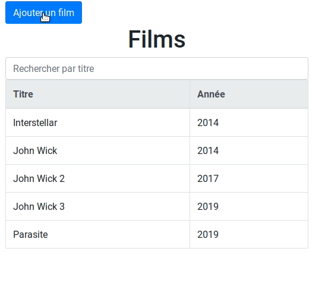
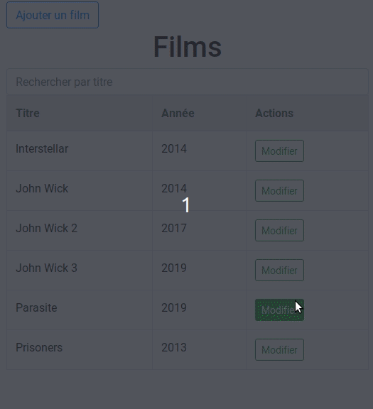
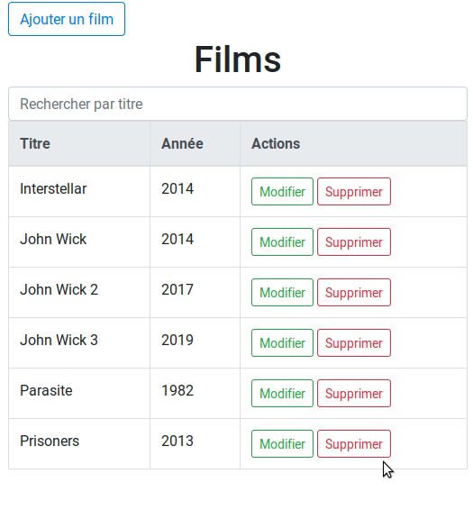

Dans ce tutoriel nous allons voir comment mettre en place une petite application CRUD à l'aide de JavaScript. Dans un premier temps, nous verrons comment récupérer les données et les afficher. Puis dans un second temps, nous mettrons en place un formulaire pour ajouter, modifier et supprimer des données.



## Création des fichiers

Dans un nouveau dossier, créez les 3 fichiers ci-dessous :

- **index.html** ;
- **movies.js** ;
- **app.js**.

### Création de la page HTML

Dans le fichier **index.html**, ajoutez le contenu HTML ci-dessous.

```html
<!doctype html>
  <html lang="fr">
    <meta charset="UTF-8" />
    <title>Films</title>
    <link rel="stylesheet" href="https://stackpath.bootstrapcdn.com/bootstrap/4.3.1/css/bootstrap.min.css">
  </head>
  <body>
    <section class="container mt-1">
      <div id="content">
        <h1 class="text-center">Films</h1>
        <table class="table table-bordered">
          <thead class="thead-light">
            <tr>
              <th scope="col">Titre</th>
              <th scope="col">Année</th>
            </tr>
          </thead>
          <tbody>
          </tbody>
        </table>
      </div>
    </section>
  </body>
  <script type="module" src="app.js"></script>

</html>
```

Le reste du tableau HTML sera fourni par le script en JavaScript.

### Préparation du fichier de données

Dans le fichier **movies.js**.

```javascript
export const movies =
  [
    {
      title: "Interstellar",
      year: 2014
    },
    {
      title: "John Wick",
      year: 2014
    },
    {
      title: "John Wick 2",
      year: 2017
    },
    {
      title: "John Wick 3",
      year: 2019
    },
    {
      title: "Parasite",
      year: 2019
    }
  ]
```

On exporte les données contenues dans le tableau `movies`. Chaque ligne comporte un titre (**title**) de type **String** (chaine de caractères) et une année (**year**) de type **Number** (numéro).

Libre à vous d'ajouter plus de données.

### Création du fichier app.js

Dans le fichier **app.js**, on importe les données.

```javascript
import { movies } from "./movies.js"

console.table(movies)
```

Ouvrez le fichier **index.html** dans votre navigateur préféré puis la console intégrée.

Remarque : vous aurez une erreur sur Chrome concernant l'accès au fichier de données. `Access to script at 'file:///***/app.js' from origin 'null' has been blocked by CORS policy: The response is invalid.` Une solution est d'avoir un hébergeur en local sur sa machine, une autre est d'appeler la liste des données directement dans le fichier **app.js**.

## Afficher les données dans le tableau HTML

Dans le fichier **app.js**, on créé une nouvelle fonction `fetchAllMovies()` qui va nous permettre d'afficher la liste des films à afficher en HTML.

```javascript
function fetchAllMovies(movies) {
  // Récupération de l'élement
  const elApp = document.getElementsByTagName("tbody")[0]
  elApp.innerHTML = ""

  let data = ""
  // Récupération des données
  movies.forEach(m => {
    data += `<tr>
      <td>${m.title}</td>
      <td>${m.year}</td>
    </tr>`
  })

  // Affichage des éléments dans le HTML
  elApp.innerHTML += data
}

fetchAllMovies(movies)
```

Dans un premier temps, on récupère l'élément à remplir. Ici c'est le parent `<tbody>`. Puis dans une boucle `forEach`, on stocke dans la variable `data` le HTML concaténé à l'aide du "template litterals". Et on fini par afficher ces données dans notre élément HTML via `ìnnerHTML`.

## Rechercher par titre de films

Dans le fichier **index.html**, ajoutez une barre de recherche avant le tableau.

```html
<input type="search" class="form-control" placeholder="Rechercher par titre">
```

Dans le fichier **app.js**, on ajoute un `eventListener` lors de la saisie de texte dans ce champs de recherche.

```javascript
document.querySelectorAll("input[type=search]")[0].addEventListener("input", search)
```

Pour ce faire, on créé une nouvelle fonction appelée en second paramètre `search()`.

```javascript
function search() {
  console.log(this.value)
}
```

Dans la console de votre navigateur web, on voit que les données saisies sont bien récupérées.



```javascript
function search() {
  const filteredData = movies.filter(movie => movie.title.toLowerCase().includes(this.value.toLowerCase()))
  fetchAllMovies(filteredData)
}
```

Pour trouver une ou plusieurs lignes, on utilise la fonction `filter` qui permet de rechercher des élements dans un tableau. De plus, on utilise la fonction `toLowerCase` pour initialiser le type de saisie de l'utilisateur. Jamais 2 sans 3, on utilise également la fonction `includes` qui permet de rechercher des caractères dans une chaine de caractères en retournant un booléen.



On en profite également pour afficher un message d'information lorsque aucune ligne n'est trouvée dans la fonction `fetchAllMovies`.

```javascript
if (data.length > 0) {
  // Affichage des données dans le tableau
  elApp.innerHTML += data
} else {
  // Aucune donnée
  elApp.innerHTML += "<p>Aucune ligne trouvée</p>"
}
```



## Plus de CRUD

Jusqu'à présent, on a surtout affiché des données. Dans cette partie, nous allons mettre en place un formulaire afin d'ajouter ou modifier des données. Et nous ajouterons la possibilité de supprimer ces données.

### Préparation du formulaire

On ajouter un bouton et notre formulaire avant la barre de recherche.

```html
<button class="btn btn-outline-primary" id="form-add">Ajouter un film</button>
<form action="javascript:void(0);" id="form" class="mt-4">
  <div class="form-group">
    <label for="title">Titre</label>
    <input type="text" name="title" id="title" class="form-control" required>
  </div>
  <div class="form-group">
    <label for="year">Année</label>
    <input type="number" name="year" id="year" class="form-control" required>
  </div>
  <input type="hidden" id="hidden">
  <button class="btn btn-xs btn-primary" id="form-save">Enregistrer</button>
  <button class="btn btn-xs" id="form-cancel">Annuler</button>
</form>
```

Par défaut, on cache ce formulaire en JavaScript.

```javascript
const elForm = document.getElementById("form")
elForm.style.display = "none"
const elContent = document.getElementById("content")
```

### Afficher le formulaire

On ajoute un `eventListerner` au clic sur le bouton d'ajout.

```javascript
document.getElementById("form-add").addEventListener("click", function () {
  displayForm()
})
```

Cela appel la fonction `displayForm` pour afficher le formulaire et masquer le reste du contenu.

```javascript
function displayForm() {
  elForm.style.display = "block"
  elContent.style.display = "none"
}
```

### Ajouter une ligne

On ajoute un `eventListerner` au clic sur le bouton d'enregistrement du formulaire.

```javascript
document.getElementById("form-save").addEventListener("click", function () {
  // Récupération des champs
  const title = document.getElementById("title").value
  const year = document.getElementById("year").value

  if (title && year) {
    // Nouvelle ligne
    const movie = { title: title, year: year }

    // Ajout de la nouvelle ligne
    movies.push(movie)
  
    // Affichage du nouveau tableau
    return fetchAllMovies(movies)
  }
})
```

On récupère les 2 variables de notre formulaire. Si elles sont bien saisies, on ajoute la nouvelle ligne dans le tableau de données via la fonction `push`. Puis on retourne le nouveau tableau via la fonction `fetchAllMovies`.

L'ajout fonctionne sauf que le tableau n'est pas affiché et les données saisies restent dans le formulaire.

Pour remédier à cela, on créé une nouvelle fonction `hideForm`.

```javascript
function hideForm() {
  elForm.style.display = "none"
  elContent.style.display = "block"

  document.getElementById("title").value = ""
  document.getElementById("year").value = ""
  document.getElementById("hidden").value = ""
}
```

Appellez cette fonction avant le `return` avec `hideForm()` dans le  dernier `addEventListener` créé .

On fait pareil pour le bouton d'annulation.

```javascript
document.getElementById("form-cancel").addEventListener("click", function () {
  hideForm()
})
```



### Modifier une ligne

Dans le tableau HTML, ajoutez une nouvelle colonne.

```html
<th scope="col">Actions</th>
```

Puis dans le fichier **app.js**, dans la fonction `fetchMovies`, modifiez la boucle pour afficher un nouveau bouton.

```javascript
movies.forEach((m, index) => {
  data += `<tr>
    <td>${m.title}</td>
    <td>${m.year}</td>
    <td>
      <button class="edit btn btn-sm btn-outline-success" value="${index}">Modifier</button>
    </td>
  </tr>`
})
```

Désormais, on récupère la valeur de l'index appelé en second paramètre de la boucle `forEach`. Toujours dans la fonction `fetchMovies`, on ajoute un `eventListerner` sur chaque bouton de modification.

```javascript
elApp.innerHTML += data

// Chaque bouton "Editer"
document.querySelectorAll("button.edit").forEach(b => {
  b.addEventListener("click", function () {
    return editMovie(this.value)
  })
})
```

Puis on créé une nouvelle fonction `editMovie` avec en paramètre l'index de la ligne.

```javascript
function editMovie(index) {
  // Récupération de la ligne via son index
  const movie = movies.find((m, i) => {
    return i == index
  })

  // Alimentation des champs
  document.getElementById("title").value = movie.title
  document.getElementById("year").value = movie.year
  document.getElementById("hidden").value = index

  displayForm()
}
```

L'index nous permet de retourner la ligne du tableau concernée via `find` afin d'alimenter les données du formulaire et l'afficher.

A ce stade la ligne concernée ne sera pas mise à jour mais ajoutée. Pour ce faire, modifier la ligne ci-dessous.

```javascript
movies.push(movie)
```

En mettant en place une condition.

```javascript
if (document.getElementById("hidden").value.length > 0) {
  movies.splice(document.getElementById("hidden").value, 1, movie)
} else {
  movies.push(movie)
}
```

Dans cette condition, on vérifie si l'utilisateur fait une modification (on utilise la fonction `splice`) ou un ajout de données (fonction `push`).



### Supprimer une ligne

Comme pour la modification, ajoutez un bouton dans la colonne "Actions".

```html
<td>
  <button class="edit btn btn-sm btn-outline-success" value="${index}">Modifier</button>
  <button class="delete btn btn-sm btn-outline-danger" value="${index}">Supprimer</button>
</td>
```

Puis un `eventListener` sur chaque bouton de suppression.

```javascript
// Chaque bouton "Supprimer"
document.querySelectorAll("button.delete").forEach(b => {
  b.addEventListener("click", function () {
    return deleteMovie(this.value)
  })
})
```

Créez une nouvelle fonction `deleteMovie`.

```javascript
function deleteMovie(index) {
  if (confirm("Confirmez-vous la suppression de ce film ?")) {
    movies.splice(index, 1)
    fetchAllMovies(movies)
  }
}
```

Dans une boite de confirmation, on affiche un message de confirmation. Si l'utilisateur valide, la ligne concernée est supprimée via la fonction `splice` et le nouveau tableau de données est affiché.



## Conclusion

Avec des fonctions natives et quelques `eventListener` on arrive rapidement à mettre en place une petite application CRUD. Cela étant, il est conseillé de s'orienter vers des framework permettant de maintenir des projet moyen / long terme tels que VueJS, React, Angular, etc...
