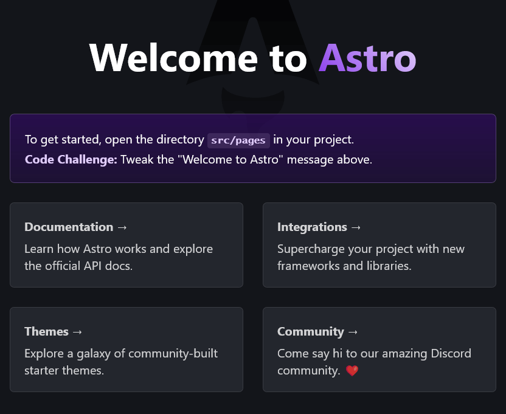
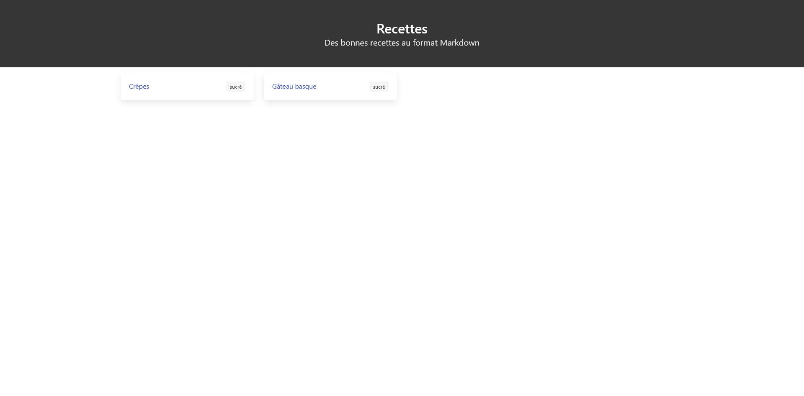
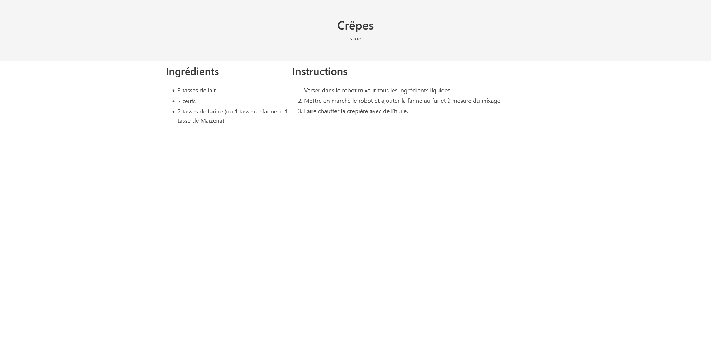
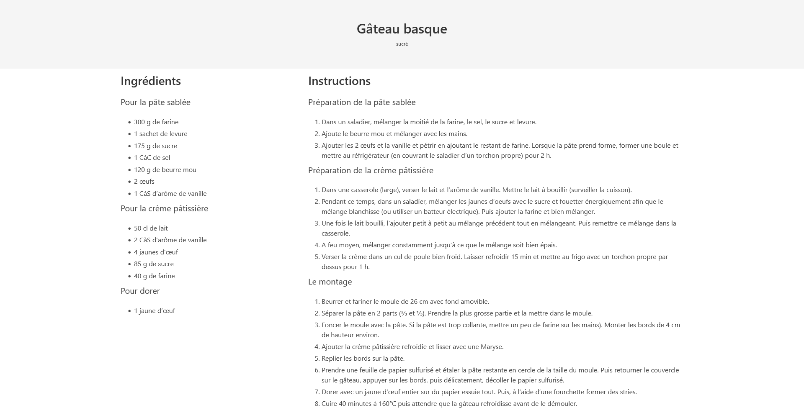
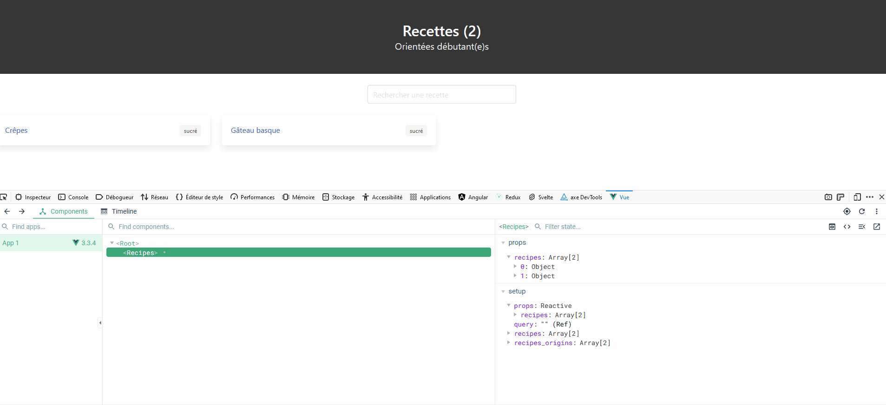

## Introduction

> AstroJS c'est quoi ?


Astro est un framework conçu en Javascript et Typescript pour créer des sites web statiques ou en SSR avec la possibilité de créer des composants à partir d'autres frameworks tels que React, VueJS, Svelte mais aussi AlpineJS, Lit, Preact et SolidJS. Il permet de créer des applications web légères grâce à son système d'hydratation nommé "Astro Island". En effet, chaque partie d'une page Web (header, sidebar, contenu principal, footer) n'ayant pas besoin d'utiliser de JavaScript, si un bloc nécessite une interaction avec JavaScript, une directive d'Astro est disponible pour permettre au client de charger le JS dans le composant dédié.

NB : cette directive n'est disponible que pour les frameworks cités précédement, JS étant désactivé par défaut.

## Objectifs

Dans un premier temps, nous allons mettre en place un site de recettes de cuisine. Pour ce faire, nous allons utiliser le "Content Collection" introduit dans la version 2 d'Astro. Quant aux recettes, elles seront rédigées dans des fichiers au format Markdown. Chacune comporte le schéma ci-dessous :

|Nom | Decription | Type |
|-|-|-|
| `title` | Le titre | string |
| `type` | Le type ("sucré" ou "salé") | string |
| `ingredients` | La liste des ingrédients | tableau de string |
| `instructions` | La liste des instructions | tableau de string |

Pour les listes "ingredients" et "instructions", il y aura une sous liste.

Puis dans un second temps, nous rajouterons un nouvelle fonctionnalité pour rechercher ces recettes par titre avec le framework Vue.

## Installation

Avant de commencer, vérifiez que NodeJS (> 14) et NPM sont bien installés sur votre machine `node -v && npm -v` afin d'installer Astro avec la commande ci-dessous (version 2.3.2 utilisée lors de la rédaction de ce tutoriel).

```bash
npm create astro@latest
```

Puis suivez les indications (ci-dessous avec Astro 2.10.9).

```bash
 astro   v2.10.9 Launch sequence initiated.

   dir   Where should we create your new project?
         ./astro-recipes

  tmpl   How would you like to start your new project?
         Include sample files
      ✔  Template copied

  deps   Install dependencies?
         Yes
      ✔  Dependencies installed

    ts   Do you plan to write TypeScript?
         Yes

   use   How strict should TypeScript be?
         Strict
      ✔  TypeScript customized

   git   Initialize a new git repository?
         No
      ◼  Sounds good! You can always run git init manually.

  next   Liftoff confirmed. Explore your project!

         Enter your project directory using cd ./astro-recipes
         Run npm run dev to start the dev server. CTRL+C to stop.
         Add frameworks like react or tailwind using astro add.
```

Remarque : si vous utilisez l'IDE VSCode, il est recommandé d'utiliser l'extension Astro.

Lancez le serveur de développement avec la commande `npm run dev`. Vous devriez avoir l'écran ci-dessous sur le port 3000 de votre localhost (par défaut).



Puis installez le framework CSS Bulma `npm install bulma` et importez-le dans le header du fichier "src/layouts/Layout.astro".

```tsx
---
import 'bulma/css/bulma.min.css';
---
```

## Configuration de Content Collections

Dans le dossier "src", créez un dossier "content" puis un répertoire "recipes" dans ce dernier qui contiendra les recettes au format Markdown.

### Exemple de recettes

#### Recette simple

Créez le fichier "crepes.md" avec le contenu ci-dessous.

<details>
<summary>Afficher le contenu</summary>

```md
---
title: "Crêpes"
type: sucré
ingredients:
  - list:
    - 3 tasses de lait
    - 2 œufs
    - 2 tasses de farine (ou 1 tasse de farine + 1 tasse de Maïzena)
instructions:
  - list:
    - Verser dans le robot mixeur tous les ingrédients liquides.
    - Mettre en marche le robot et ajouter la farine au fur et à mesure du mixage.
    - Faire chauffer la crêpière avec de l’huile.
---
```

</details>

#### Recette avancée

Créez le fichier "gateau-basque.md" avec le contenu ci-dessous.

<details>
<summary>Afficher le contenu</summary>

```md
---
title: Gâteau basque
type: sucré
ingredients:
  - step: Pour la pâte sablée
    list:
      - 300 g de farine
      - 1 sachet de levure
      - 175 g de sucre
      - 1 CàC de sel
      - 120 g de beurre mou
      - 2 œufs
      - 1 CàS d’arôme de vanille
  - step: Pour la crème pâtissière
    list:
      - 50 cl de lait
      - 2 CàS d’arôme de vanille
      - 4 jaunes d’œuf
      - 85 g de sucre
      - 40 g de farine
  - step: Pour dorer
    list:
      - 1 jaune d’œuf
instructions:
  - step: Préparation de la pâte sablée
    list:
      - Dans un saladier, mélanger la moitié de la farine, le sel, le sucre et levure.
      - Ajoute le beurre mou et mélanger avec les mains.
      - Ajouter les 2 œufs et la vanille et pétrir en ajoutant le restant de farine. Lorsque la pâte prend forme, former une boule et mettre au réfrigérateur (en couvrant le saladier d’un torchon propre) pour 2 h.
  - step: Préparation de la crème pâtissière
    list:
      - Dans une casserole (large), verser le lait et l’arôme de vanille. Mettre le lait à bouillir (surveiller la cuisson).
      - Pendant ce temps, dans un saladier, mélanger les jaunes d’oeufs avec le sucre et fouetter énergiquement afin que le mélange blanchisse (ou utiliser un batteur électrique). Puis ajouter la farine et bien mélanger.
      - Une fois le lait bouilli, l’ajouter petit à petit au mélange précédent tout en mélangeant. Puis remettre ce mélange dans la casserole.
      - A feu moyen, mélanger constamment jusqu’à ce que le mélange soit bien épais.
      - Verser la crème dans un cul de poule bien froid. Laisser refroidir 15 min et mettre au frigo avec un torchon propre par dessus pour 1 h.
  - step: Le montage
    list:
      - Beurrer et fariner le moule de 26 cm avec fond amovible.
      - Séparer la pâte en 2 parts (2⁄3 et 1⁄3). Prendre la plus grosse partie et la mettre dans le moule.
      - Foncer le moule avec la pâte. Si la pâte est trop collante, mettre un peu de farine sur les mains). Monter les bords de 4 cm de hauteur environ.
      - Ajouter la crème pâtissière refroidie et lisser avec une Maryse.
      - Replier les bords sur la pâte.
      - Prendre une feuille de papier sulfurisé et étaler la pâte restante en cercle de la taille du moule. Puis retourner le couvercle sur le gâteau, appuyer sur les bords, puis délicatement, décoller le papier sulfurisé.
      - Dorer avec un jaune d’œuf entier sur du papier essuie tout. Puis, à l’aide d’une fourchette former des stries.
      - Cuire 40 minutes à 160°C puis attendre que la gâteau refroidisse avant de le démouler.
---
```

</details>

### Schéma de données

À la racine du dossier "content", créez le fichier de configuration "config.ts".

```js
import { z, defineCollection } from 'astro:content';
```

On importe puis on définit notre collection de recettes avec la librairie Zod.

```js
const recipesCollection = defineCollection({
  schema: z.object({
    title: z.string(),
    type: z.string(),
    ingredients: z.array(
      z.object({
        step: z.string().optional(),
        list: z.string().array(),
      })
    ),
    instructions: z.array(
      z.object({
        step: z.string().optional(),
        list: z.string().array(),
      })
    ),
  }),
});
```

Et on exporte cette collection sous le nom de "recipes".

```jsx
export const collections = { recipesCollection };
```

## Listage des recettes

Dans le dossier "src/pages", modifiez la page "index.ts" avec l'import de la librairie de collection dans le header du fichier.

```jsx
---
import Layout from "../layouts/Layout.astro";
import { getCollection } from "astro:content";
const recipes = await getCollection("recipes");
---
```

Ainsi, la liste des collections est disponible dans la variable "recipesEntries".

Remarque : on retrouve ces données dans le fichier "types.d.ts" généré dans le dossier ".astro" (à ajouter dans le fichier ".gitignore" si vous utilisez Git).

Désormais, on peut afficher nos données dans une boucle `map` au format JSX.

```jsx
<Layout title="Bienvenue sur le site des recettes">
  <section class="hero is-dark">
    <div class="hero-body has-text-centered">
      <h1 class="title">Recettes</h1>
      <p class="subtitle">Des bonnes recettes au format Markdown</p>
    </div>
  </section>

  <section class="container mt-3">
    <div
      class="columns is-multiline is-variable is-0-mobile is-0-tablet is-3-desktop"
    >
      {
        recipes.map((recipe) => (
          <>
            <div class="column is-3">
              <div class="box">
                <article class="media">
                  <div class="media-content">
                    <div class="content">
                      <p>
                        <a href={recipe.slug}>{recipe.data.title}</a>
                      </p>
                    </div>
                  </div>
                  <div>
                    <span class="tag">{recipe.data.type}</span>
                  </div>
                </article>
              </div>
            </div>
          </>
        ))
      }
    </div>
  </section>
</Layout>
```

Notre page d'accueil est en place.



## Affichage d'une recette

Dans le répertoire "src/pages", créez un nouveau fichier "[slug].astro".

```jsx
---
import Layout from "../layouts/Layout.astro";
import { getCollection } from "astro:content";

export async function getStaticPaths() {
  const recipes = await getCollection("recipes");
  return recipes.map((recipe) => ({
    params: { slug: recipe.slug },
    props: { recipe },
  }));
}

// Futur contenu
---
```

On commence par charger notre collection de recettes afin de récupérer les données relatives ("title", "type", "ingredients" et "instructions") au slug de la page en cours.
Et on récupère la recette associée à la page courante dans des variables.

```jsx
const { recipe } = Astro.props;
const { title, type, ingredients, instructions } = recipe.data;
```

Puis, on déclare notre layout.

```html
<Layout title={title}>
  <article>
    <!-- Futur contenu -->
  </article>
</Layout>
```

On commence par le bloc titre et le type de la recette.

```html
<section class="hero mb-2">
  <div class="hero-body has-text-centered has-background-light">
    <h1 class="title">
      {title}
    </h1>
    <p class="subtitle">
      <span class="tag">{type}</span>
    </p>
  </div>
</section>
```

Puis on passe aux 2 sections ("Ingrédients" et "Instructions") placées cote à cote à l'écran.

```html
<div class="container mt-3 content">
  <div class="columns is-multiline is-variable is-0-mobile is-0-tablet">
    <section class="column is-one-third">
      <!-- Liste des ingrédients -->
    </section>
    <section class="column is-two-third">
      <!-- Liste des instructions -->
    </section>
  </div>
</div>
```

Ensuite, on liste les ingrédients dans une boucle `map`.

```jsx
<h2 class="title">Ingrédients</h2>
{
  ingredients.map((ingredient: any) => (
    <div>
      {ingredient.step && (
        <h3 class="mt-3 title is-5 has-text-weight-normal has-text-grey-dark">{ingredient.step}</h3>
      )}
      <ul>
        {ingredient.list.map((list: any) => (
          <li>{list}</li>
        ))}
      </ul>
    </div>
  ))
}
```

Et on liste les instructions sur le même principe.

```jsx
<h2 class="title">Instructions</h2>
{
  instructions.map((instruction: any) => (
    <div>
      {instruction.step && (
        <h3 class="mt-3 title is-5 has-text-weight-normal has-text-grey-dark">{instruction.step}</h3>
      )}
      <ol>
        {instruction.list.map((list: any) => (
          <li>{list}</li>
        ))}
      </ol>
    </div>
  ))
}
```

L'affichage est pris en compte pour une recette "simple".



Ainsi que pour une recette "avancée".



## Recherche par titre avec Vue

À ce stade, le site est fonctionnel sauf que l'on veut ajouter une nouvelle fonctionnalité sur la page d'accueil. Un champ de recherche pour permettre à l'utilisateur de saisir une recette via son titre. Pour ajouter ce genre d'interaction, nous allons utiliser VueJS 3. Pour ce faire, commencez par installer le plugin `npx astro add vue` sans oublier de relancer le serveur de développement une fois l'installation terminée.

```bash
npx astro add vue
✔ Resolving packages...

  Astro will run the following command:
  If you skip this step, you can always run it yourself later

 ╭───────────────────────────────────────╮
 │ npm install @astrojs/vue vue@^3.2.30  │
 ╰───────────────────────────────────────╯

√ Continue? ... yes
✔ Installing dependencies...

  Astro will make the following changes to your config file:

 ╭ astro.config.mjs ─────────────────────────────╮
 │ import { defineConfig } from 'astro/config';  │
 │                                               │
 │ import vue from "@astrojs/vue";               │
 │                                               │
 │ // https://astro.build/config                 │
 │ export default defineConfig({                 │
 │   integrations: [vue()]                       │
 │ });                                           │
 ╰───────────────────────────────────────────────╯

√ Continue? ... yes
  
   success  Added the following integration to your project:
  - @astrojs/vue

  Astro will make the following changes to your C:\Users\EtienneROUZEAUD\Documents\astro-recipes\tsconfig.json:

 ╭ C:\Users\EtienneROUZEAUD\Documents\astro-recipes\tsconfig.json ╮
 │ {                                                              │
 │   "extends": "astro/tsconfigs/strict",                         │
 │   "compilerOptions": {                                         │
 │     "jsx": "preserve"                                          │
 │   }                                                            │
 │ }                                                              │
 ╰────────────────────────────────────────────────────────────────╯

√ Continue? ... yes

   success  Successfully updated TypeScript settings
```

Dans le repertoire "src/components", créez un nouveau composant "Recipes.vue" avec le code ci-dessous.

```html
<script setup>
import { ref, toRef, watch } from 'vue';
// Suite du code
</script>
```

On charge les librairies natives de Vue `ref`, `toRef` et `watch`. Et on récupére les recettes en `props` sous la forme d'un tableau via `defineProps`.

```ts
const props = defineProps({
  recipes: Array,
})
```

Puis on déclare les recettes dans une variable via `toRef` ainsi que deux autres variables de `query` pour récupérer la valeur du champ saisie par l'utilisateur via `ref` et `recipes_origins` pour copier les valeurs des recettes reçues en props.

```ts
let recipes = toRef(props, 'recipes');
const query = ref('');
const recipes_origins = props.recipes;
```

Ainsi, on peut remettre en place le template avec le titre et le champ de recherche.

```jsx
<template>
  <div>
    <section class="hero is-dark">
      <div class="hero-body has-text-centered">
        <h1 class="title">Recettes ({{ recipes.length }})</h1>
        <p class="subtitle">Orientées débutant(e)s</p>
      </div>
    </section>

    <section
      class="columns is-centered my-3 is-variable is-0-mobile is-0-tablet"
    >
      <div class="column is-2">
        <input
          v-model="query"
          class="input"
          type="search"
          placeholder="Rechercher une recette"
        />
      </div>
    </section>

    <!-- Pour afficher le résultat -->
    <pre>{{ recipes }}</pre>
  </div>
</template>
```

Dans le fichier "index.astro", on appel notre composant "Recipes".

```jsx
---
import Recipes from "../components/Recipes.vue";
// Code inchangé
----

<Layout title="Bienvenue sur le site des recettes">
  <Recipes recipes={recipes} client:load />
</Layout>
```

On fait passer les données dans la props "recipes" et on n'oublie pas la directive `client` pour activer l'interaction du composant.  
De retour dans le fichier "recipes.vue", on met en place le watcher sur le champs de recherche.

```jsx
watch(query, async () => {
  if (query.value) {
    recipes = recipes_origins.filter((recipe) =>
      recipe.data.title.toLowerCase().includes(query.value.toLowerCase())
    );
  } else {
    recipes = recipes_origins;
  }
})
```

Si on a une valeur, alors on filtre sur la liste de toutes les recettes sinon, on affiche toutes les recettes.  
Et on complète le composant avec l'affichage des recettes.

```html
<div class="columns is-multiline is-variable is-0-mobile is-0-tablet is-3-desktop">
  <div
    v-for="recipe in recipes"
    :key="recipe.data.title"
    class="column is-3"
  >
    <div class="box">
      <article class="media">
        <div class="media-content">
          <div class="content">
            <p>
              <a :href="recipe.slug">{{ recipe.data.title }}</a>
            </p>
          </div>
        </div>
        <div>
          <span class="tag">
            {{ recipe.data.type }}
          </span>
        </div>
      </article>
    </div>
  </div>
</div>
```

Ci-dessous, on peut voir qu'il est tout à fait possible d'utiliser l'extension **Vue Devtools**.



## Conclusion

Le site est opérationnel et étant statique, peut être déployé sur Github Pages ou Gitlab Pages.

## Liens

- Site officiel de Astro : [https://astro.build](https://astro.build) ;
- Documentation sur le Content Collection : [https://docs.astro.build/en/guides/content-collections](https://docs.astro.build/en/guides/content-collections) ;
- Site officiel de Zod : [https://zod.dev](https://zod.dev) ;
- Site officiel de Bulma : [https://bulma.io](https://bulma.io) ;
- Déployer sur Github Pages: [https://docs.astro.build/en/guides/deploy/github](https://docs.astro.build/en/guides/deploy/github) ;
- Déployer sur Gitlab Pages: [https://docs.astro.build/en/guides/deploy/gitlab](https://docs.astro.build/en/guides/deploy/gitlab).
