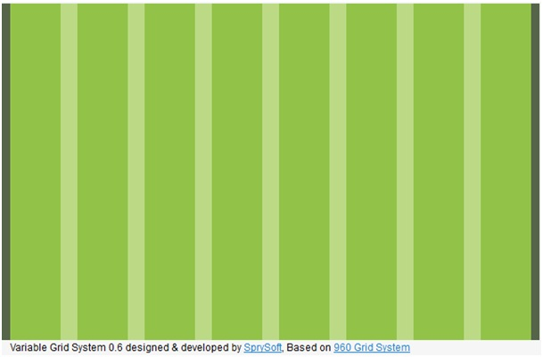
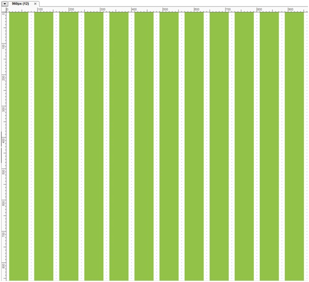

Avec Axure, il est possible de mettre en place un système de grillage pour aider à faire des maquettes responsives grâce aux "Masters".  
Un grillage responsive basique se base sur 12 grilles pour une surface de 960px (largeur de l'illustration ci-dessus).  
Chaque grille fait 60 pixels de large (en vert foncé).  
Les gouttières (en vert clair) entre les grilles font 20 pixels de largeur et les 2 extrêmes font 10 pixels (vert marron).

## Mise en place

Ouvrez Axure, dans l'encadré "Masters" cliquez sur "Add Master".  
Nommez le "960px (12)".  
Sélectionnez ce master (simple clic) puis sélectionnez l'outil "Rectangle" (dans l'encadré Widgets).

Tracez un rectangle d'une largeur de 60px de 10px à gauche d'une hauteur quelconque. Copiez ce rectangle que vous positionnez à 20 pixels du précédent, répétez l'action 10 fois de suite (la dernière grille / rectangle doit s'arrêter à 950px).

Vous souhaitez désormais créer un "master" de 640px soient 8 grilles. Faites un clic droit sur le master précédent "Duplicate" > "Master". Renommez le en "640px (8)" et supprimez les 4 derniers grilles / rectangles.  
Utilisation courante des masters :   
faites un clic droit sur le master > "Add To Pages...", cochez les pages désirées puis validez.

## Liste des grilles

* **12 colonnes : 960px**
* 11 colonnes : 880px
* 10 colonnes : 800px
* **9 colonnes : 720px**
* 8 colonnes : 640px
* 8 colonnes : 560px
* **6  colonnes : 480px**
* 5 colonnes : 400px
* **4 colonnes : 320px**
* 3 colonnes : 240px
* 2 colonnes : 160px
* 1 colonne : 80px

## Sources

* Générateur de grilles : https://grids.heroku.com
* Définition des Masters sur Axure (en anglais) : http://www.axure.com/masters