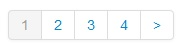
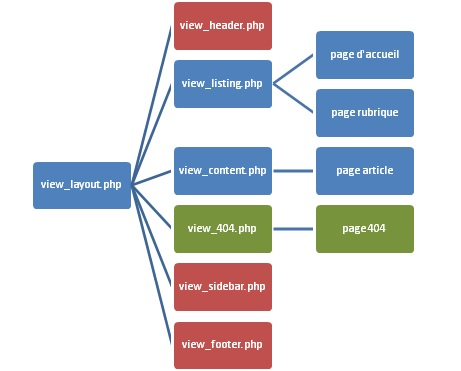
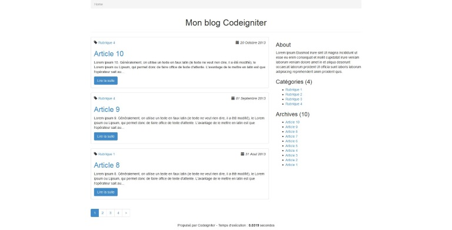
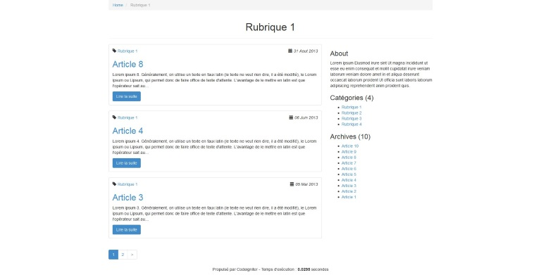
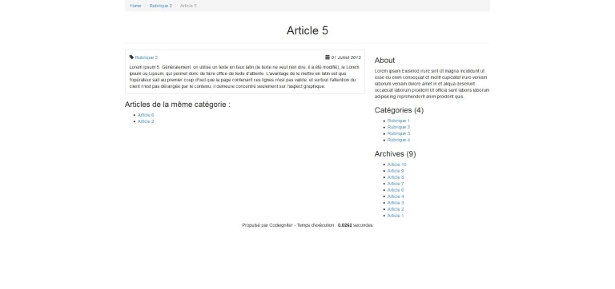
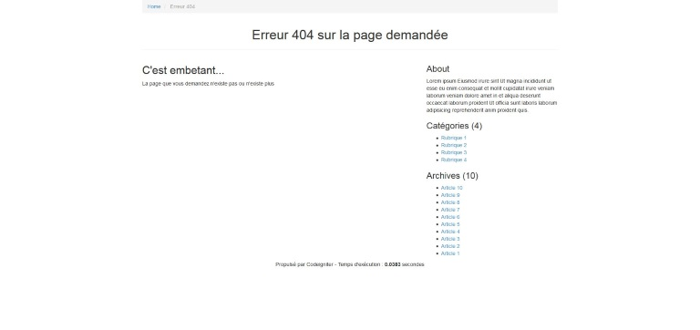

Ce tutoriel n'a pas pour but, ni la prétention de réinventer un système de blog (ce n'est pas pour faire un WordPress bis) mais pour s'entraîner à coder sur le framework CodeIgniter 2 avec du HTML 5 et Twitter Bootstrap 3 pour la partie CSS.
Dans cette première partie, nous allons voir la méthode slug avec la technique de routage qui s'impose par la suite afin de belles URL...  
Avant de commencer, j'espère que vous avez jeté un coup d'oeuil sur l'article précédent "<a href="codeigniter/installation-et-preparation-de-codeigniter-2">Installation et préparation de CodeIgniter 2"</a>.  
Le code présent dans ce tutoriel est une façon parmi tant d'autre de créer son blog. CodeIgniter est loin d'être restrictif pour cela.
## Objectif : faire la partie front d'un blog avec de l'url rewriting

On veut obtenir pour un article l'URL suivante : http://mon-blog.com/rubrique/mon-article  
Pour cela, il nous faut :

* 1 contrôleur
* 1 modèle
* 7 vues (dont 3 includes)
* 1 helper
* modification du fichier routes.php
* 1 table de données (MySQL en utf8_unicode_ci) comportant 2 tables :

```sql
CREATE TABLE IF NOT EXISTS `rubric` (
    `r_id` int(11) NOT NULL AUTO_INCREMENT,
    `r_title` varchar(255) NOT NULL,
    `r_description` text NOT NULL,
    `r_url_rw` varchar(255) NOT NULL,
    PRIMARY KEY (`r_id`),
    UNIQUE KEY `r_url_rw` (`r_url_rw`)
) ENGINE=InnoDB;

CREATE TABLE IF NOT EXISTS `content` (
    `c_id` int(11) NOT NULL AUTO_INCREMENT,
    `r_id` int(11) NOT NULL,
    `c_title` varchar(255) NOT NULL,
    `c_content` text NOT NULL,
    `c_cdate` datetime NOT NULL,
    `c_udate` datetime NOT NULL,
    `c_url_rw` varchar(255) NOT NULL,
    PRIMARY KEY (`c_id`),
    UNIQUE KEY `c_url_rw` (`c_url_rw`),
    CONSTRAINT fk_r_id FOREIGN KEY (r_id) REFERENCES rubric (r_id)
) ENGINE=InnoDB;

INSERT INTO `rubric`
VALUES
(1, 'Rubrique 1', 'La description de la rubrique 1', 'rubrique-1'),
(2, 'Rubrique 2', 'La description de la rubrique 2', 'rubrique-2'),
(3, 'Rubrique 3', 'La description de la rubrique 3', 'rubrique-3'),
(4, 'Rubrique 4', 'La description de la rubrique 4', 'rubrique-4');

INSERT INTO `content`
VALUES
(1, 1, 'Article 1', "Lorem ipsum 1. Généralement, on utilise un texte en faux latin (le texte ne veut rien dire, il a été modifié), le Lorem ipsum ou Lipsum, qui permet donc de faire office de texte d'attente. L'avantage de le mettre en latin est que l'opérateur sait au premier coup d'oeil que la page contenant ces lignes n'est pas valide, et surtout l'attention du client n'est pas dérangée par le contenu, il demeure concentré seulement sur l'aspect graphique.", '2013-01-05 12:00:10', '0000-00-00 00:00:00', 'article-1'),
(2, 2, 'Article 2', "Lorem ipsum 2. Généralement, on utilise un texte en faux latin (le texte ne veut rien dire, il a été modifié), le Lorem ipsum ou Lipsum, qui permet donc de faire office de texte d'attente. L'avantage de le mettre en latin est que l'opérateur sait au premier coup d'oeil que la page contenant ces lignes n'est pas valide, et surtout l'attention du client n'est pas dérangée par le contenu, il demeure concentré seulement sur l'aspect graphique.", '2013-03-10 12:00:10', '0000-00-00 00:00:00', 'article-2'),
(3, 1, 'Article 3', "Lorem ipsum 3. Généralement, on utilise un texte en faux latin (le texte ne veut rien dire, il a été modifié), le Lorem ipsum ou Lipsum, qui permet donc de faire office de texte d'attente. L'avantage de le mettre en latin est que l'opérateur sait au premier coup d'oeil que la page contenant ces lignes n'est pas valide, et surtout l'attention du client n'est pas dérangée par le contenu, il demeure concentré seulement sur l'aspect graphique.", '2013-05-05 12:00:10', '0000-00-00 00:00:00', 'article-3'),
(4, 1, 'Article 4', "Lorem ipsum 4. Généralement, on utilise un texte en faux latin (le texte ne veut rien dire, il a été modifié), le Lorem ipsum ou Lipsum, qui permet donc de faire office de texte d'attente. L'avantage de le mettre en latin est que l'opérateur sait au premier coup d'oeil que la page contenant ces lignes n'est pas valide, et surtout l'attention du client n'est pas dérangée par le contenu, il demeure concentré seulement sur l'aspect graphique.", '2013-06-06 12:00:10', '0000-00-00 00:00:00', 'article-4'),
(5, 2, 'Article 5', "Lorem ipsum 5. Généralement, on utilise un texte en faux latin (le texte ne veut rien dire, il a été modifié), le Lorem ipsum ou Lipsum, qui permet donc de faire office de texte d'attente. L'avantage de le mettre en latin est que l'opérateur sait au premier coup d'oeil que la page contenant ces lignes n'est pas valide, et surtout l'attention du client n'est pas dérangée par le contenu, il demeure concentré seulement sur l'aspect graphique.", '2013-07-01 12:00:10', '0000-00-00 00:00:00', 'article-5'),
(6, 2, 'Article 6', "Lorem ipsum 6. Généralement, on utilise un texte en faux latin (le texte ne veut rien dire, il a été modifié), le Lorem ipsum ou Lipsum, qui permet donc de faire office de texte d'attente. L'avantage de le mettre en latin est que l'opérateur sait au premier coup d'oeil que la page contenant ces lignes n'est pas valide, et surtout l'attention du client n'est pas dérangée par le contenu, il demeure concentré seulement sur l'aspect graphique.", '2013-07-02 12:00:10', '0000-00-00 00:00:00', 'article-6'),
(7, 3, 'Article 7', "Lorem ipsum 7. Généralement, on utilise un texte en faux latin (le texte ne veut rien dire, il a été modifié), le Lorem ipsum ou Lipsum, qui permet donc de faire office de texte d'attente. L'avantage de le mettre en latin est que l'opérateur sait au premier coup d'oeil que la page contenant ces lignes n'est pas valide, et surtout l'attention du client n'est pas dérangée par le contenu, il demeure concentré seulement sur l'aspect graphique.", '2013-07-03 12:00:10', '0000-00-00 00:00:00', 'article-7'),
(8, 1, 'Article 8', "Lorem ipsum 8. Généralement, on utilise un texte en faux latin (le texte ne veut rien dire, il a été modifié), le Lorem ipsum ou Lipsum, qui permet donc de faire office de texte d'attente. L'avantage de le mettre en latin est que l'opérateur sait au premier coup d'oeil que la page contenant ces lignes n'est pas valide, et surtout l'attention du client n'est pas dérangée par le contenu, il demeure concentré seulement sur l'aspect graphique.", '2013-08-31 12:00:10', '0000-00-00 00:00:00', 'article-8'),
(9, 4, 'Article 9', "Lorem ipsum 9. Généralement, on utilise un texte en faux latin (le texte ne veut rien dire, il a été modifié), le Lorem ipsum ou Lipsum, qui permet donc de faire office de texte d'attente. L'avantage de le mettre en latin est que l'opérateur sait au premier coup d'oeil que la page contenant ces lignes n'est pas valide, et surtout l'attention du client n'est pas dérangée par le contenu, il demeure concentré seulement sur l'aspect graphique.", '2013-09-01 12:00:10', '0000-00-00 00:00:00', 'article-9'),
(10, 4, 'Article 10', "Lorem ipsum 10. Généralement, on utilise un texte en faux latin (le texte ne veut rien dire, il a été modifié), le Lorem ipsum ou Lipsum, qui permet donc de faire office de texte d'attente. L'avantage de le mettre en latin est que l'opérateur sait au premier coup d'oeil que la page contenant ces lignes n'est pas valide, et surtout l'attention du client n'est pas dérangée par le contenu, il demeure concentré seulement sur l'aspect graphique.", '2013-10-20 12:00:10', '0000-00-00 00:00:00', 'article-10');
```

Pensez à configurer votre fichier database.php (application/config) afin d'être connecté à votre base de données et n'oubliez pas le .htaccess (à la racine de votre site) pour le rewriting...

## Principe du slug

Dans la table "rubrique", le champ "r_url_rw" ainsi que le champ "c_url_rw" dans la table "content", contiendrons respectivement l'url du titre de la rubrique et de l'article dont les mots seront séparés par des tirets ("dash" ou "hyphens"). Cela devient facile grâce au helper "URL" inclut dans CodeIgniter :  
`$url_rw = url_title($titre, 'dash', TRUE);`  
Cette fonctionnalité sera abordée dans une autre partie de ce tutoriel, du coté back-office lorsque cette dernière sera créée à partir du titre de l'article rentré par l'utilisateur.

## 1 - Le contrôleur blog

Dans le dossier "controllers" (`application/controllers`), créez un nouveau dossier "front" puis un contrôleur "blog.php".

```php
<?php if ( ! defined('BASEPATH')) exit('No direct script access allowed');

class Blog extends CI_Controller{

    function __construct()
    {
        parent::__construct();
        // Chargement des ressources pour ce controller
        $this->load->database();
        $this->load->model('front/model_blog');
        $this->load->library('pagination');
        $this->load->helper(array('functions', 'text', 'url'));
    }

    public function index($numero_page = 1)
    {
        $data['page']       = 'home';
        $data['title']      = 'Mon blog CodeIgniter';
        $data['meta_title'] = 'Mon Blog';
        if($numero_page > 1):
            $data['numero_page'] = $numero_page;
            $data['meta_title'] .= ' - page ' . $numero_page;
        endif;
        $data['meta_desc']  = "Mon super blog propulsé par CodeIgniter 2";

        // Retourne tous les articles (sidebar)
        $data['all_content'] = $this->model_blog->get_all_contents();

        // Retourne toutes les rubriques (sidebar)
        $data['query_all_rubrics'] = $this->model_blog->get_all_rubrics();

        // Paramêtres pour la pagination
        $config = pagination_custom();

        # Chemin
        $config['base_url']    = base_url('page');
        # Lien de la 1ère page de la pagination
        $config['first_url']   = base_url();
        # Nombre de chiffres dans la pagination
        $config['total_rows']  = $data['all_content']->num_rows();
        # Nombre total de pages possibles
        $config['num_links']   = round(($config['total_rows'] / $config['per_page']) + 1);
        # page/1 donc 2 en URI
        $config['uri_segment'] = 2;

        // Initialisation de la pagination
        $this->pagination->initialize($config);

        // Vérification du numéro de la page
        if($numero_page > $config['num_links']):
            redirect(base_url('erreur404'), 404);
        else:
            $data['query'] = $this->model_blog->get_contents_listing($numero_page, $config['per_page'] );
            // Génération de la pagination
            $data['pagination'] = $this->pagination->create_links();
        endif;

        // Chargement des données dans la vue
        $this->load->view('front/view_layout', $data);
    }

    public function view($slug_rubric = '', $slug_content = '', $numero_page = 1)
    {
        // Retourne toutes les rubriques (sidebar)
        $data['query_all_rubrics'] = $this->model_blog->get_all_rubrics();

        // Cas d'une rubrique
        if($this->uri->total_segments() == 1 or $this->uri->total_segments() == 3):

            // Récupération de tous les articles (listing)
            $data['all_content'] = $this->model_blog->get_all_contents();

            // Paramêtres pour la pagination
            $config = pagination_custom();

            # Chemin
            $config['base_url']    = base_url($slug_rubric . '/page');
            # Lien de la 1ère page de la pagination
            $config['first_url']   = base_url($this->uri->segment(1));
            # Nombre de chiffres dans la pagination
            $config['total_rows']  = $this->model_blog->get_contents_rubric_listing($slug_rubric, '', '')->num_rows();
            # Nombre total de pages possibles
            $config['num_links']   = round(($config['total_rows'] / $config['per_page']) + 1);
            # "nom_rubrique/page/1" donc 3 en URI
            $config['uri_segment'] = 3;

            // Initialisation de la pagination
            $this->pagination->initialize($config);

            // Vérification du numéro de la page
            if($numero_page > $config['num_links']):
                redirect(base_url('erreur404'), 404);
            else:
                // Récupération du contenu de la rubrique
                $data['query'] = $this->model_blog->get_contents_rubric_listing($slug_rubric, $numero_page, $config['per_page'] );
                // Si la reqûete abouti sans résultat, on redirige vers la page 404
                if ($data['query']->num_rows == 0):
                    redirect(base_url('erreur404'), 404);
                endif;
                // Génération de la pagination
                $data['pagination'] = $this->pagination->create_links();
            endif;

            // On récupère la valeur de r_url_rw pour faire une vérification ensuite
            $row = $data['query']->row(); 

            $data['page']      = 'rubric';
            // Encapsulation des données
            $data['title']     = $data['meta_title'] = $row->r_title;
            if($numero_page > 1):
                $data['numero_page'] = $numero_page;
                $data['meta_title'] .= ' - page ' . $numero_page;
            endif;
            $data['meta_desc'] = $row->r_description;

        // Cas d'un article
        elseif($this->uri->total_segments() == 2):
            // Récupération du contenu de l'article
            $data['query_article'] = $this->model_blog->get_content($slug_rubric, $slug_content);

                // Si la requête sort un résultat
                if ($data['query_article']->num_rows() == 1):
                    $data['page'] = 'content';
                    // Encapsulation des données
                    $row                = $data['query_article']->row();
                    $data['title']      = $data['c_title'] = $row->c_title;
                    $data['c_content']  = $row->c_content;
                    $data['c_cdate']    = $row->c_cdate;
                    $data['c_url_rw']   = $row->c_url_rw;
                    $data['r_title']    = $row->r_title;
                    $data['r_url_rw']   = $row->r_url_rw;

                    $data['meta_title'] = $row->c_title;
                    $data['meta_desc']  = character_limiter(strip_tags($row->c_content, 160));

                    // Récupération du contenu des autres articles de la même rubrique
                    $data['query_same_rubric'] = $this->model_blog->get_contents_same_rubric($slug_rubric, $slug_content);

                    if(!$this->agent->mobile()):
                        // Récupération du contenu des autres articles (sidebar)
                        $data['all_content'] = $this->model_blog->get_contents_others($slug_content);
                    else:
                        $data['all_content'] = '';
                    endif;

                // Sinon on redirige vers la page 404
                else:
                    redirect(base_url('erreur404'), 404);
                endif;
        
        else:
            redirect(base_url('erreur404'), 404);

        endif;

        // Chargement des données dans la vue
        $this->load->view('front/view_layout', $data);
    }

    public function erreur404()
    {
        // Retourne tous les articles (sidebar)
        $data['all_content'] = $this->model_blog->get_all_contents();

        // Retourne toutes les rubriques (sidebar)
        $data['query_all_rubrics'] = $this->model_blog->get_all_rubrics();

        $data['page']  = '404';
        $data['title'] = $data['meta_title'] = $data['meta_desc'] = 'Erreur 404 sur la page demandée';
        
        // Instancie une vraie erreur 404
        http_response_code(404);

        // Chargement des données dans la vue
        $this->load->view('front/view_layout', $data);
    }

}

/* End of file blog.php */
/* Location: ./application/controllers/blog.php */
```

## Explications

Dans la fonction de constructeur, on appel le model blog, la librairie pagination, et les helpers assets, text et url via `$this->load`.  

Dans les 2 fonctions principales à savoir "index" pour la page d'accueil et "view" pour les pages  rubriques et les articles, il y a des paramètres qui reviennent comme le type de la page (`$data['page']`), le titre de la page (`$data['title']`) le titre méta (`['meta_title']`), etc...

Il y aussi la fonction "pagination_custom" (`$config = pagination_custom();`) qui est appelée dans les 2 fonctions précédentes afin d'éviter de retaper du code. Cette fonction provient du helper "functions" que l'on verra plus bas dans ce tutoriel.

Arrêtons-nous sur la pagination, car elle n'est pas forcement simple à comprendre du 1er coup.  
Tout d'abord, il faut comprendre la notion de "digit".  
Un digit correspond au numéro dans la pagination (ci-dessous : "1", "2", "3" et "4").



**Configuration de la pagination :**

**$config['base_url']**  
Il faut indiquer à Codeginiter l'URL pointant vers chaque digit.  
Exemple dans notre code :  
`$config['base_url']  = base_url('page');`  
Le digit 2 va pointer sur : http://localhost/blog/page/2  
Autre exemple :  
`$config['base_url']  = base_url($slug_rubric . '/page');`  
Le digit 2 de la rubrique "rubrique 1" va pointer sur : http://localhost/blog/rubrique_1/page/2

**$config['first_url']**  
Concerne le lien du digit 1 autrement dit, le lien de la 1ère page.  
Si l'on ne touche pas à ce paramètre alors le lien sera du type :  
http://localhost/blog/page/1  
Dans notre code, on veut redirigé ce digit vers la 1ère page classique, c'est-à-dire :  
http://localhost/blog/page/1vers http://localhost/blog  
`$config['first_url']= base_url();`  
http://localhost/blog/rubrique_1/page/1 vers http://localhost/blog/rubrique_1  
`$config['first_url']= base_url($slug_rubrique);`

**$config['total_rows']**  
Le nombre total de content.

**$config['per_page']**  
Le nombre de content (d'articles dans notre cas) par page.

**$config['num_links']**  
Le nombre de digits que l'on veut afficher dans la pagination.  
Formule magique pour afficher pour obtenir toutes les pages :  
`round(($config['total_rows'] / $config['per_page']) + 1`

**$config['uri_segment']**  
Le nombre d'occurrences dans l'url  
Exemple :  
http://localhost/blog/page/1  
"page" correspond à l'URI 1  
"1" correspond à l'URI 2  
Autre exemple :  
http://localhost/blog/rubrique_1/page/1  
"rubrique_1" correspond à l'URI 1  
"page" correspond à l'URI 2  
"1" correspond à l'URI 3  
Il faut indiquer la dernière occurrence (celle qui correspond au digit).

**$config['use_page_numbers'] = TRUE;**  
Pour lister les pages par numéro de digit (et non par le nombre de content).

Ensuite on initialise la pagination avec le code suivant :  
`$this->pagination->initialize($config);`  
Coté SQL la requête générée doit être du type suivant (par la suite dans le model) :
pour la 1ère page (http://localhost/blog) :


```sql
SELECT `c_title`, `c_content`, `c_cdate`, `c_url_rw`, `r_title`, `r_url_rw`
FROM (`content`)
JOIN `rubric` ON `rubric`.`r_id` = `content`.`r_id`
ORDER BY `c_id` DESC
LIMIT 3
```

Pour la seconde page (http://localhost/blog/page/2) :

```sql
SELECT `c_title`, `c_content`, `c_cdate`, `c_url_rw`, `r_title`, `r_url_rw`
FROM (`content`)
JOIN `rubric` ON `rubric`.`r_id` = `content`.`r_id`
ORDER BY `c_id` DESC
LIMIT 3,3
```

Il faut mettre une limitation au niveau de la page courante.  
Comment on peut connaitre la page courante ?  
Formule magique : (page_courante - 1) * nombre_de_content_par_page  
Exemple : on est sur la page 2 avec 3 contents par page :  
(2 -1) * 3 = 3  
On mettra cette formule dans le modèle qui arrive...

Et pour afficher la pagination :  
`$data['pagination'] = $this->pagination->create_links();`</p>

## 2- Le modèle Model_blog

Dans le dossier "models" (`application/models`), créez un nouveau dossier "front" puis un modèle que vous nommerez "model_blog.php".  
On veut obtenir, de notre base de données :</p>

* tous les articles
* les articles pour le listing
* un article à partir de son slug
* les autres articles de la même rubrique (en dessous d'un article)
* tous les autre articles (pour la sidebar)
* toutes les rubriques (pour la sidebar)
* une rubrique à partir de son slug

```php
<?php if ( ! defined('BASEPATH')) exit('No direct script access allowed');

class Model_blog extends CI_Model {
    // les 7 fonctions (ci-dessous) à placer ici
}

/* End of file model_blog.php */
/* Location: ./application/models/front/model_blog.php */
```

### Obtenir tous les articles

```php
// Obtenir tous les articles
function get_all_contents()
{
    $this->db->select('c_title, c_content, c_cdate, c_url_rw, r_title, r_url_rw')
             ->from('content')
             ->join('rubric', 'rubric.r_id = content.r_id')
             ->order_by('c_id', 'DESC');

    $query = $this->db->get();
    return $query;
}
```

### Obtenir les articles pour le listing

```php
// Obtenir les articles pour le listing
function get_contents_listing($numero_page, $per_page)
{
    $this->db->select('c_title, c_content, c_cdate, c_url_rw, r_title, r_url_rw');
    $this->db->from('content');
    $this->db->join('rubric', 'rubric.r_id = content.r_id');
    $this->db->order_by('c_id', 'DESC');
    if($numero_page):
        $this->db->limit($per_page, ($numero_page-1) * $per_page);
    else:
        $this->db->limit($per_page);
    endif;

    $query = $this->db->get();
    return $query;
}
```

### Obtenir un article à partir de son slug

```php
// Obtenir un article en particulier (via son slug) pour le content
function get_content($slug_rubric, $slug_content)
{
    $this->db->select('c_title, c_content, c_cdate, c_url_rw, r_title, r_url_rw')
             ->from('content')
             ->join('rubric', 'content.r_id = rubric.r_id')
             ->where('r_url_rw', $slug_rubric)
             ->where('c_url_rw', $slug_content);

    $query = $this->db->get();
    return $query;
}
```

### Obtenir les autres articles que celui en cours

```php
// Obtenir les autres articles
function get_contents_others($slug_content)
{
    $this->db->select('c_title, c_url_rw, r_url_rw')
             ->join('rubric', 'rubric.r_id = content.r_id')
             ->from('content')
             ->where('c_url_rw <>', $slug_content)
             ->order_by('c_id', 'DESC');

    $query = $this->db->get();
    return $query;
}
```

### Obtenir les autres articles de la même rubrique que celui en cours

```php
// Obtenir les autres articles de la même rubrique
function get_contents_same_rubric($slug_rubric, $slug_content)
{
    $this->db->select('c_title, c_url_rw, r_url_rw')
             ->join('rubric', 'content.r_id = rubric.r_id')
             ->from('content')
             ->where('rubric.r_url_rw', $slug_rubric)
             ->where('content.c_url_rw <>', $slug_content)
             ->order_by('c_id', 'DESC');

    $query = $this->db->get();
    return $query;
}
```

### Obtenir toutes les rubriques

```php
// Obtenir toutes les rubriques
function get_all_rubrics()
{
    $this->db->select('r_title, r_url_rw')
             ->from('rubric')
             ->order_by('r_title', 'ASC');

    $query = $this->db->get();
    return $query;
}
```

### Obtenir les rubriques pour le listing

```php
// Obtenir les rubriques pour le listing (via son slug)
function get_contents_rubric_listing($slug_rubric, $numero_page, $per_page)
{
    $this->db->select('c_title, c_content, c_cdate, c_url_rw, r_title, r_description, r_url_rw');
    $this->db->from('content');
    $this->db->join('rubric', 'rubric.r_id = content.r_id');
    $this->db->where('rubric.r_url_rw', $slug_rubric);
    $this->db->order_by('content.c_id', 'DESC');
    if($numero_page and $per_page):
        $this->db->limit($per_page, ($numero_page-1) * $per_page);
    elseif($per_page):
        $this->db->limit($per_page);
    endif;

    $query = $this->db->get();
    return $query;
}
```

## 3 - Les vues

Dans le dossier `application/views`, créez un nouveau dossier que vous nommerez "front". Dans ce dossier créez un nouveau dossier que vous nommerez "include" puis créez les 6 fichiers suivants :

* include/view_header.php
* include/view_sidebar.php
* include/view_footer.php
* view_layout.php
* view_listing php
* view_content.php

### Architecture du template des vues :



Le view_layout.php va appeler dans tous les cas, les vues suivantes (stockées dans le dossier  views/include) :

* view_header.php
* view_sidebar.php
* view_footer.php

Quant aux 3 dernières vues, on mettra une condition (via un switch case) suivant le type de page.

Pour les pages accueil et rubrique : view_listing.php  
Car on veut juste le listing des articles et la pagination avec la même mise en page.

Pour la page article : view_content.php  
Car on veut juste le contenu de l'article.

Pour la page 404 :view_404.php  
Car on veut juste afficher un message personnalisé.

Pour la partie CSS, crééz à la racine du répertoire de CodeIgniter, un dossier "assets", puis mettez le contenu de Twitter Bootstrap 3 dedans (seuls les dossiers "css" et "font" sont utilisés dans cette partie).

### include/view_header.php

```html
<!DOCTYPE html>
<html lang="fr">
    <head>
        <meta charset="utf-8">
        <title><?php echo $meta_title; ?></title>
        <meta name="description" content="<?php echo $meta_desc; ?>" />
        <?php echo css_url('bootstrap.min'); ?>
    </head>
```

### include/view_sidebar.php

```html
<aside class="col-md-4 hidden-xs">

    <h3>About</h3>
    <p>Lorem ipsum Eiusmod irure sint Ut magna incididunt ut esse eu enim consequat et mollit cupidatat irure veniam laborum veniam dolore amet in et aliqua deserunt occaecat laborum proident Ut officia sunt laboris laborum adipisicing reprehenderit anim proident quis.</p>
    <?php if($query_all_rubrics->num_rows > 0): ?>

    <h3>Catégories (<?php echo $query_all_rubrics->num_rows(); ?>)</h3>
    <ul class="unstyled">
    <?php foreach ($query_all_rubrics->result() as $row): ?>
        <li><a href="<?php echo base_url($row->r_url_rw); ?>" <?php if ($this->uri->segment(1) == $row->r_url_rw): echo 'title="Categorie actuelle"'; endif; ?>><?php echo $row->r_title; ?></a></li>
    <?php endforeach; ?>
    </ul>
    <?php endif; ?>

    <?php if($all_content->num_rows > 0): ?>
    <h3>Archives (<?php echo $all_content->num_rows(); ?>) </h3>
    <ul class="unstyled">
    <?php foreach($all_content->result() as $row): ?>
        <li><?php echo content_url($row->r_url_rw, $row->c_url_rw, $row->c_title); ?></li>
    <?php endforeach;?>
    </ul>
    <?php endif; ?>

</aside><!-- end of .col-md-4 -->
```

### include/view_footer.php
```html
<footer data-role="footer">
            <p class="footer" style="text-align: center">Propulsé par CodeIgniter - Temps d'exécution : **0.0610** seconds</p>
        </footer>

    </body>
</html>
```

### view_layout.php

```html
<?php $this->load->view('front/include/view_header.php'); ?>

<div class="container">

    <!-- Start breadcrumb -->
    <ol class="breadcrumb" itemtype="http://data-vocabulary.org/Breadcrumb" itemscope="">
        <?php if($page == 'home'): ?>
        <li class="active">
            <span itemprop="title">
            <?php if(isset($numero_page)): ?>
                <a href="<?php echo base_url(); ?>">Home</a> - page <?php echo $numero_page; ?>
            <?php else: ?>
                <span itemprop="title">Home</span>
            <?php endif; ?>
            </span>
        </li>
        <?php else: ?>
        <li><span itemprop="title"><a itemprop="url" href="<?php echo base_url(); ?>">Home</a></span></li>
            <?php if($page == 'rubric'): ?>
                <li class="active">
                    <span itemprop="title">
                    <?php if(isset($numero_page)): ?>
                        <a href="<?php echo base_url($this->uri->segment(1)); ?>"><?php echo $title; ?></a> - page <?php echo $numero_page; ?>
                    <?php else: ?>
                        <?php echo $title; ?>
                    <?php endif; ?>
                    </span>
                </li>
            <?php endif; ?>
            <?php if($page == 'content'): ?>
                <li>
                    <span itemprop="title"><?php echo rubric_url($r_url_rw, $r_title); ?></span>
                </li>
                <li class="active">
                    <span itemprop="title"><?php echo $c_title; ?></span>
                </li>
            <?php endif; ?>
            <?php if($page == '404'): ?>
                <li class="active">
                    <span itemprop="title">Erreur 404</span>
                </li>
            <?php endif; ?>
        <?php endif; ?>
    </ol>
    <!-- End breadcrumb -->

    <div class="page-header">
        <h1 class="text-center"><?php echo $title; ?></h1>
    </div>

    <div class="row">
        <div class="col-md-8">
            <?php switch ($page) {
                case 'home':
                case 'rubric':
                        $this->load->view('front/view_listing.php');
                    break;

                case 'content':
                        $this->load->view('front/view_content.php');
                    break;

                case '404':
                        $this->load->view('front/view_404.php');
                    break;

                default:
                    break;
            }
            ?>
        </div><!-- end of .col-md-8 -->

        <?php $this->load->view('front/include/view_sidebar.php'); ?>

    </div><!-- end of .row -->
</div><!-- end of .container -->

<?php $this->load->view('front/include/view_footer.php'); ?>
```

### view_listing.php

```html
<?php if($query->num_rows() > 0): ?>

    <?php foreach($query->result() as $row): ?>
        <article class="thumbnail">
            <div class="caption">
                <p class="row">
                    <span class="col-md-2">
                        <i class="glyphicon glyphicon-tag"></i> <?php echo rubric_url($row->r_url_rw, $row->r_title); ?>
                    </span>
                    <span class="col-md-3 col-md-offset-7 text-right">
                        <i class="glyphicon glyphicon-calendar"></i> 
                        <?php $jour  = date("d", strtotime($row->c_cdate)); ?>
                        <?php $mois  = date("m", strtotime($row->c_cdate)); ?>
                        <?php $annee = date("Y", strtotime($row->c_cdate)); ?>
                        <em><?php echo date_fr($jour, $mois, $annee); ?></em>
                    </span>
                </p><!-- end of .row -->
                <h2><?php echo content_url($row->r_url_rw, $row->c_url_rw, $row->c_title); ?></h2>
                <p><?php echo character_limiter($row->c_content, 256); ?></p>
                <?php echo content_url_button($row->r_url_rw, $row->c_url_rw); ?>
            </div><!-- end of .caption -->
        </article><!-- end of .thumbnail -->
    <?php endforeach; ?>

    <?php echo $pagination; ?>

<?php else: ?>
    <p>Aucun article n'est disponible pour le moment</p>
<?php endif; ?>
```

### view_content.php

```html
<article class="thumbnail">
    <div class="caption">
        <p class="row">
            <span class="col-md-2">
                <i class="glyphicon glyphicon-tag"></i> <a href="<?php echo base_url($r_url_rw);?>"><?php echo $r_title; ?></a>
            </span>
            <span class="col-md-3 col-md-offset-7 text-right">
                <i class="glyphicon glyphicon-calendar"></i>
                <?php $jour  = date("d", strtotime($c_cdate)); ?>
                <?php $mois  = date("m", strtotime($c_cdate)); ?>
                <?php $annee = date("Y", strtotime($c_cdate)); ?>
                <em><?php echo date_fr($jour, $mois, $annee); ?></em>
            </span>
        </p><!-- end of .row -->
        <?php echo $c_content; ?>
    </div><!-- end of .caption -->
</article><!-- end of .thumbnail -->

<?php if($query_same_rubric->num_rows() > 0): ?>
<h3>Article<?php if($query_same_rubric->num_rows() > 1){ echo 's';} ?> de la même catégorie :</h3>
<ul>
<?php foreach($query_same_rubric->result() as $row): ?>
    <li><?php echo content_url($row->r_url_rw, $row->c_url_rw, $row->c_title); ?></li>
<?php endforeach; ?>
</ul>
<?php endif; ?>
```

### view_404.php

```html
<h2>C'est embetant...</h2>
<p>La page que vous demandez n'existe pas ou n'existe plus</p>
```

## 4 - Helper function

Dans le dossier `application/helpers`, créez un fichier helper : "functions_helper.php".  
Avec ce helper, on va pouvoir simplifier le code dans nos vues en créant des fonctions.  
Exemple avec l'appel de l'URL d'un article que l'on appel dans la vue :

```php
<?php echo content_url($row->r_url_rw, $row->c_url_rw, $row->c_title); ?>
```

au lieu de :
```php
<a href="<?php echo base_url($row->r_url_rw . '/' . $row->c_url_rw); ?>"><?php echo $row->c_title; ?></a>
```

Appeler la feuille de style css :

```php
<?php if ( ! defined('BASEPATH')) exit('No direct script access allowed');

if ( ! function_exists('css_url'))
{
    function css_url($nom)
    {
        return '<link rel="stylesheet" href="' . base_url() . 'assets/css/' . $nom . '.css" />
';
    }
}
```

Appeler l'url de l'article :

```php
if ( ! function_exists('content_url'))
{
    function content_url($rubric, $content, $titre)
    {
        return '<a href="' . base_url($rubric . '/' . $content) . '">' . $titre . '</a>';
    }
}
```

Appeler l'url de l'article à partir du bouton "lire la suite" :

```php
if ( ! function_exists('content_url_button'))
{
    function content_url_button($rubric, $content)
    {
        return '<a href="' . base_url($rubric . '/' . $content) . '" class="btn btn-primary">Lire la suite</a>';
    }
}
```

Appeler l'url de la rubrique d'un article :

```php
if ( ! function_exists('rubric_url'))
    {
    function rubric_url($rubric, $titre)
    {
        return '<a href="' . base_url($rubric) . '">' . $titre . '</a>';
    }
}
```

CodeIgniter ne gérant pas les dates en français, la création de ce helper va nous permettre de pouvoir exécuter la fonction datefr() :

```php
if ( ! function_exists('date_fr'))
{
    function date_fr ($jour, $mois, $annee)
    {
        $mois_n = $mois;
        switch ($mois) {
            case '01':
                $mois = 'Janvier';
                break;
            case '02':
                $mois = 'Février';
                break;
            case '03':
                $mois = 'Mars';
                break;
            case '04':
                $mois = 'Avril';
                break;
            case '05':
                $mois = 'Mai';
                break;
            case '06':
                $mois = 'Juin';
                break;
            case '7':
                $mois = 'Juillet';
                break;
            case '8':
                $mois = 'Aout';
                break;
            case '9':
                $mois = 'Septembre';
                break;
            case '10':
                $mois = 'Octobre';
                break;
            case '11':
                $mois = 'Novembre';
                break;
            case '12':
                $mois = 'Décembre';
                break;
            
            default:
                break;
        }

        return '<time datetime="' . $annee . '-' . $mois_n . '-' . $jour . '">' .$jour . ' ' . $mois . ' ' . $annee.'</time>';
    }
}
```

Pour la pagination :

```php
if ( ! function_exists('pagination_custom'))
{
    function pagination_custom()
    {
        // Paramètres de configuration
        # Nombre d'articles par page
        $config['per_page']         = 3;
        # Lister les pages par numéro (page 1, page 2, etc...)
        $config['use_page_numbers'] = TRUE;

        # HTML entre les digits
        $config['full_tag_open']    = '<ul class="pagination">';
        $config['full_tag_close']   = '</ul><!--pagination-->';
        $config['num_tag_open']     = '<li>';
        $config['num_tag_close']    = '</li>';
        $config['cur_tag_open']     = '<li class="active"><span>';
        $config['cur_tag_close']    = '</span></li>';
        $config['next_tag_open']    = '<li>';
        $config['next_tag_close']   = '</li>';
        $config['prev_tag_open']    = '<li>';
        $config['prev_tag_close']   = '</li>';
        $config['first_tag_open']   = '<li style="display: none;">';
        $config['first_tag_close']  = '</li>';
        $config['last_tag_open']    = '<li style="display: none;">';
        $config['last_tag_close']   = '</li>';

        return $config;
    }
}
```

## Routage

Dans le fichier de configuration "routes.php" (`application/config`), on veut que notre url soit routée correctement, de la forme http://localhost/blog/nom-rubrique/nom-article. Avant cela, il faut définir notre controller par défaut, autrement dit celui que l'on vient de créer auparavant :  
`$route['default_controller'] = 'front/blog';`

On ajoute la pagination de la page d'accueil :  
`$route['page/(:num)']   = $route['default_controller'] . '/index/$1';`

Puis, les rubriques :  
`$route['(:any)'] = 'front/blog/view/$1';`  
http://localhost/blog/nom-rubrique  
"blog" correspond au contrôleur blog.php  
$1 correspond à la valeur dans le contrôleur blog.php de la variable $slug_rubrique.

Puis, on finit par les articles :  
`$route['(:any)/(:any)'] = 'front/blog/view/$1/$2';`  
http://localhost/blog/nom-rubrique/nom-article.  
$2 correspond alors à la valeur dans le contrôleur blog.php de la variable $slug_content.

Important : ces 2 lignes de codes sont toujours à placer à la fin du fichier.

Ce qui donne au final :

```php
$route['default_controller'] = 'front/blog';

# 404  
$route['erreur404']          = $route['default_controller'] . '/erreur404'; 

#pagination home  
$route['page/(:num)']        = $route['default_controller'] . '/index/$1';

# rubrique  
$route['(:any)']             = $route['default_controller'] . '/view/$1';
# rubrique + content  
$route['(:any)/(:any)']      = $route['default_controller'] . '/view/$1/$2';
```

## Captures d'écran du résultat à l'écran

Page d'accueil :

[](./img/news/codeigniter_blog_front/codeigniter_blog_accueil.jpg)

Page rubrique :

[]
(./img/news/codeigniter_blog_front/codeigniter_blog_rubrique.jpg)

Page article :

[]
(./img/news/codeigniter_blog_front/codeigniter_blog_article.jpg)

Page 404 :

[]
(./img/news/codeigniter_blog_front/codeigniter_blog_404.jpg)