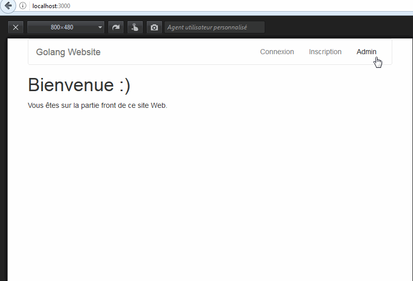

Lorsqu'un utilisateur s'authentifie sur une page de connexion, cela créé un cookie de session. De ce fait, si l'utilisateur tente de se rendre sur une page protégée sans s'être authentifié, ne possédant pas le cookie de session sur son navigateur Web, il ne pourra pas y accéder. Quant à la déconnexion, cela aura pour effet de supprimer le cookie de session.

Dans un premier temps on va mettre en place un système simpliste, puis on introduira la notion de hachage de mot de passe avec Bcrypt, l'apport d'un token CSRF et on finira en créant une liste d'utilisateurs sur une base de donnée de type SQL via SQLite.



## Préparation

### Packages externes

`go get github.com/gin-gonic/gin && go get github.com/gorilla/securecookie && go get github.com/gorilla/csrf && github.com/mattn/go-sqlite3 && github.com/jinzhu/gorm`

- **Gin** : le micro framework ;
- **securecookie** : cookie de session ;
- **csrf** : gestion du token du même nom ;
- **go-sqlite3** : le driver pour SQlite ;
- **gorm** : l'ORM pour les requêtes SQL.

### Vue d'ensemble des fichiers

Ci-dessous l'architecture de notre application de connexion / déconnexion.

```bash
│   main.go
│
├───controllers
│       back.go
│       front.go
│       session.go
│
├───db
│       db.go
|
├───helpers
│       cookies.go
│       password.go
│
└───views
        view_admin.html
        view_footer.html
        view_form.html
        view_header.html
        view_index.html
```

### Structure de données

Dans le dossier "db/db.go", on crée la structure de données "Users".

```go
package db

// La structure de données
type Users struct {
    Id             int
    Name, Password string
}
```

Un utilisateur possède un nom ("Name") et un mot de passe ("Password").

### Template

Il serait dommage de se priver des templates avec Go.

#### Le header

On définit un template "header" contenant la majorité de notre code HTML dans le fichier "views/view_header.html".

```html
{{ define "header" }}

<!DOCTYPE html>
<html>
<head>
    <meta charset="utf-8">
    <title>Bienvenue sur mon site</title>
    <link rel="stylesheet" href="https://maxcdn.bootstrapcdn.com/bootstrap/3.3.7/css/bootstrap.min.css">
</head>
<body class="container">

<nav class="navbar navbar-default">

  <div class="container-fluid">

    <div class="navbar-header">
      <button type="button" class="navbar-toggle collapsed" data-toggle="collapse" data-target="#bs-example-navbar-collapse-1" aria-expanded="false">
        <span class="sr-only">Toggle navigation</span>
        <span class="icon-bar"></span>
        <span class="icon-bar"></span>
        <span class="icon-bar"></span>
      </button>
      <a class="navbar-brand" href="/">Golang Website</a>
    </div>

    <div class="collapse navbar-collapse" id="bs-example-navbar-collapse-1">
      <ul class="nav navbar-nav navbar-right">
        <li {{ if eq .currentPage "login" }} class="active" {{ end }}><a href="/login">Connexion</a></li>
        <li {{ if eq .currentPage "signUp" }} class="active" {{ end }}><a href="/signup">Inscription</a></li>
        <li {{ if eq .currentPage "admin" }} class="active" {{ end }}><a href="/admin">Admin</a></li>
        {{ if .userName }}
        <li class="dropdown">
          <a href="#" class="dropdown-toggle" data-toggle="dropdown" role="button" aria-haspopup="true" aria-expanded="false">{{ .userName }}<span class="caret"></span></a>
          <ul class="dropdown-menu">
            <li><a href="/logout">Logout</a></li>
          </ul>
        </li>
        {{ end }}
      </ul>
    </div>

  </div>

</nav>

{{ if .success }}
<div class="alert alert-success" role="alert">
  {{ .success }}
  <button type="button" class="close" data-dismiss="alert" aria-label="Close">
    <span aria-hidden="true">&times;</span>
  </button>
</div>
{{ end }}

{{ if .warning }}
<div class="alert alert-warning" role="alert">
  {{ .warning }}
  <button type="button" class="close" data-dismiss="alert" aria-label="Close">
    <span aria-hidden="true">&times;</span>
  </button>
</div>
{{ end }}

{{ end }}
```

#### Le footer

Puis un second template nommé "footer" dans le fichier "views/view_footer.html".

```html
{{ define "footer" }}

<script src="https://ajax.googleapis.com/ajax/libs/jquery/3.2.1/jquery.min.js"></script>
<script src="https://maxcdn.bootstrapcdn.com/bootstrap/3.3.7/js/bootstrap.min.js"></script>
</body>
</html>

{{ end }}
```

## Le routeur

Dans le fichier "main.go", on configure notre routeur dans la fonction principale.

```go
package main

import (
    "[chemin_du_projet]/controllers"

    "github.com/gin-gonic/gin"
)

func main() {
    // Initialisation du routeur
    r := gin.Default()

    // Dossier des vues HTML
    r.LoadHTMLGlob("views/*")

    // Page d'accueil
    r.GET("/", controllers.IndexHandler)

    // Page admin (privée)
    r.GET("/admin", controllers.AdminHandler)

    // Page de connexion
    r.GET("/login", controllers.LoginHandlerForm)
    r.POST("/login", controllers.LoginHandler)

    // Page de déconnexion
    r.GET("/logout", controllers.LogoutHandler)

    // Port du serveur
    r.Run(":3000")
}
```

On a donc 5 routes distinctes dont une pour notre futur formulaire de connexion. Le port utilisé est le "3000".

## Middleware

On va avoir besoin de récupérer la valeur du cookie contenu dans le fichier "helpers/cookies.go".

```go
import (
    "[chemin_du_projet]/controllers"
    "[chemin_du_projet]/helpers"

    "github.com/gin-gonic/gin"
)
```

La route "admin" n'étant pas si privée que ça... on va donc créer un middleware qui va vérifier si le cookie de session n'existe pas alors on redirige l'utilisateur vers la page de connexion.

```go
func Private() gin.HandlerFunc {
    return func(c *gin.Context) {
        _, err := c.Request.Cookie(helpers.CookieSessionName)

        if err != nil {
            c.Redirect(302, "/login")
            c.Abort() // Très important (sinon pas protégée avec curl -i http://localhost:3000/admin)
        }
    }
}
```

Remarque : la variable `CookieSessionName` sera déclarée prochainement dans le helper "session.go" (vous pouvez commenter l'intérieur de la fonction `Private()` pour le moment...).

Puis remplacez la route concernée en ajoutant le middleware.

```go
// Page admin (privée)
r.GET("/admin", Private(), controllers.AdminHandler)
```

Il est également possible de créer un groupe de routes et d'attribuer ce middleware à tout ce groupe (vive le DRY :D).

```go
admin := r.Group("/admin") // Nom du groupe "admin" dont l'URI est "/admin"
admin.Use(Private())       // Utilisation du middleware Private()
{
    // Page admin (privée)
    admin.GET("", controllers.AdminHandler)
    // Autres routes dans "/admin"
    // ...
}
```

## Helper

### Les cookies

Ce helper va nous servir à créer un cookie de session, récupérer les infos de ce cookie, supprimer ce cookie mais également créer un cookie "flash" (sans durée), le supprimer sans oublier l'encodage et le décodage de sa valeur (pour les caractères spéciaux).

#### Initialisation de la session

Dans le fichier "helpers/cookies.go".

```go
package helpers

import (
    "net/http"
    "net/url"

    "github.com/gin-gonic/gin"
    "github.com/gorilla/securecookie"
)

// Création du cookie sécurisé
var cookieHandler = securecookie.New(securecookie.GenerateRandomKey(64), securecookie.GenerateRandomKey(32))

// Nom du cookies de session
var CookieSessionName = "session"
```

On importe le package "net/http" pour travailler sur les cookies ainsi que "gorilla/securecookie" pour créer un cookie sécurisé que l'on déclare dans une variable nommée "cookieHandler" via la fonction `securecookie.New()`. Le premier argument sert à définir une clef de hachage et le second à définir une clef de blocage. Quant aux packages "net/http" et "net/url", ils nous serviront pour les cookies flash.

#### Création de la session

Puis on crée la fonction `SetSession` pour définir un cookie à partir du nom de l'utilisateur.

```go
func SetSession(userName string, c *gin.Context) {
    value := map[string]string{
        "name": userName,
    }

    if encoded, err := cookieHandler.Encode(CookieSessionName, value); err == nil {
        cookie := &http.Cookie{
            Name:  CookieSessionName,
            Value: encoded,
            Path:  "/",
            HttpOnly: true,
            //Secure: true, SEULEMENT DISPONIBLE AVEC HTTPS ACTIVE
        }
        http.SetCookie(c.Writer, cookie)
    }
}
```

1. On stocke la valeur de l'utilisateur dans une variable (`value`) ;
2. On encode notre cookie à partir du super cookie `cookieHandler` dans la variable `encoded` ;
3. Le cookie possède également un nom ("session" dans notre cas via la variable `cookieSessionName`) ainsi qu'un chemin.

Je vous conseille d'activer le flag "HttpOnly" pour des raisons de sécurité (cela empèche notamment l'exécution de la fonction JavaScript `document.cookie`). Vous pouvez ajouter plus de sécurité si votre application est en HTTPS en définissant le cookie de session comme étant de type "secure" (`Secure: true`).

#### Récupérer la valeur de l'utilisateur

Puis on crée une autre fonction `getUserName` pour récupérer le nom d'utilisateur stocké dans le cookie.

```go
func GetUserName(c *gin.Context) (userName string) {
    if cookie, err := c.Request.Cookie(CookieSessionName); err == nil {
        cookieValue := make(map[string]string)
        if err = cookieHandler.Decode(CookieSessionName, cookie.Value, &cookieValue); err == nil {
            userName = cookieValue["name"]
        }
    }

    return userName
}
```

Si le cookie existe, alors on récupère la valeur "name" du cookie que l'on retourne comme chaine de caractères.

#### Supprimer la session

Et une autre fonction `ClearSession` pour détruire le cookie lors de la déconnexion.

```go
func ClearSession(c *gin.Context) {
    cookie := &http.Cookie{
        Name:   CookieSessionName,
        Value:  "",
        Path:   "/",
        MaxAge: -1,
    }

    http.SetCookie(c.Writer, cookie)
}
```

#### Encodage / décodage de valeurs

On a besoin d'encoder et de décoder les cookies pour accepter les caractères spéciaux.

```go
// Encodage de la valeur du cookie
func encode(value string) string {
    encode := &url.URL{Path: value}
    return encode.String()
}

// Décodage de la valeur du cookie
func decode(value string) string {
    decode, _ := url.QueryUnescape(value)
    return decode
}
```

#### Création du cookie "flash"

On aura besoin de stocker des données dans un cookie provisoire.

```go
func SetFlashCookie(c *gin.Context, name string, value string) {
    cookie := &http.Cookie{
        Name:   name,
        Value:  encode(value),
        Path:   "/",
        MaxAge: 1,
    }

    http.SetCookie(c.Writer, cookie)
}
```

On prend soin d'encoder la valeur du cookie. Avec un age très limité puisqu'il s'agit de données provisoires (message de succès, d'avertissement, d'erreur...).

#### Récupération de la valeur du cookie "flash"

On aura besoin de récupérer un cookie provisoire pour informer l'utilisateur.

```go
func GetFlashCookie(c *gin.Context, name string) (value string) {
    cookie, err := c.Request.Cookie(name)

    var cookieValue string
    if err == nil {
        cookieValue = cookie.Value
    } else {
        cookieValue = cookieValue
    }

    return decode(cookieValue)
}
```

On retourne la valeur... décodée.

## Contôleurs

On va traiter nos 3 contrôleurs en commencant par le front puis la session et pour finir, le back.

### Front

Dans le fichier "controllers/front.go".

```go
package controllers

import (
    "[chemin_du_projet]/helpers"

    "github.com/gin-gonic/gin"
)

func IndexHandler(c *gin.Context) {
    userName := helpers.GetUserName(c)

    c.HTML(200, "view_index.html", gin.H{
        "userName":    userName,
        "currentPage": "index",
        "success":     helpers.GetFlashCookie(c, "success"),
    })
}
```

On récupère (si elle existe), la valeur du cookie de session via la fonction `GetUserName(c)`.

On affiche la page web dans "views/view_index.html".

```html
{{ template "header" . }}

  <h1>Bienvenue :)</h1>

  <p>Vous êtes sur la partie front de ce site Web.</p>

{{ template "footer" }}
```

### Session

On s'occupe de créer le formulaire "views/view_form.html" qui servira à la fois pour se connecter et pour s'inscrire.

```html
{{ template "header" . }}

<div class="col-sm-6 col-sm-offset-3 form-box">

  <div class="form-top">

    <div class="form-top-left">
      <h3>{{ if eq .currentPage "login" }}Connexion{{ else }}Inscription{{ end }}</h3>
    </div>

  </div>

  <div class="form-bottom">

    <form role="form" action="" method="post" class="login-form">
      <div class="form-group">
        <label for="form-username">Nom d'utilisateur</label>
        <input name="username" placeholder="Username..." class="form-username form-control" id="form-username" type="text" required>
      </div>
      <div class="form-group">
        <label for="form-password">Mot de passe</label>
        <input name="password" placeholder="Password..." class="form-password form-control" id="form-password" type="password" required>
      </div>
      <button type="submit" class="btn btn-primary">{{ if eq .currentPage "login" }}Se connecter{{ else }}Valider mon inscription{{ end }}</button>
    </form>

  </div>

</div>

{{ template "footer" }}
```

Le plus important étant la présence des 2 champs obligatoire.

Dans le fichier "controllers/session.go".

```go
package controllers

import (
    "[chemin_du_projet]/db"
    "[chemin_du_projet]/helpers"

    "github.com/gin-gonic/gin"
)
```

Puis dans notre contrôleur, on affiche notre formulaire dans la route `LoginHandlerForm`.

```go
func LoginHandlerForm(c *gin.Context) {
    // Récupération du nom d'utilisateur pour le templating
    userName := helpers.GetUserName(c)

    c.HTML(200, "view_form.html", gin.H{
        "userName":    userName,
        "currentPage": "login",
        "warning":     helpers.GetFlashCookie(c, "warning"),
    })
}
```

On récupère les données rentrées dans le formulaire (nom d'utilisateur et mot de passe) dans la route de type POST `LoginHandlerForm`.

```go
func LoginHandler(c *gin.Context) {
    // Utilisateur concerné
    user := db.Users{
        "toto",
        "password",
    }

    // Récupération des champs
    name := c.PostForm("username")
    pass := c.PostForm("password")

    if name != "" && pass != "" {

        if name == user.Name && pass == user.Password {
            helpers.SetSession(name, c)
            helpers.SetFlashCookie(c, "success", "Bienvenue "+user.Name)
            // Redirection vers la page protégée
            c.Redirect(302, "/admin")
        } else {
            // Pas bon :(
            helpers.SetFlashCookie(c, "warning", "Identifiants incorrects")
            c.Redirect(302, "/login")
        }

    }
}
```

Si la correspondance est correcte alors on instancie le cookie de session et on redirige vers la page privée. Sinon on stocke un message d'avertissement dans un cookie de type "warning".

Dans ce contrôleur, il ne nous manque plus que la déconnexion avec la route `LogoutHandler`.

```go
func LogoutHandler(c *gin.Context) {
    helpers.ClearSession(c)
    helpers.SetFlashCookie(c, "success", "Vous êtes désormais déconnecté(e)")
    c.Redirect(302, "/")
}
```

On supprime le cookie de session avec `ClearSession` et on redirige vers la page d'accueil avec le message contenu dans le cookie flash.

### Back

On crée notre magnifique page admin dans "views/views_admin.html".

```html
{{ template "header" . }}

  <h1>Admin (page protégée)</h1>

{{ template "footer"}}
```

Dans la fonction de la route `AdminHandler` on appel la variable userName à partir de la fonction `getUserName`.

```go
package controllers

import (
    "[chemin_du_projet]/helpers"

    "github.com/gin-gonic/gin"
)

// Admin
func AdminHandler(c *gin.Context) {
    // Récupération du nom d'utilisateur pour le templating
    userName := helpers.GetUserName(c)

    c.HTML(200, "view_admin.html", gin.H{
        "userName":    userName,
        "currentPage": "admin",
        "success":     helpers.GetFlashCookie(c, "success")
    })
}
```

## Bcrypt

Présent dans de nombreux langage de programmation, Bcrypt est une fonction de hash. Contrairement à MD5, SHA-1, SHA-256, etc..., le mot de passe est haché différement et de ce fait est bien plus résistant aux attaques par force brute. Bcrypt utilise 3 critères :

- **cost** : le coût souhaité de l'algorithme (suivant la puissance de la machine hébergeant le serveur) ;
- **salt** : sel de l'algorithme ;
- **key** : le mot de passe que l'on souhaite encoder.

On aura donc besoin de hacher et de comparer.

### Préparation du fichier

Dans le fichier "helpers/password.go", on importe la librairie `golang.org/x/crypto/bcrypt`.

```go
package helpers

import (
    "golang.org/x/crypto/bcrypt"
)
```

### Hachage

```go
func HashPassword(password string) (string, error) {
    bytes, err := bcrypt.GenerateFromPassword([]byte(password), bcrypt.DefaultCost)
    return string(bytes), err
}
```

Dans la fonction `hashPassword`, on passe en paramètre le mot de passe en clair. On retourne une chaine de caractères via la fonction `GenerateFromPassword`. Le coût ("cost") est definit à 10 (le minimum étant 4 `bcrypt.MinCost`, le maximum 31 `bcrypt.MaxCost` et par défaut 10 `bcrypt.DefaultCost`).

### Vérification par comparaison

```go
func CheckPasswordHash(password, hash string) bool {
    err := bcrypt.CompareHashAndPassword([]byte(hash), []byte(password))
    return err == nil
}
```

On passe en paramètre le mot de passe et le mot de passe haché. On retourne un booléen via la fonction `CompareHashAndPassword`.

### Testons

Dans la fonction `LoginHandler`, on modifie les lignes concernées.

```go
func LoginHandler(c *gin.Context) {
    // Utilisateur concerné
    user := db.Users{
        1,
        "toto",
        "password",
    }

    // Mot de passe haché ("password")
    hash, _ := helpers.HashPassword(user.Password)

    // Récupération des champs
    name := c.PostForm("username")
    pass := c.PostForm("password")

    if name != "" && pass != "" {

        if name == user.Name && helpers.CheckPasswordHash(pass, hash) {
            helpers.SetSession(name, c)
            helpers.SetFlashCookie(c, "success", "Bienvenue "+user.Name)
            // Redirection vers la page protégée
            c.Redirect(302, "/admin")
        } else {
            // Pas bon :(
            helpers.SetFlashCookie(c, "warning", "Identifiants incorrects")
            c.Redirect(302, "/login")
        }

    }
}
```

## Token CSRF

Le token CSRF (Cross-Site Request Forgery) permet de se protéger contre une faille bien connue, l'attaque XSS. Avec la génération de ce token aussi bien coté utilisateur que coté serveur, cela permet de renforcer la sécurité à moindres frais.

### Coté serveur

Dans le fichier "main.go", importez le package officiel "net/http" et le package pour notre token "github.com/gorilla/csrf". Puis remplacez la ligne `r.Run(":3000")` par la ligne ci-dessous.

```go
http.ListenAndServe(":3000",
    csrf.Protect([]byte("32-byte-long-auth-key"), csrf.Secure(false))(r))
```

Il est important de spécifier le cookie de type Secure à false si HTTPS n'est pas activé (sinon le cookie ne fonctionnera pas).

Remarque : vous pouvez remplacez `[]byte("32-byte-long-auth-key")` par securecookie.GenerateRandomKey(32) (après avoir importé le package "github.com/gorilla/securecookie").

Dans le fichier "controller/session.go", dans la fonction `LoginHandlerForm`, ajoutez la propriété `csrf.TemplateTag` avec pour valeur `csrf.TemplateField(c.Request)`.

```go
c.HTML(200, "view_form.html", gin.H{
    "userName":       userName,
    "currentPage":    "login",
    "warning":        helpers.GetFlashCookie(c, "warning"),
    csrf.TemplateTag: csrf.TemplateField(c.Request),
})
```

N'oubliez pas d'importer le package "github.com/gorilla/csrf" dans ce fichier.

### Coté client

Dans le formulaire ("views/view_form"), ajoutez la valeur `{{ .csrfField }}` avant la fermeture de la balise `</form>`. Cela aura pour effet d'ajouter un champ de type "hidden" dans le formulaire contenant le token comme valeur. En effet, la valeur `csrf.TemplateField(c.Request)` produit le code ci-dessous.

```go
fmt.Sprintf(`<input type="hidden" name="%s" value="%s">`,
        "myFieldName", Token(r))
```

Un exemple de rendu en HTML.

```html
<input name="gorilla.csrf.Token" value="JZ6ZacxKVbWWReZh90RgOtYgjzptXRL8NnpbCtI7a7P/R/oAtIWrgcUY5DgEDIiUmnMX3HfupUm3r4C3xci/IQ==" type="hidden">
```

Si vous supprimez ou modifiez la valeur du champ, vous aurez le message suivant "Forbidden - CSRF token invalid" avec une erreur HTTP 403.

## Base de données

Jusqu'à présent on a testé avec un seul compte utilisateur. On va s'assurer que les futurs utilisateurs puissent s'inscrire tout en ayant leur mot de passe haché dans la base de données et en prenant en compte l'unicité des comptes.

### Connexion à SQLite

Dans le fichier "db.go" présent dans le dossier "db", on importe l'ORM et le driver pour SQLite.

```go
package db

// Les imports de librairies
import (
    "github.com/jinzhu/gorm"
    _ "github.com/mattn/go-sqlite3"
)

// La structure de données
type Users struct {
    Id       int    `gorm:"AUTO_INCREMENT" form:"id"`
    Name     string `gorm:"not null;unique" form:"username"` // Utilisateur unique!
    Password string `gorm:"not null" form:"password"`
}

// Connexion à la BDD SQLite
func InitDb() *gorm.DB {
    // Ouverture de la connexion vers la BDD SQLite
    db, err := gorm.Open("sqlite3", "./data.db")
    // Afficher les requêtes SQL (facultatif)
    db.LogMode(true)

    // Création de la table "users"
    if !db.HasTable(&Users{}) {
        db.CreateTable(&Users{})
        db.Set("gorm:table_options", "ENGINE=InnoDB").CreateTable(&Users{})
    }

    if err != nil {
        panic(err)
    }

    return db
}
```

On modifie la structure de données pour l'accorder avec l'ORM Gorm. Et on initialise la connexion au fichier SQLite "data.db".

### Formulaire d'inscription

Dans le fichier "main.go", ajoutez les 2 routes ci-dessous.

```go
// Page d'inscription
r.GET("/signup", controllers.SignUpHandlerForm)
r.POST("/signup", controllers.SignUpHandler)
```

Puis dans le contrôleur "session.go".

```go
func SignUpHandlerForm(c *gin.Context) {
    // Récupération du nom d'utilisateur pour le templating
    userName := helpers.GetUserName(c)

    c.HTML(200, "view_form.html", gin.H{
        "userName":       userName,
        "currentPage":    "signUp",
        "warning":        helpers.GetFlashCookie(c, "warning"),
        csrf.TemplateTag: csrf.TemplateField(c.Request),
    })
}
```

On utilise le même formulaire que pour la connexion sans oublier de générer le token CSRF.

Et la route de vérification de type "POST" `SignUpHandler`.

```go
func SignUpHandler(c *gin.Context) {
    var user db.Users

    if c.Bind(&user) == nil {
        // Mot de passe haché
        hash, _ := helpers.HashPassword(user.Password)
        user.Password = hash

        // Connexion à SQLite
        dbmap := db.InitDb()
        defer dbmap.Close()

        if err := dbmap.Where("name = ?", user.Name).First(&user).Error; err == nil {
            helpers.SetFlashCookie(c, "warning", "Inscription refusée, le nom d'utitlisateur "+user.Name+" existe déjà")
            c.Redirect(302, "/signup")
        } else {
            // Création de l'utilisateur
            dbmap.Create(&user)
            // Création du cookie de session
            helpers.SetSession(user.Name, c)
            c.Redirect(302, "/admin")
        }

    } else {
        helpers.SetFlashCookie(c, "warning", "Champs non remplis")
        c.Redirect(302, "/signup")
    }
}
```

1. On récupère les données postées dans le formulaire d'inscription avec la fonction `c.Bind` ;
2. On hash le mot de passe via la fonction `hashPassword` ;
3. On s'assure que le nom d'utilisateur n'existe pas dans la BDD.
4. On se connecte à SQLite afin d'insérer les données avec la fonction `Create` ;

### Connexion

Une fois le ou les utilisateurs créés, il faut modifier la route `LoginHandler`.

```go
func LoginHandler(c *gin.Context) {
    var user db.Users

    // Binding du formulaire
    if c.Bind(&user) == nil {
        // Récupération du mdp en clair
        clearPassword := user.Password

        // Connexion au fichier SQLite
        dbmap := db.InitDb()
        defer dbmap.Close()

        if err := dbmap.Where("name = ?", user.Name).First(&user).Error; err == nil {

            // Vérification du mdp
            if helpers.CheckPasswordHash(clearPassword, user.Password) {
                // Création du cookie de session
                helpers.SetSession(user.Name, c)
                helpers.SetFlashCookie(c, "success", "Bienvenue "+user.Name)
                c.Redirect(302, "/admin")
            } else {
                // MDP incorrect
                helpers.SetFlashCookie(c, "warning", "Mot de passe incorrect")
                c.Redirect(302, "/login")
            }

        } else {
            // Nom d'utilisateur incorrect
            helpers.SetFlashCookie(c, "warning", "Nom d'utilisateur incorrect")
            c.Redirect(302, "/login")
        }

    } else {
        // Champs non remplis
        helpers.SetFlashCookie(c, "warning", "Champs non remplis")
        c.Redirect(302, "/login")
    }
}
```

1. On récupère les données postées dans le formulaire de connexion avec la fonction ``c.Bind`` ;
2. On récupère le mot de passe en clair saisi par l'utilisateur ;
3. On se connecte à SQLite afin de trouver le nom d'utilisateur saisie ;
4. Avec la fonction `checkPasswordHash` qui renvoie un booléen, on s'assure que le mot de passe en clair et le mot de passe haché corresponde bien ;
5. On instancie le cookie de session via la fonction `SetSession` et on redirige l'utilisateur vers la page "admin".

### Afficher tous les utilisateurs

Dans la page admin, on va afficher la liste des utilisateurs dans un tableau.

```go
func AdminHandler(c *gin.Context) {
    var users []db.Users

    dbmap := db.InitDb()
    defer dbmap.Close()
    dbmap.Find(&users)

    // Récupération du nom d'utilisateur pour le templating
    userName := helpers.GetUserName(c)

    c.HTML(200, "view_admin.html", gin.H{
        "userName":    userName,
        "currentPage": "admin",
        "users":       users,
        "success":     helpers.GetFlashCookie(c, "success"),
    })
}
```

Pour que ce code fonctionne, importez le package interne "[chemin_du_projet]/db".

Puis dans la vue associée ("view_admin.html"), on boucle le tableau de données contenu dans la variable `users` avec `range`.

```html
{{ template "header" . }}

  <h1 class="text-center">Liste des utilisateurs</h1>

  <div class="table-responsive">
    <table class="table table-bordered">
      <tr>
        <th>Id</th>
        <th>Name</th>
        <th>Password (Bcrypt)</th>
      </tr>
      {{ range $user := .users }}
        <tr>
          <td>{{ $user.Id }}</td>
          <td>{{ $user.Name }}</td>
          <td>{{ $user.Password }}</td>
        </tr>
      {{ end }}
    </table>
  </div>

{{ template "footer" }}
```

## Conclusion

La connexion et la déconnexion fonctionnent. Maintenant il faudrait offrir la possibilité à l'utilisateur de modifier son mot de passe et mettre en place un système de récupération du mot de passe par email.

## Sources

- [https://github.com/gin-gonic/gin](https://github.com/gin-gonic/gin) ;
- [https://github.com/gorilla/securecookie](https://github.com/gorilla/securecookie) ;
- [https://github.com/gorilla/csrf](https://github.com/gorilla/csrf) ;
- [https://github.com/jinzhu/gorm](https://github.com/jinzhu/gorm) ;
- [https://gowebexamples.github.io/sessions](https://gowebexamples.github.io/sessions) ;
- [https://gowebexamples.github.io/password-hashing](https://gowebexamples.github.io/password-hashing) ;
- [http://www.alexedwards.net/blog/simple-flash-messages-in-golang](http://www.alexedwards.net/blog/simple-flash-messages-in-golang) ;
- [https://golang.org/pkg/html/template](https://golang.org/pkg/html/template) ;
- [https://fr.wikipedia.org/wiki/Bcrypt](https://fr.wikipedia.org/wiki/Bcrypt).
