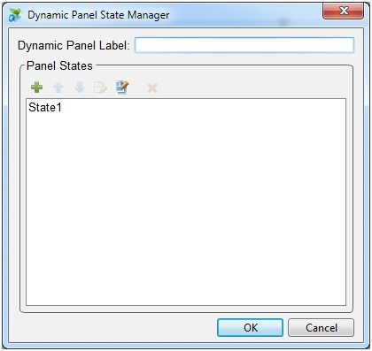
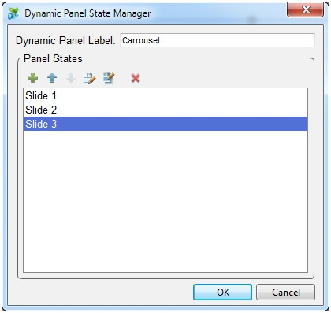
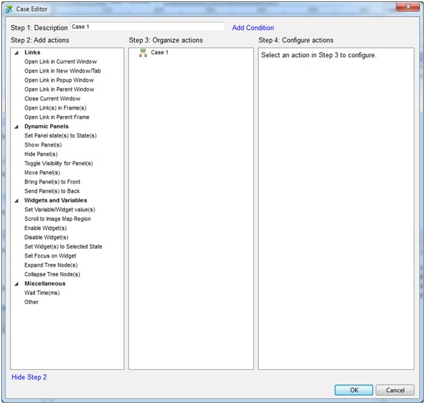
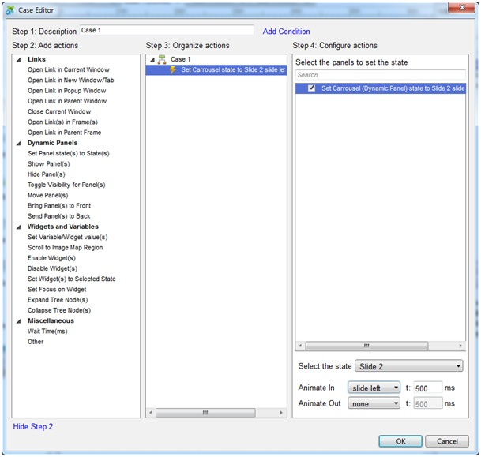

Axure est un logiciel permettant de faire du prototypage de site Web. Vous pouvez faire des maquettes de site assez simplement avant de passer par l'étape de réalisation de la maquette (ou wireframe) sous un logiciel de PAO. Axure embarque des possibilités d'animations que l'on peut retrouver sur certains sites web ce qui est idéal pour montrer le fonctionnement du futur site à son client.

## Mise en place du Dynamic Panel

Axure lancé, insérez un "Dynamic Panel" sur la page souhaitée

Dans le "Dynamic Panel Manager" (en bas à gauche), doubles cliquez sur "Unlabeled" (ou bien clic gauche, "Edit"). La fenêtre "Dynamic Panel State Manager" apparaît.

Dans "Dynamic Panel Label", tapez "Carrousel".
Et dans "Panel States", renommez "State 1" en "Slide 1" puis ajoutez 2 autres "States" que vous renommez "Slide 2" et "Slide 3" puis validez.

## Création du contenu des slides

Doubles cliquez sur chaque States ("Slide 1", "Slide 2" et "Slide 3"). Vous pouvez remarquer que ces derniers ce sont ouverts dans un onglet à leur nom.  
Placez le contenu souhaité dans chacun des slides.  
Ajoutez-y 2 flèches de directions (précédente et suivante) avec l'outil rectangle (pour faire une flèche en forme de triangle : clic droit sur le rectangle, "Edit Button Shape", "Triangle Left" pour précédent, "Triangle Right" pour suivant).

## Passons maintenant aux transitions

Dans le "slide 1", sélectionnez la flèche suivante que vous venez de créer. Dans "Widget Properties" (en haut à droite), doubles cliquez sur "OnClick". La fenêtre "Case Editor".

Cliquez sur "Set Panel state(s) to State(s)" (dans "Dynamic Panels"), cochez "Carrousel (Dynamic Panel)", selectionnez dans "Select the state" le slide suivant, dans le cas présent, "Slide 2".  
Nous allons sélectionner dans "Animate In" l'option de transition "Slide left" pour faire un effet de slide. Une fois ces options définies, cliquez sur "OK".

Répétez cette étape pour les autres slides puis générer votre prototype (touche F5).
