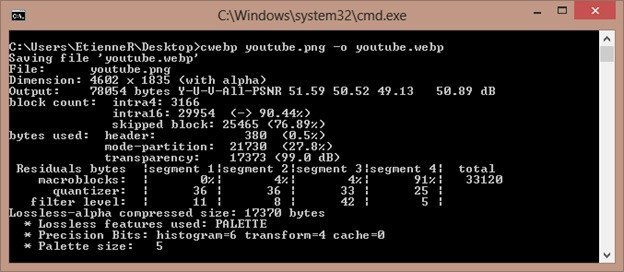
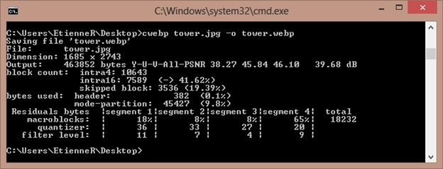

WebP est un nouveau format développé par Google. Il vise à remplacer le PNG, le JPEG et le TIFF en permettant une meilleur compression pour un résultat au plus semblable. Cette performance permet de réduire la taille de 25% à 34% par rapport ses vieux concurrents. A noter que WebP gère la transparence des PNG. A l'heure actuelle de cette rédaction, seuls Chrome (32+) et Opera (19+) peuvent décoder ce nouveau format.

## Téléchargement de la librairie

Allez sur le site de Google dédiés aux développeurs et téléchargez la version adapté à votre système d'exploitation : [https://code.google.com/p/webp/downloads/list?hl=fr](https://code.google.com/p/webp/downloads/list?hl=fr)  
Créez un nouveau dossier dans le dossier "C:/Programmes" (pour la version 64 bits), "C:/Programmes" (pour la version 32 bits) que vous nommez "webp" où vous désipez tous les fichiers présents dans le dossier "libwebp-0.4.0-windows-x..".

## Ajouter la variable système

L'encodage se faisant via la ligne de commande "cwebp", il faut informer Windows de l'emplacement de l'exécutable.  
Dans "Panneau de configuration", allez dans "Système", "Paramètres système avancés", "Variable d'environnement" puis double cliquez sur "Path", à la fin de la ligne ajoutez la ligne suivante :  
Pour la version 64 bits :  
`;C:/Program Files/web/bin`  
Pour la version 32 bits :  
`;C:/Programmes/web/bin`  
Validez  
Lancez l'invite de commande (cmd).  
Tapez "cwebp" afin de confirmer que l'exécutable fonctionne.  
Si vous n'avez pas d'erreur, vous pouvez continuer.

## Encoder une image

Via l'invite de commande, allez dans le dossier où se trouve l'image à convertir (PNG, JPEG ou TIFF).
Tapez la ligne de commande suivante :  
`cwebp mon_image.mon_extension -o mon_image.webp`  
L'image "mon_image.webp" est créée.

Dans l'exemple ci-dessus, l'image en PNG pèse 175 Ko, encodée en WebP, elle ne fait plus que 76.2 Ko avec la même qualité.

Dans le second exemple ci-dessus, l'image JPEG pèse 3.05 Mo, encodée en WebP, elle ne fait plus que 452 Ko avec la même qualité !

## Configurer la qualité de l'image

Pour configurer la qualité de l'image de sortie, c'est simple :
`cwebp –q 0 mon_image.extension -o mon_image.webp`  
L'image générée sera de faible qualité.  
`cwebp –q 100 mon_image.extension -o mon_image.webp`  
L'image générée sera de très grande qualité.  
Pour plus de commande ci-dessous :  
`cwebp -longhelp`

## Sources

- En savoir plus sur le format WebP : [http://fr.wikipedia.org/wiki/WebP](http://fr.wikipedia.org/wiki/WebP) ;
- En savoir plus sur les lignes de commandes cwebp : [https://developers.google.com/speed/webp/docs/cwebp](https://developers.google.com/speed/webp/docs/cwebp) ;
- Liste des navigateurs compatibles avec le WebP : [http://caniuse.com/web](http://caniuse.com/web).
