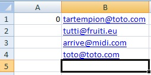

Vous souhaitez importer des nouvelles données dans votre base de données MySQL via PHP My Admin par le biais d'un fichier CSV. Pour autant vous ne souhaitez pas importer des doublons.
Il est possible de remédier facilement à ce problème en mettant en place une déclaration d'unicité.

```sql
CREATE TABLE client(
id_client int(11) NOT NULL AUTO_INCREMENT,
email_client varchar(255) NOT NULL,
PRIMARY KEY (id_client)
)
DEFAULT CHARSET=utf8;

INSERT INTO client (email_client)
VALUES
('toto@toto.com'),
('lorem@ipsum.net');
```

## Création du fichier CSV

Dans un tableau Excel, copiez les adresses email dans la colonne B et mettez 0 (les id des clients étant en auto_increment...) à A1.  
Enregistrez votre fichier sous le format : CSV (séparteur point virgule) (\*.csv).



## Déclaration d'unicité

Allez dans la table concernée (dans cet exemple, le nom de la table sera "client" contenu dans la table "ma_table").  
La clef primaire est "id_client".  
Le champ auquel nous nous intéressons est le champ "email_client". On veut importer les nouvelles adresses des clients en évitant les doublons.  
Sur PMA, allez dans la structure et survolez "Plus" au bout de la ligne "email_client" et cliquez sur "Ajouter un index unique".


ou bien en SQL :

```sql
ALTER TABLE `client` ADD UNIQUE (
`email_client`
);
```

## Testons

On fait le test avec le client ayant pour adresse : toto@toto.com

```sql
INSERT INTO client (email_client)
VALUES ('toto@toto.com');
```

Une erreur SQL vous est retournée : **#1062 - Duplicate entry 'toto@toto.com' for key 'email_client'**
