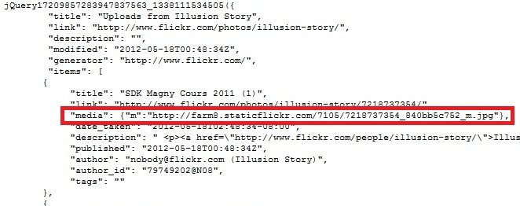

Vous souhaitez afficher un album de votre galerie Flickr sur votre site Web. La méthode de "callback" sert à récupérer des données stockées sur un serveur distant. L'API Flickr permet d'effectuer ce genre de requête combiné avec du jQuery (utilisation de `$.getJSON`) et du JSON (JavaScript Object Notation).

## photosets.getPhotos

Pour récupérer l'id correspondant à l'un de vos albums, copiez le lien url pointant vers l'un de vos albums.  
En copiant le lien, par défaut, l'url se présente sous la forme suivante :  
http://www.flickr.com/photos/nom_de_votre_compte/sets/photoset_id/  
Exemple :  
http://www.flickr.com/photos/etienne-r/sets/72157629339061530  
le "photoset_id" est 72157629339061530  
Pour générer le JSON, allez à l'adresse suivante après vous êtes connecté sur le site :  
http://www.flickr.com/services/api/explore/flickr.photosets.getPhotos :  

* "photoset_id", rentrez l'id de votre album
* "Sortie", sélectionnez JSON

Cliquez sur "Call method" afin de générer le JSON.  
Nous allons nous intéresser à l'URL de callback qui se situe en dessous du cadre où le JSON vient d'être généré car il vous faut copier ce lien dans le code suivant :

```javascript
<div id="container">
	<ul id="images">
</div> 
<script src="http://code.jquery.com/jquery-1.7.2.min.js"></script>
<script>
	$.getJSON("http://api.flickr.com/services/rest/?method=flickr.photosets.getPhotos&api_key=clef-API&photoset_id=le_photoset&extras=original_format&format=json&jsoncallback=?",
function(data){
		// Debut de la boucle
		$.each(data.photoset.photo, function(i,item){
			// Sockage de l'image dans une variable
			var photo = 'http://farm' + item.farm + '.static.flickr.com/' + item.server + '/' + item.id + '_' + item.secret + '_s.jpg';
			// Sockage de l'url dans une variable
			var url= 'http://farm' + item.farm + '.static.flickr.com/' + item.server + '/' + item.id + '_' + item.secret + '_c.jpg';
			// Affichage des images dans la balise ul#images avec le l'url dans la balise li
			$("").attr({src: photo, alt: item.title}).appendTo("#images").wrap("<li><a href=' "+ url +"' title=' "+ item.title +" ' ></a></li>");
		}); //Fin de la boucle
	});
	// Fin appel JSON
</script>
```

Petites explications :

* pour charger une image sur Flickr, il faut qu'elle soit de la forme :
http://farm#.static.flickr.com/serveur/id-photo _id-secret.jpg
* `farm#` : numéro du sous domaine (notion de "ferme de sous domaines")
* `server` : id du serveur
* `id-photo` : identifiant de la photo
* `secret` : identifiant secret de la photo

Le script ci-dessus va chercher le JSON par le biais de `$.getJSON` et va récupérer les données dans une boucle `$.each`. La variable `photo` va stocker le lien de chaque photo au format vignette tandis que la variable `url` va enregistrer l'adresse de chaque photo au format 800px. La troisième et dernière ligne de la boucle permet d'afficher le résultat au format HTML dans la balise dont l'id est image. Cette dernière comportera l'affichage de  la variable photo dans une balise image englobée dans les puces avec l'url de la photo au format 800px.  
Pour la taille de l'image, devant l'extension jpg, on peut mettre les options suivantes :

* `_s` : carré (75 * 75px)
* `_m` : medium (paysage : 240 * 160px - portrait : 160 * 240px)
* `_z` : 640px
* `_c` : 800px

## photo_public.gne

Si vous souhaitez afficher les 20 dernières images d'un compte Flickr, vous pouvez passer par `photo_public.gne` qui est aussi disponible pour les non abonnés.

```javascript
<div id="container">
	<ul id="images">
</div>
<script src="js/http://code.jquery.com/jquery-1.7.2.min.js"></script>
<script>
	// Debut appel JSON
	$.getJSON("http://api.flickr.com/services/feeds/photos_public.gne?id=idGettr-du-compte&format=json&jsoncallback=?",
	function(data){
		// Debut de la boucle
		$.each(data.items, function(i,item){
			// Sockage de l'image dans une variable et remplacement de la taille "m" par la taille "s"
			var min = (item.media.m).replace("_m.jpg", "_s.jpg"); 
			// Affichage des images dans la balise ul#images avec le l'url dans la balise li
			$("").attr("src", min).appendTo("#photos").wrap("<li><a href='" + url + "' '></a><li>");
		});
		// Fin de la boucle
	});
	// Fin appel JSON
</script>
```

Pour obtenir le idGettr allez sur http://idgettr.com   
Si vous souhaitez limiter l'affichage des images à 10 par exemple, il faudra imposer une limite en fin de la boucle `$.each` :

```javascript
if (i == 9) return false; // "9" car la variable i commence à 0
```

## Débogage

Vous pouvez afficher le JSON sous Firebug en allant dans Script (il faut rafraichir la page) puis à droite de "Tous", il y a le nom de la page sur laquelle vous êtes, cliquez sur la flèche pointant vers le bas et sélectionnez le lien en dessous de "api.flickr.com/services/rest/".  
Sous Chrome, allez dans "Scripts" cliquez sur le premier icone à gauche (Scripts navigator) puis allez dans "api.flickr.com" > "Services".  


En effet, dans le mode `photo_public.gne`, vous pouvez observer que l'adresse url de chaque photos est données dans "items" > "media" > "m" ce qui n'est pas le cas dans le mode `photosets.getPhotos`.