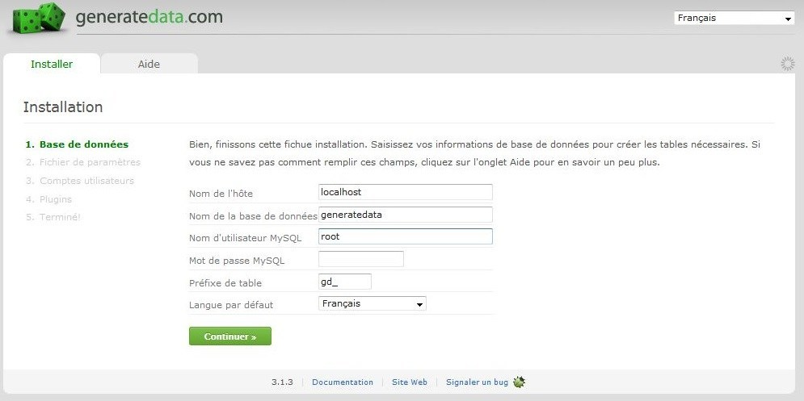
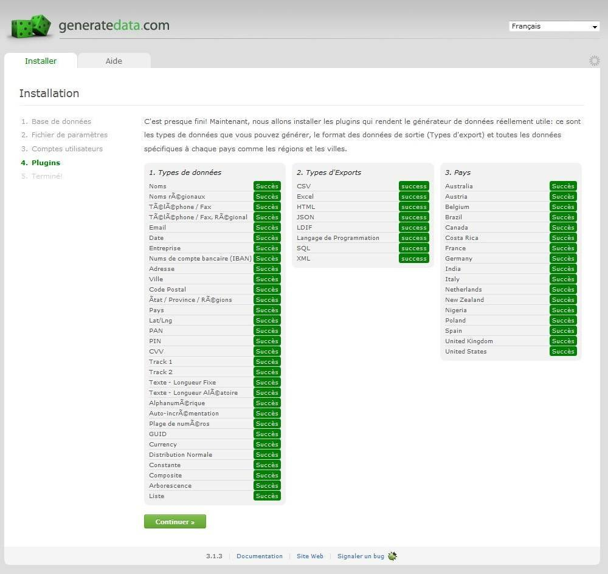
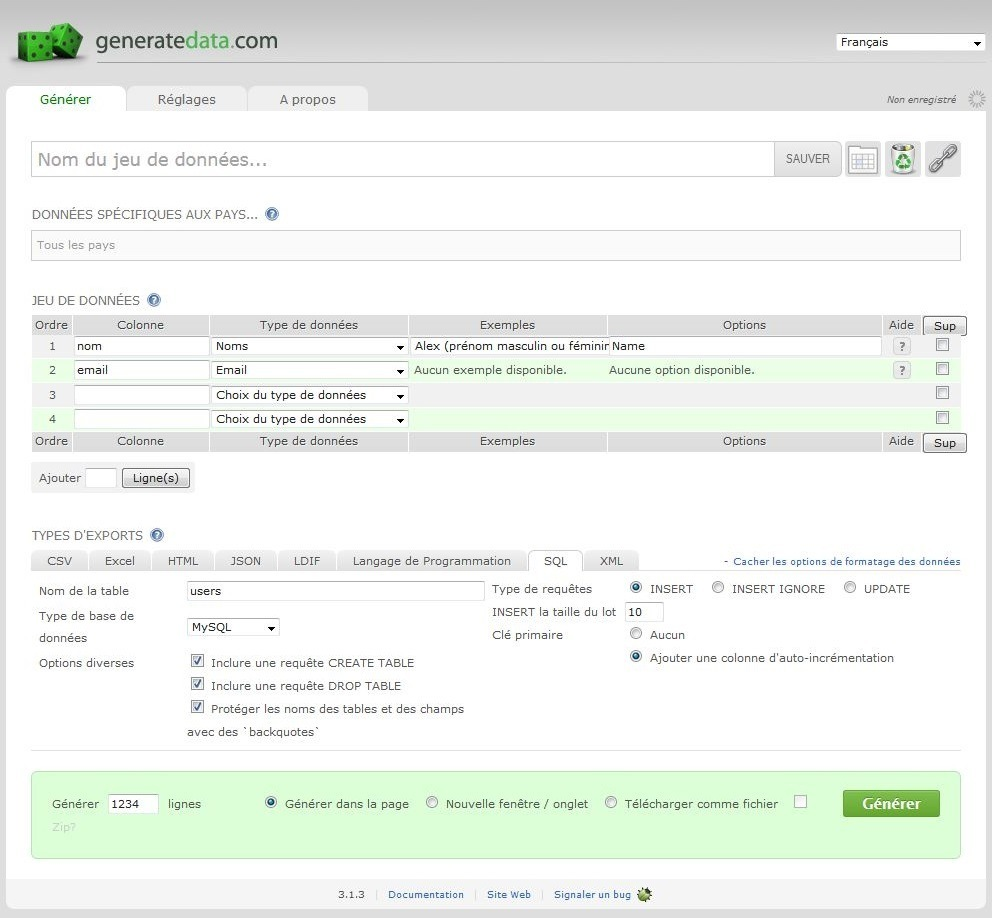
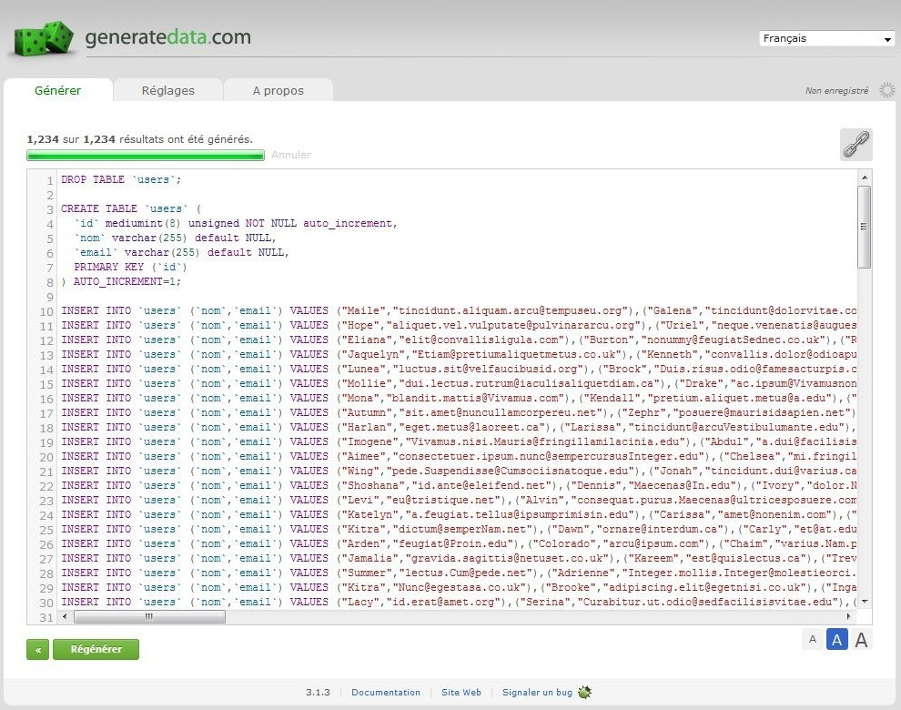

Vous développez une application web et vous avez besoin de faire des tests avec de la data que vous n'avez pas sous la main afin de vérifier le bon fonctionnement de votre site (charge serveur, affichage). Pour cela il existe une application web "Generatedata" disponible à l'adresse suivante : [http://www.generatedata.com/?lang=fr](http://www.generatedata.com/?lang=fr)  
Le site propose de générer des fausses données (une sorte de lorem ipsum) dans de nombreux formats : CSV, Excel, Json, Ldif, SQL, XML mais aussi pour PHP, Javascript, Perl et Python (sous forme de tableau).  
Le nombre d'enregistrements de lignes est limité à 1000 enregistrements à la fois. Si vous désirez en produire d'avantage, l'application est disponible en téléchargement sur le GitHub officiel : [https://github.com/benkeen/generatedata/tags](https://github.com/benkeen/generatedata/tags) en PHP.

## Installation

L'application s'installe comme un CMS.
Dans votre base de données, créez une nouvelle table que vous nommez "generatedata".  
Désipez le dossier de "generatedata-3.1.3" à la racine de votre serveur Apache (dossier "www" par défaut) et renommez-le en "generatedata".  
Connectez-vous sur votre serveur à l'adresse suivante : [http://localhost/generatedata](http://localhost/generatedata) (par défaut).  
Etape 1 : sélectionnez en haut à droite "Français".  
Dans le champ "Nom de l'hôte", indiquez l'adresse de votre serveur de base de données (localhost ou 127.0.0.1 par défaut).  
Dans "Nom de la base" indiquez le nom de la base de donnée ci-dessus "generatedata" puis dans "Nom d'utilisateur MySQL" tapez "root" par défaut et dans "Mot de passe MySQL" indiquez votre mot de passe si vous en possédez un (sinon laissez vide). Cliquez sur "Continuer"

Etape 2 : cliquez sur "Créer un fichier".  
Etape 3 : laissez cocher par défaut "Un seul compte utilisateur, connexion anonyme".  
Etape 4 : cliquez sur "Installer les Plugins". Une fois la fin de la génération des plugins finie, cliquez sur "Continuer".

Etape 5 : vous pouvez désormais vous servir de Generatedata en cliquant sur "Aller au script".

## Utilisation

Dans la colonne "Titre de la colonne" donnez un nom à votre entité, puis sélectionnez quel type de données vous désirez ("nom", "email", "date", etc...).  
Dans "Type d'export" sélectionnez votre langage. En dessous, sélectionnez le nombre de ligne à générer et cliquez sur "Générer".

Generatedata étant un outil génial, vous pouvez lui demander de générer les données directement dans un fichier en cochant "Télécharger comme un fichier" (avant la génération des données).

## Conclusion

Cet outil se révèle indispensable dans la création d'une API afin de mener à bien vos tests de performances.
