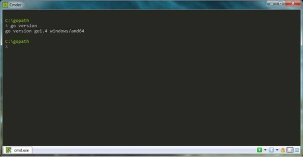
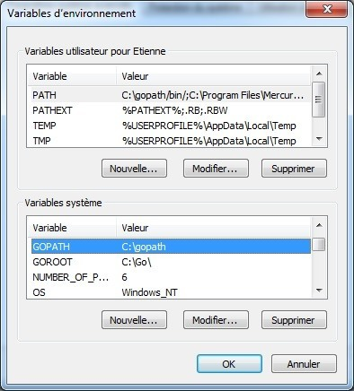
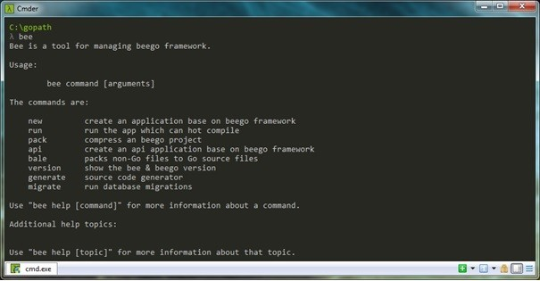
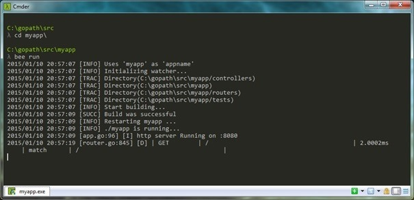
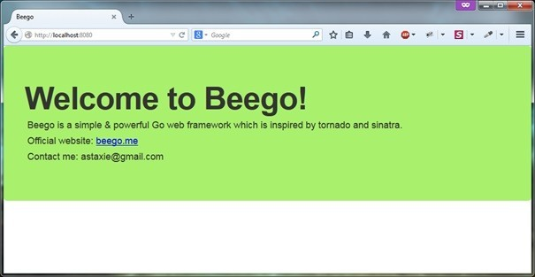
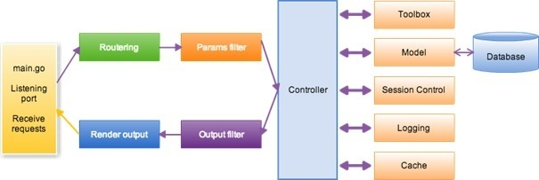
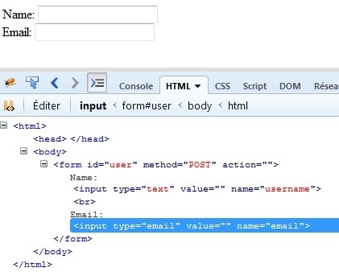
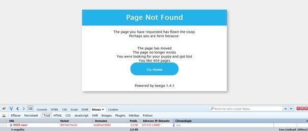

Beego est un framework écrit en Go (diminutif de Golang). Il permet de coder des sites Internet (tout comme Django sur Python, Ruby On Rails sur Ruby, etc…). Dans cette première partie, on va voir comment installer Go et Beego sur une machine Windows, disséquer rapidement le framework, créer une nouvelle page, transférer des données du contrôleur à la vue et mettre en place un formulaire.

## Installation de Golang

Dans un premier temps, si vous n'avez pas encore installé Go sur votre machine, allez sur la page de téléchargement : https://golang.org/dl, téléchargez puis installez Golang.  
Tapez dans votre console `go version`.



Puis, dans un second temps, il crééz un dossier qui va recueillir les fichiers sources du framework Beego mais aussi les autres projets sur Golang.  
Pour ce faire, allez à la racine de votre disque dur et créez le dossier "gopath".  
Créez une nouvelle variable d'environnement que vous nommez "GOPATH" puis dans "Valeur" copier-coller le chemin de votre répertoire "gopath" et validez.



Si vous faites Windows + R et que vous tapez "%gopath%" vous accédez bien à votre répertoire.

Astuce : dans la console Windows, tapez `go env`.

## Téléchargement de Beego

Ouvrez une console Windows et tapez la ligne de commande suivante :  
`go get github.com/astaxie/beego`

Info : avec la commande `go get`, les fichiers sont téléchargés et placés dans le dossier "%gopath%/src/github.com/astaxie/beego".

NB : Le logiciel Git doit être installé sur votre ordinateur. Si "go get" contient une URL avec "code.google.com/[…]" vous aurez besoin du logiciel Mercurial.

## Installation de l'outil "bee tool"

Dans votre dossier "%gopath%", créez un répertoire "bin".
Dans la console Windows tapez :  
`go get github.com/beego/bee`

Recréez une variable d'environnement, mais cette fois, à la suite de la variable "Path" :  
`;%GOPATH%/bin/`

Ouvrez une nouvelle console Windows en mode administrateur et tapez "bee".




## Création d'un nouveau projet

On va maintenant pouvoir passer aux choses sérieuses. Toujours dans la fenêtre de console en mode administrateur, changez de répertoire :

`cd %gopath%/src`  
`bee new myapp`

Cela va générer le projet "myapp" dans "%gopath%/src/myapp".


On peut alors lancer le serveur en se plaçant d'abord dans le répertoire de notre application :

`cd myapp`

Puis, on exécute notre application :

`bee run`

Cette commande va compiler un exécutable "myapp.exe" qui n'est autre que le serveur Web sur le port 8080 par défaut. Lorsque vous modifierez un fichier de votre projet avec l'extension go, le serveur redémarra automatiquement pour ainsi, recompiler votre application.  
Vous pouvez désormais ouvrir votre navigateur Web préféré sur l'adresse locale : http://localhost:8080



Attention : si vous avez un serveur Web traditionnel (Apache, Nginx, IIS, etc...) en cours d'exécution, le port 8080 peut rentrer en conflit. Si ce dernier vous handicape, vous pouvez le changer dans le fichier "conf/app.conf". Editez la valeur contenue dans la variable intitulée "httport" (ligne 2). Vous devez alors relancer votre serveur pour prendre en compte cette modification.



## Architecture MVC de l'application

* "conf" : le fichier de configuration
* "controllers" : les contrôleurs
* "models" : les modèles
* "routers": le fichier de routage
* "static" : pour les fichiers de type css, images et javascript dans leur dossier respectif
* "test" : les fichiers de test
* "views" : les vues

## Comment ça fonctionne ?



Comme sur un MVC classique.
Le routeur appelle le contrôleur qui à son tour affiche la vue.  

Le contrôleur ("controllers/defaut.go") :

```go
package controllers

import (
	"github.com/astaxie/beego"
)

type MainController struct {
	beego.Controller
}

func (this *MainController) Get() {
	this.Data["Website"] = "beego.me"
	this.Data["Email"]   = "astaxie@gmail.com"
	this.TplNames = "index.tpl"
}
```

La vue (views/index.tpl) :

```html
<h1>Welcome to Beego!</h1>
<p class="description">
	Beego is a simple & powerful Go web framework which is inspired by tornado and sinatra.
<br />
	Official website: <a href="http://{{.Website}}">{{.Website}}</a>
<br />
	Contact me: {{.Email}}
</p>
```

Beego utilise le moteur de templating natif de Go ("html/template"). Bien entendu, vous pouvez le changer par un autre.

Les données sont bien transmises du contrôleur vers la vue et la page est accessible grâce à la table de routage contenue dans la fonction "init" du fichier de routage par défaut "routers/router.go" :

```go
package routers

import (
	"someone/controllers"
	"github.com/astaxie/beego"
)

func init() {
	beego.Router("/", &controllers.MainController{})
}
```

La fonction de base du contrôleur appelée par le fichier de routage par défaut est "Get()" (contrairement à "Index()" dans de nombreux frameworks en PHP).

## Créons notre première page.

Dans le dossier "controllers" créez un nouveau contrôleur "test.go".
A l'intérieur, on reprend le même en-tête que le contrôleur "defaut.go", c'est-à-dire :

```go
package controllers

import (
	"github.com/astaxie/beego"
)
```

Puis on déclare notre contrôleur en lui attribuant un nom :

```go
type TestController struct {
	beego.Controller
}
```

Ensuite, on déclare nos variables ainsi que le template que l'on désire charger :

```go
func (this *TestController) About() {
	this.Data["title"]   = "About"
	this.Data["content"] = "Lorem Ipsum"

	this.TplNames = "test/about.tpl"
}
```

Attention : bien mettre des doubles quotes et non des simples quotes (mauvais réflexe de développeur PHP... et sur Golang, c'est le Mal !).

Dans "routers/router.go" (dans la fonction "init"), à la suite du code actuel, rajoutez cette route :

```go
beego.Router("/about", &controllers.TestController{}, "get:About")
```

Explications :

- En 1er paramètre, on indique l'URI (Uniform Resource Identifier) de notre application ("/about").  
- En 2nd paramètre, on indique le contrôleur ("TestController").  
- En 3ème paramètre, on indique la fonction de notre contrôleur concernée ("About").  
Bee re-compile comme un grand et relance le serveur. 

Si vous vous rendez sur la page dédiée (http://localhost:8080/about), vous aurez droit au message classique :

`someone:can't find templatefile in the path:test/about.tpl`

En effet, Beego nous signale que le fichier template appelé dans le contrôleur "Test" n'existe pas.
Pour régler cela, dans le dossier "views", créez un nouveau dossier "test" puis un nouveau fichier template "about.tpl" :

```html
<h1>{{.title}}</h1>
<p>{{.content}}</p>
```

## Les routes dynamiques

On veut créer une URL du type : http://localhost:8080/author/robert  
Dans le contrôleur "test.go", ajoutez la fonction ci-dessous :

```go
func (this *TestController) Author() {
	this.Data["title"] = this.Ctx.Input.Param(":name")

	this.TplNames = "test/about.tpl"
}
```

Et dans le fichier de routage ("routers/routes.go"), ajoutez la route suivante :

```go
beego.Router("/author/:name", &controllers.TestController{}, "get:Author")
```

http://localhost:8080/author/robert est accessible.

## Formulaire 

Allons plus loin avec les formulaires. Après la déclaration de notre contrôleur "test.go", mettez en place la structure suivante :

```go
type user struct {
	Id	  int	 `form:"-"`
	Name  string	`form:"username"`
	Email string	`form:"email,email"`
}
```

Puis, créez une nouvelle fonction dans le contrôleur :
```go
func (this *TestController) User() {
	this.Data["Form"] = &user{}
	this.TplNames	 = "test/add_user.tpl"
}
```

Dans le répertoire "views/test", créez un nouveau fichier template que vous nommez "add_user.tpl".

```html
<form id="user" action="" method="POST">
	{{.Form | renderform}}
</form>
```

Ensuite, dans le fichier route :
```go
beego.Router("/user", &controllers.TestController{}, "get:User")
```

En vous rendant sur la page du formulaire, http://localhost:8080/user, Beego a créé automatiquement un formulaire à partir des 2 champs renseignés dans la structure "user" de notre contrôleur "Test".



Sauf qu'il manque quelque chose sur ce formulaire… Avant la fin de la balise de fermeture du formulaire (```</form>```), ajoutez le bouton de soumission des données :

```html
<br />
<input type="submit" value="Envoyer" />
```

On va afficher le résultat dans une autre vue ("test/result_user.tpl") :

```html
<h1>{{.username}}</h1>
<h2>{{.email}}</h2>
```

Ces variables mentionnées ci-dessus, ont besoin d'être définies dans le contrôleur. Ce sont les variables récupérées depuis notre formulaire. A la suite dans notre fonction "User", ajoutez la condition suivante :

```go
	if this.Ctx.Input.Method() == "POST" {

		this.Data["username"] = this.Input().Get("username")
		this.Data["email"]	= this.Input().Get("email")

		this.TplNames = "test/result_user.tpl"
	}
```

Et là, vous vous dites que le formulaire à l'adresse http://localhost:8080/user… marche sauf que lors de l'envoi des données une erreur de type 404 apparait.



Allez dans votre fichier de routage et spécifiez que vous désirez à la fois du GET et du POST comme type de requêtes HTTP sur la page "/user".
Remplacez donc :

```go
beego.Router("/user", &controllers.TestController{}, "get:User")
```

Par :

```go
beego.Router("/user", &controllers.TestController{}, "get,post:User")
```

Désormais, le formulaire peut envoyer des données via POST.

En ce qui concerne le parsage automatique du formulaire, rapide à déployer, hélas, ce dernier est assez limité car il ne propose pas d'inclure de label et il n'est pas possible d'ajouter un id ou une classe pour chaque champ d'un formulaire (input et textarea).

## Upgrade du framework

Avant de terminer cet article, j'ai mis à jour Beego (de la version 1.4.1 vers 1.4.2) en tapant simplement la commande ci-dessous :

`go get –u github.com/astaxie/beego`


## Conclusion 

Beego est un framework Web qui permet de se mettre doucement au Golang, même si il est recommandé de connaitre les bases du langage au préalable. Conçu par des ingénieurs de chez Google, il fait beaucoup parler de lui en ce moment, principalement dans les benchmarks.

## Sources

* Le site officiel de Beego : http://beego.me
* Moteur de templating natif : http://golang.org/pkg/html/template
* Autres moteurs de templating en Go : https://github.com/avelino/awesome-go#template-engines
* S'initier à Golang : https://tour.golang.org
* Benchmark regroupant plusieurs langages et framework (dont Go et Beego) : http://www.techempower.com/benchmarks