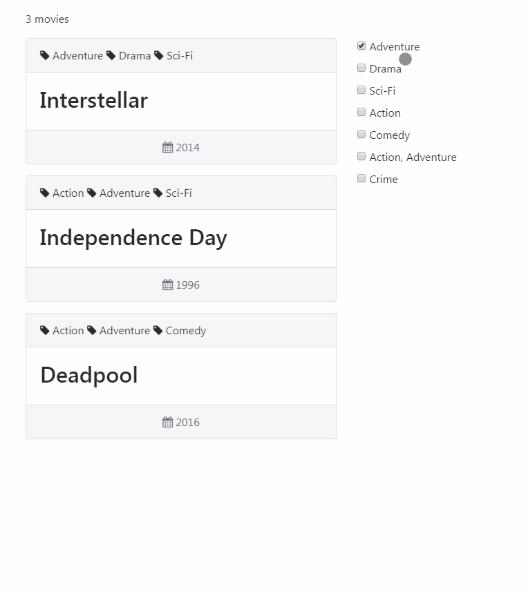

La méthode `filter` permet de créer un tableau contenant les éléments filtrés d'un autre tableau. Cette méthode est utilisée dans les frameworks JS comme Angular, Vue, etc... mais elle vient avant tout de la programmation fonctionnelle.



## Anatomie d'un filtre

On met en place une fonction qui va nous servir de filtre.

```javascript
function Monfiltre(element, index, self) {
  console.log(element);
  console.log(index);
  console.log(self);
}
```

On peut mettre 3 paramètres dans le callback d'un filtre :

- la valeur de l'élément courant (obligatoire) (string);
- l'index de l'élément courant (number);
- l'objet Array traversé (array).

`filter()` ne modifie pas le tableau filtré.

## Premiers filtres

On commence avec un tableau simple constitué de plusieurs éléments.

```javascript
let agrumes = ['orange', 'citron', 'clémentine', 'mandarine'];
```

Et avec notre premier filtre en trouvant une correspondance dans le tableau "agrumes" créé précédement.

```javascript
let result = agrumes.filter(function(element) {
  return element == 'orange';
});

console.log(result);  // [ "orange" ]
console.log(agrumes); // [ "orange", "citron", "clémentine", "mandarine" ] résultat inchangé :)
```

On peut également déclarer ce filtre avec une expression de fonction fléchée afin d'écrire le code (de façon lisible) sur une seule ligne.

```javascript
let result = agrumes.filter( (element) => element == 'orange' );
```

C'est bien sympa un tableau simple mais traitons avec un tableau multidimensionnel.

```javascript
let recipes = [
  {
    'title': 'Jus d\'orange',
    'ingredients': ['orange']
  },
  {
    'title': 'Tarte aux agrumes',
    'ingredients': ['farine', 'beurre', 'sucre', 'oeuf', 'citron', 'orange', 'clémentine']
  },
  {
    'title': 'Citronnade',
    'ingredients': ['eau', 'citron']
  }
];
```

On crée un filtre, pour aller chercher dans l'attribut "ingredients".

```javascript
let match = recipes.filter(function(element) {
  for (let i = 0; i < element.ingredients.length; i++) {
    if (element.ingredients[i] === 'citron') {
      return element;
    }
  }
});

console.table(match); // Retourne les 2 dernières lignes
```

## Filtres avancés

Dans un nouveau tableau, on a une liste de films dont chacun contient un titre, un ou plusieurs type(s) et une année.

```javascript
let movies = [
  {
    'title': 'Interstellar',
    'type': ['Adventure', 'Drama', 'Sci-Fi'],
    'year': 2014
  },
  {
    'title': 'Independence Day',
    'type': ['Action', 'Adventure', 'Sci-Fi'],
    'year': 1996
  },
  {
    'title': 'Deadpool',
    'type': ['Action', 'Adventure', 'Comedy'],
    'year': 2016
  },
  {
    'title': 'Batman Begins',
    'type': ['Action, Adventure'],
    'year': 2005
  },
  {
    'title': 'Bad Boys',
    'type':  ['Action', 'Comedy', 'Crime'],
    'year': 1995
  }
];
```

On veut trouver un ou plusieurs film(s) de type "Action" ou "Sci-Fi" et dont la date de sortie est avant 2010. On commence par les 2 types.

```javascript
function OldMovies(element) {
  for (let i = 0; i < element.type.length; i++) {
    // film de type "Action" OU "Sci-Fi"
    if (element.type[i] == 'Action' || element.type[i] == 'Sci-Fi') {
      return element;
    }
  }
}

console.table(movies.filter(OldMovies));
```

Le resultat nous retourne un tableau de 5 lignes de résultats : "Interstellar", "Independance Day", "Deadpool", "Batman Begins" et "Bad Boys". Dans la boucle de notre filtre, on ajoute la condition pour la date.

```javascript
function OldMovies(element) {
  for (let i = 0; i < element.type.length; i++) {
    // film de type "Action" OU "Sci-Fi" et datant d'avant 2010
    if ( (element.type[i] == 'Action' || element.type[i] == 'Sci-Fi') && element.year < 2010) {
      return element;
    }
  }
}
```

On n'oublie pas de mettre les 2 premières conditions entre parenthèses sinon le résultat est biaisé et on a bien le résultat désiré avec les 3 films : "Independance Day", "Batman Begins" et "Bad Boys".

On obtient le même résultat mais avec les paramètres "index" et "self" sur une seule ligne et sans boucle

```javascript
function OldMovies(element, index, self) {
  return self[index].type == "Adventure", "Action" && self[index].year < 2010;
}
```

Remarque : cette méthode d'écriture ne fonctionne que s'il y a plusieurs valeurs à rechercher (dans notre exemple "Adventure" et "Action").

Jamais 2 sans 3, on peut également filtrer en utilisant `indexOf`.

```javascript
function OldMovies(element) {
  return (element.type.indexOf("Adventure") !== -1 || element.type.indexOf("Action") !== -1) && element.year < 2010;
}
```

Un second filtre pour la route : les films de type "Action" et "Adventure" sortis après ou en 2005. Pour cela, on préféra utiliser `indexOf`.

```javascript
function RecentsMovies(element) {
  return (element.type.indexOf("Action") !== -1 && element.type.indexOf("Adventure") !== -1) && element.year >= 2005;
}
```

## Quelques exemples

### Première ou dernière lettre

```javascript
let fruits = ['apple', 'avocado', 'banana', 'cherry'];
```

On veut récupérer le ou le(s) élément(s) dont la première lettre est "a".

```javascript
function FirstLetter(item) {
  if (item.substring(0,1) == 'a') {
    return fruits;
  }
}

console.log(fruits.filter(FirstLetter)); // [ "apple", "avocado" ]
```

On veut récupérer le ou les élément(s) dont la dernière lettre est "a".

```javascript
function LastLetter(item) {
  if (item.slice(-1) == 'a') {
    return arr;
  }
}

console.log(fruits.filter(LastLetter)); // Array [ "banana" ]
```

### Nombres paires ou impaires

Si vous êtes familier avec ce genre d'exercice dans d'autres langage de programmation, vous vous doutez que le plus simple est d'utiliser le modulo.

```javascript
let numbers = [1, 2, 3, 4, 5, 6, 7, 8, 9, 10];
```

On veut récupérer les numéros paires d'une chaine d'entiers.

```javscript
function Even(item) {
  return item % 2 == 0;
}

console.log(numbers.filter(Even)); // [ 2, 4, 6, 8, 10 ]
```

On veut récupérer les numéros impaires d'une chaine d'entiers.

```javascript
function Odd(item) {
  return item %2 !== 0;
}

console.log(numbers.filter(Odd)); // [ 1, 3, 5, 7, 9 ]
```

### Supprimer un item

Au lieu d'utiliser la fonction native `splice` pour supprimer un élément du tableau, on peut utiliser un filtre.

```javascript
let item   = 'banane'; // item à supprimer  
let fruits = ['pomme', 'banane', 'abricot']; // tableau existant

fruits = fruits.filter(function(element) {
  return element !== item;
});

console.log(fruits); //Array [ "pomme", "abricot" ]
```

### Supprimer les doublons

Dans un tableau de données, il se peut qu'il y ait des doublons. Pour les supprimer, un simple filtre suffit.

```javascript
let doublons = ['citron', 1, 'citron', 2, '1'];

function Unique(element, index, self) {
  return self.indexOf(element) === index;
}

console.log(doublons.filter(Unique)); // [ "citron", 1, 2, "1" ]
```

Ce filtre marche avec n'importe quel type de valeurs (chaine de caractère, entiers, etc...) car on demande de retourner les valeurs. On peut également l'adapter pour afficher tous les types de nos films en commencant par récupérer tous les types.

```javascript
let types = [];

// Chaque ligne (film)
for (let i = 0; i < movies.length; i++) {

  // Chaque "type" dans chaque ligne (film)
  for (let j = 0; j < movies[i].type.length; j++) {
    types.push(movies[i].type[j]);
  }

}

console.log(types.filter(Unique)); // [ "Adventure", "Drama", "Sci-Fi", "Action", "Comedy", "Crime" ]
```

### Une valeur unique d'un tableau

Soit un tableau contenant plusieurs lignes.

```javascript
let characters = [
  { id: 1, lastname: 'Doe', firstname: 'Jane' },
  { id: 2, lastname: 'Doe', firstname: 'John' },
  { id: 3, lastname: 'Connor', firstname: 'Sarah' },
  { id: 4, lastname: 'Connor', firstname: 'John' }
];
```

On souhaite récupérer la troisième ligne dont l'id est 3.

```javascript
let id = 3;
let getIdCharacter = characters.filter(function(element) {
  return element.id === id;
})[0];

console.log(getIdCharacter); // { id: 3, lastname: "Connor", firstname: "Sarah" }
```

Remarque : si vous cherchez une valeur en double (exemple : "firstname" = "John"), le résultat affiché sera la 1ère ligne du tableau contenant cette valeur.

## TP : Filtrer le contenu d'un tableau

On veut afficher la liste des types de films dans des checkbox ainsi que la liste complète des films. Lorsque l'utilisateur coche une ou plusieurs checkbox, alors on filtre suivant le type coché.

### Préparation HTML

Une petite interface Booststrap 4 (version alpha) pour simplifier l'habillage graphique de notre future application.

```html
<!DOCTYPE html>
<html>
<head>
  <meta charset="UTF-8">
  <meta name="viewport" content="width=device-width, initial-scale=1">
  <title>Movies - Filter</title>
  <link rel="stylesheet" href="https://maxcdn.bootstrapcdn.com/bootstrap/4.0.0-alpha.6/css/bootstrap.min.css">
  <link rel="stylesheet" href="https://maxcdn.bootstrapcdn.com/font-awesome/4.7.0/css/font-awesome.min.css">
</head>
<body class="container" style="margin-top: 1rem;">
  <p id="count"></p>
  <div class="row">

    <section id="movies" class="col-md-8">
      <!-- Liste des films -->
    </section>

    <ul id="types" class="col-4 list-unstyled">
      <!-- Liste des types de films sous forme de checkboxes-->
    </ul>

  </div>

<script>
  // Ici le code JavaSript
</script>
</body>
</html>
```

### Initialisation

Il existe plusieurs moyen d'arriver à ses fins sur JavaScript. Je vous propose d'instancier l'application dans une function.

```javascript
let movies = [...] // contenu de la variable inchangé (remplacer [...] par le vrai tableau)

let app = new function() {
  // Récupération des données
  this.movies = movies;

  // La suite
}
```

### Listage des films

Dans une nouvelle fonction on sélectionne la div "movies". On créé une variable vide qui va recevoir l'ensemble du code HTML dans la boucle. Cette dernière boucle dans le tableau des films contenus dans la variable "data" appelée en paramètre dans la fonction. On affiche ces données via la fonction native `innerHTML`. Puis on fait appel à une fonction `Count` que l'on va créé à la suite.

```javascript
// Affiche les films (tous par défaut)
this.FetchAll = function(data) {
  // Selection de l'élément
  let elMovies = document.getElementById('movies');

  let htmlMovies = '';

  for (let i in data) {
    htmlMovies += '<article class="card mb-3"><div class="card-header">';
    for (let j in data[i].type) {
      htmlMovies += '<i class="fa fa-tag" aria-hidden="true"></i> ' + data[i].type[j] + ' ';
    }
    htmlMovies += '</div>';
    htmlMovies += '<div class="card-block"><h2>' + data[i].title + '</h2></div>';
    htmlMovies += '<div class="card-footer text-muted text-center"> <i class="fa fa-calendar" aria-hidden="true"></i> ' + data[i].year + '</div>';
    htmlMovies += '</article>';
  }

  // Affichage de l'ensemble des lignes en HTML
  elMovies.innerHTML = htmlMovies;

  // Affiche le nombre de films
  this.Count(data);
};
```

Déclarée précédement, on créé la fonction "this.Count" pour afficher le nombre de films dans la div "count".

```javascript
// Retourne le nombre de films
this.Count = (data) => document.getElementById('count').innerHTML = data.length + ' movies';
```

Pour afficher le résultat de cette fonction, il faut appeler la fonction "FetchAll" en dehors de la fonction "app".

```javascript
let app = new function() {
  // Contenu inchangé
}

// Affichage de tous les films
app.FetchAll(movies);
```

### Listage des types

On a besoin de récupérer tous les types des films. Dans un premier temps on récupère tous les types dans un tableau. Puis dans un second temps, on supprime l'ensemble des doublons présent dans le tableau à l'aide d'un filtre. Enfin dans un troisième temps d'afficher la liste filtrée des types.

```javascript
// Retourne la liste des checkboxes
this.DisplayFilters = function() {
  // Selection de l'élément
  let elTypes = document.getElementById('types');
  let types   = [];

  // Chaque ligne (film)
  for (let i in movies) {

    // Chaque "type" dans chaque ligne (film)
    for (let j in movies[i].type) {
      types.push(movies[i].type[j]);
    }

  }

  let uniqueTypes = types.filter( (value, index, self) => self.indexOf(value) === index );
  let htmlTypes = '';

  for (let i in uniqueTypes) {
    htmlTypes += '<li><input type="checkbox" id="' + uniqueTypes[i] + '" name="types[]" value="' + uniqueTypes[i] + '"> <label for="' + uniqueTypes[i] + '">' + uniqueTypes[i] + '</label></li>';
  }

  elTypes.innerHTML = htmlTypes;
};
```

On va utiliser ces fonctions dans la prochaine fonction, celle du triage.

### Trie

Pour chaque checkbox cochée, on doit créer un évenement. Si on coche une valeur, alors on stocke la valeur du choix coché. Il faut gérer l'évènement inverse, c'est-à-dire si l'utitlisateur décoche la case alors il faut supprimer cette valeur du tableau.

```javascript
// Retourne les films filtrés
this.FilterByType = function() {
  // Afiche les checkboxes
  this.DisplayFilters();

  let checkboxes = document.querySelectorAll('input');
  let arrType    = [];
  let self       = this;

  for (let checkbox of checkboxes) {
    checkbox.addEventListener('click', function() {
      if (checkbox.checked) {
        // Ajout dans le tableau de la valeur cochée
        arrType.push(checkbox.value);
      } else {
        // Suppression dans le tableau
        let removeItem = arrType.filter( (e) => e !== checkbox.value );

        arrType = removeItem;
      }

      // Ici la suite du code
    });

  }

};
```

A partir de ce tableau, on peut gérer le filtrage des films. En se basant sur la longueur du tableau des choix, on peut effectuer les tris et retourner un nouveau tableau en paramètre de la fonction `FetchAll`.

```javascript
if (arrType.length > 0) {
  let i = arrType.length - 1;
  // 1er choix
  if (arrType.length == 1) {
    filteredMovie = self.movies.filter( (e) => e.type.indexOf(arrType[0]) !== -1 );
  // Autre(s) choix
  } else {
    filteredMovie = filteredMovie.filter(function(e) {
        for (let j = 0; j < i; j++) {
          return e.type.indexOf(arrType[i]) !== -1;
        }
    });
  }

  self.FetchAll(filteredMovie);
} else {
  // Reset (aucune case cochée)
  app.FetchAll(movies);
}
```

Pour afficher le résultat de cette fonction, il faut appeler la fonction `FilterByType` en dehors de la fonction `app`, à la suite de `FetchAll`.

```javascript
let app = new function() {
  // Contenu inchangé
}

// Affichage de tous les films
app.FetchAll(movies);
// Filtrage
app.FilterByType();
```

## Conclusion

On a fait le tour des filtres en JavaScript. Concernant le TP, libre à vous de le modifier à votre gout en appelant par exemple la liste des films à partir d'un fichier JSON (voir d'une API), ajouter un champ de recherche pour rechercher par titre, trier avec un champ de type range pour les années, etc...
