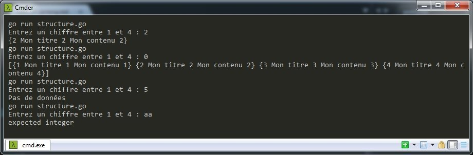
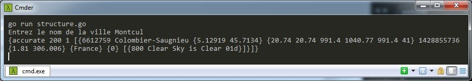

Les structures font parties des fondamentaux de Golang notamment dans le développement Web où elles sont utilisées dans les modèles lors de développement d'applications en MVC. Elles permettent également de travailler à partir de fichiers de type Json ou XML facilement. Une structure retournera des données sous formes de tableau de différent typages (entier, chaine de carcatères, décimal, etc...).

## Déclaration d'une structure

On déclare une structure de la manière suivante.

```go
type Post struct {
    // Futur contenu de notre structure
}
```

Il ne reste plus qu'à compléter notre structure.

```go
type Post struct {
    Id int64
    Title string
    Content string
}
```

En résumé, on a notre structure nommée "Post" qui contient un champ "Id" de type entier et 2 chaines de caractères "Title" et "Content".

Attention : le nom d'une structure et le nom des valeurs qui la compose commencent toujours par une lettre !

## Lecture de notre structure

On va maintenant rendre notre structure "Post" opérationnelle. Autrement dit, on va l'appeler et y introduire les données ci-dessous.

```go
post := Post{1, "Mon titre", "Mon contenu"}
```

Dans la variable "post", on importe le contenu de la structure "Post". Ce qui donne.

```go
package main

import (
    "fmt"
)

type Post struct {
    Id             int
    Title, Content string
}

func main() {
    post := Post{1, "Mon titre", "Mon contenu"}
    fmt.Print(post) // {1 Mon titre Mon contenu}
}
```

On peut aussi appeler la structure en précisant chaque nom des champs.

```go
post := Post{
    Id:      1,
    Title:   "Mon titre",
    Content: "Mon contenu",
}
```

Ou encore.

```go
post := Post{}
post.Id = 1
post.Title = "Mon titre"
post.Content = "Mon contenu"
```

Le résultat final sera toujours le même.

## Cas pratique avec du JSON

### Structure simple

On veut ouvrir un fichier "post.json" (présent dans le même dossier que le fichier Go) dont la structure est la suivante.

```json
{"id: 1", "title": "Mon titre 1", "content": "Mon contenu 1"}
```

On édite notre code.

```go
package main

import (
    "fmt"
    "io/ioutil"
)

type Post struct {
    Id             int
    Title, Content string
}

func main() {
    file, err := ioutil.ReadFile("post.json")

    if err == nil {
        fmt.Println(file)
    } else {
        fmt.Print(err)
    }
}
```

On ouvre le fichier json via "ioutil.ReadFile" (fonction de la librairie **io/ioutil**). S'il n'y a pas d'erreur, on affiche le contenu de la variable "json". Sinon, on affiche une erreur. Normalement, notre code fonctionne mais renvoie des données non exploitables. On ré-édite notre code pour décoder ces données.

```go
package main

import (
    "encoding/json"
    "fmt"
    "io/ioutil"
)

type Post struct {
    Id             int
    Title, Content string
}

func main() {
    file, err := ioutil.ReadFile("post.json")

    if err == nil {
        var post Post
        json.Unmarshal(file, &post)
        fmt.Println(post)
    } else {
        fmt.Print(err)
    }
}
```

Concrètement, on déclare une variable "post" accompagnée de la structure "Post". Puis, on utilise la fonction "json.Unmarshal" de la librairie **encoding/json** pour décoder le contenu au format Json présent dans le fichier "post.json" (via la variable "file") avec la structure "Post". Ensuite, on affiche le résultat.

On modifie le fichier Json en ajoutant des lignes supplémentaires.

```json
[
    {"id": 1, "title": "Mon titre 1", "content": "Mon contenu 1"},
    {"id": 2, "title": "Mon titre 2", "content": "Mon contenu 2"},
    {"id": 3, "title": "Mon titre 3", "content": "Mon contenu 3"},
    {"id": 4, "title": "Mon titre 4", "content": "Mon contenu 4"}
]
```

Le résultat affichera `{0  }` :(  
Remplacez `var post Post` par `var post []Post` car il s'agit d'un tableau de données.

Remarque : votre fichier Json ne doit pas comporter de code commenté !

On peut ainsi lui demander de n'afficher que la 1ère et 3ème ligne du fichier.

```go
package main

import (
    "encoding/json"
    "fmt"
    "io/ioutil"
)

type Post struct {
    Id      int
    Title, Content string
}

func main() {
    file, err := ioutil.ReadFile("post.json")

    if err == nil {
        var post []Post
        json.Unmarshal(file, &post)
        fmt.Println(post[0]) // {1 Mon titre 1 Mon contenu 1}
        fmt.Println(post[2]) // {3 Mon titre 3 Mon contenu 3}
    } else {
        fmt.Print(err)
    }
}
```

Exercice :  
On va interagir avec l'utilisateur en lui proposant 2 options :

- Afficher toutes les lignes ;
- Afficher une ligne en particulier.

```go
package main

import (
    "encoding/json"
    "fmt"
    "io/ioutil"
)

type Post struct {
    Id             int
    Title, Content string
}

func main() {
    var number int

    file, err := ioutil.ReadFile("post.json")

    if err == nil {
        var post []Post
        json.Unmarshal(file, &post)

        max := len(post)

        fmt.Printf("Entrez un chiffre entre 1 et %d : ", max)
        _, err := fmt.Scanf("%d", &number)

        if err != nil {
            fmt.Println(err)
        } else if number == 0 {
            fmt.Print(post) // Affiche toutes les données
        } else if number > max {
            fmt.Print("Pas de données")
        } else {
            fmt.Println(post[number-1])
        }
    }
}
```



### Structure avancée

Au lieu de créer un Json avec une structure avancée, on va piocher dans l'API du site de météorologie openweathermap.org, plus précisément sur [http://api.openweathermap.org/data/2.5/find?q=Washington&units=metric](http://api.openweathermap.org/data/2.5/find?q=Washington&units=metric) qui retourne ce genre de JSON.

```json
  {

    "message":"accurate",
    "cod":"200",
    "count":4,
    "list":[
        {
            "id":2634715,
            "name":"Washington",
            "coord":{
                "lon":-1.51667,
                "lat":54.900002
            },
            "main":{
                "temp":7.98,
                "temp_min":7.98,
                "temp_max":7.98,
                "pressure":1020.08,
                "sea_level":1034.48,
                "grnd_level":1020.08,
                "humidity":74
            },
            "dt":1427981672,
            "wind":{
                "speed":2.01,
                "deg":344
            },
            "sys":{
                "country":"GB"
            },
            "clouds":{
                "all":80
            },
            "weather":[
                {
                    "id":803,
                    "main":"Clouds",
                    "description":"broken clouds",
                    "icon":"04d"
                }
            ]
        },
        {
            "id":4915545,
            "name":"Washington",
            "coord":{
                "lon":-89.40731,
                "lat":40.703651
            },
            "main":{
                "temp":17.98,
                "temp_min":17.98,
                "temp_max":17.98,
                "pressure":994.79,
                "sea_level":1019.2,
                "grnd_level":994.79,
                "humidity":83
            },
            "dt":1427981672,
            "wind":{
                "speed":7.76,
                "deg":223
            },
            "sys":{
                "country":"US"
            },
            "rain":{
                "3h":1.73
            },
            "clouds":{
                "all":92
            },
            "weather":[
                {
                    "id":500,
                    "main":"Rain",
                    "description":"light rain",
                    "icon":"10d"
                }
            ]
        },
        {
            "id":5549222,
            "name":"Washington",
            "coord":{
                "lon":-113.508293,
                "lat":37.130539
            },
            "main":{
                "temp":6.98,
                "temp_min":6.98,
                "temp_max":6.98,
                "pressure":859.02,
                "sea_level":1024.06,
                "grnd_level":859.02,
                "humidity":30
            },
            "dt":1427981672,
            "wind":{
                "speed":1.01,
                "deg":304.5
            },
            "sys":{
                "country":"US"
            },
            "clouds":{
                "all":0
            },
            "weather":[
                {
                    "id":800,
                    "main":"Clear",
                    "description":"Sky is Clear",
                    "icon":"01d"
                }
            ]
        },
        {
            "id":5815135,
            "name":"Washington",
            "coord":{
                "lon":-120.501472,
                "lat":47.500118
            },
            "main":{
                "temp":-1.92,
                "temp_min":-1.92,
                "temp_max":-1.92,
                "pressure":916.98,
                "sea_level":1040.76,
                "grnd_level":916.98,
                "humidity":83
            },
            "dt":1427981672,
            "wind":{
                "speed":0.86,
                "deg":287
            },
            "sys":{
                "country":"US"
            },
            "clouds":{
                "all":0
            },
            "weather":[
                {
                    "id":800,
                    "main":"Clear",
                    "description":"Sky is Clear",
                    "icon":"01n"
                }
            ]
        }
    ]

}
```

L'API nous renvoit 4 résultats de villes (`"count":4`) s'appelant "Washington" dans le tableau "list".

Vu la structure du fichier Json, cela nous oblige de créer des structures imbriquées en Go, le syndrome de la "structureception".

```go
package main

import (
    "encoding/json"
    "fmt"
    "io/ioutil"
    "log"
    "net/http"
)

type Location struct {
    Message, Cod string
    Count        int
    List         []List
}

type List struct {
    Id      int
    Name    string
    Coord   Coord
    Main    Main
    Dt      int
    Wind    Wind
    Sys     Sys
    Clouds  Clouds
    Weather []Weather
}

type Main struct {
    Temp, Temp_min, Pressure, Sea_level, Grnd_level, Humidity float32
}

type Coord struct {
    Lon, Lat float32
}

type Wind struct {
    Speed, Deg float32
}

type Rain struct {
    Value float32 `json:"3h"`
}

type Sys struct {
    Country string
}

type Clouds struct {
    All int
}

type Weather struct {
    Id                      int32
    Main, Description, Icon string
}

func main() {
    resp, err := http.Get("http://api.openweathermap.org/data/2.5/find?q=Washington&units=metric")

    if err == nil {
        body, err := ioutil.ReadAll(resp.Body)

        if err == nil {
            var location Location
            err := json.Unmarshal(body, &location)

            if err == nil {
                fmt.Println(location)
            } else {
                log.Print(err)
            }

        } else {
            log.Print(err)
        }

    } else {
        log.Print(err)
    }
}
```

Quelques explications s'imposent :

1. On déclare une structure "location" (vous pouvez l'appeler comme bon vous semble si ce terme ne vous semble pas explicite...).
Au sein de cette structure, on récupère les valeurs contenues dans les champs "Message", "Cod", "Count". Puis, on arrive sur un tableau qui va aller chercher dans la structure enfant "List". "List" étant un tableau, on préfixe avec crochet fermant / ouvrant "[]" lors de sa déclaration dans sa structure parente ("Location").
2. La struture "List" comporte des données comme "Id", "Name", "Dt" mais également des structures enfants.
3. On déclare les différentes structures enfants de "List".
4. Dans la function "main", on appel l'API du site via "http.Get" (fonction de la librairie **net/http**).
5. On lit le contenu de l'URL via "ioutil.ReadAll" (fonction de la librairie **io/ioutil**).
6. On décode le contenu en Json via "json.Unmarshal" (fonction de la librairie **encoding/json**) par rapport à la structure "location".
7. On affiche le contenu dans notre console via la structure "location" qui affiche toutes les données de son enfant ("List") et de ses petits enfants.

Non mais attend, c'est quoi ce charabia dans la structure "Rain" ?

```go
type Rain struct {
    Value float32 `json:"3h"`
}
```

Le nom de l'unique valeur présente dans "Rain" est "3h" dans le fichier Json. Hors Go, comme précisé plus haut dans cet article, n'accepte pas les noms de valeur dans les structures commencant par un chiffre. Pour cela, on attribue un nom de valeur quelconque et on précise avec le binding (liaison) ``json:"3h"`` qu'il s'agit du nom de la valeur "3h" présente dans le Json.  
`fmt.Println(location.List[1].Rain.Value)` affiche bien "1.73".

Remarque : si vous ne souhaitez pas afficher certaines informations, il n'est pas nécessaire de déclarer toutes les structures, seulement celles qui sont concernées (en faisant attention à l'héritage).

Petit exercice :  
On souhaite afficher uniquement la ou les villes dont le code vaut "GB".  
On a besoin de modifier uniquement la fonction `main()` et d'y ajouter une condition concernant le code du pays.
Cela se passe dans la "sous sous" structure "Sys" et la valeur concernée est "Country".

```go
func main() {
    resp, err := http.Get("http://api.openweathermap.org/data/2.5/find?q=Washington&units=metric")

    if err == nil {
        body, err := ioutil.ReadAll(resp.Body)

        if err == nil {
            var location Location
            err := json.Unmarshal(body, &location)

            if err == nil {
                for i := 0; i < location.Count; i++ {
                    if location.List[i].Sys.Country == "GB" {
                        fmt.Println(location.List[i])
                    }
                }
            } else {
                log.Print(err)
            }

        } else {
            log.Print(err)
        }

    } else {
        log.Print(err)
    }
}
```

Un dernier exercice avant de clore cet article :  
cette fois, on veut que l'utilisateur rentre lui-même le nom de la ville. On affiche un message d'erreur personnalisé si l'API ne trouve rien correspondant la ville saisie.

```go
func main() {
    var city string

    fmt.Print("Entrez le nom de la ville ")
    _, err := fmt.Scanf("%s", &city)

    if err == nil {
        resp, err := http.Get("http://api.openweathermap.org/data/2.5/find?q=+" + city + "&units=metric")

        if err == nil {
            body, err := ioutil.ReadAll(resp.Body)

            if err == nil {
                var location Location
                err := json.Unmarshal(body, &location)

                if err == nil {

                    if location.Count > 0 {
                        fmt.Println(location)
                    } else {
                        fmt.Println("Cette ville n'existe pas :(")
                    }

                } else {
                    log.Print(err)
                }

            } else {
                log.Print(err)
            }

        } else {
            log.Print(err)
        }
    }
}
```

Explications :

1. On déclare la variable "city".
2. On invite l'utilisateur à rentrer le nom de la ville.
3. On concatène la variable "city" contenant le nom de la ville rentrée par l'utilisateur dans l'URL de l'API.
4. On décode les données fournies par l'API en JSON.
5. On met en place une condition en se basant sur la valeur de "count" pour savoir si il y a des données à afficher ou non.



## Conclusion

Avant de se jeter corps et âme dans le code, prenez soin d'analyser soigneusement la structure globale des données. Afin de gérer au mieux l'héritage des structures.
