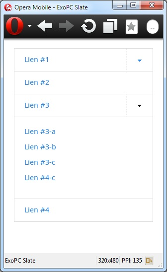

Foundation est un framework développé par Zurb qui permet de rendre votre site responsive à l'aide d'un système de grillage (ligne comportant une ou plusieurs grilles). Ce framework est une grosse bibliothèque écrite sur une feuille de style CSS comportant un grand nombre de propriétés permettant d'être appelées dans vos pages web mais aussi du jQuery pour quelques plugins responsive (un slider basique "Orbit", une modalbox "Reveal", etc..).



## Téléchargement

Téléchargez le framework à l'adresse suivante : http://foundation.zurb.com  
Attention, la feuille de style "foundation.css" comporte un reset CSS intégré (celui d'Eric Meyer's).

## Contenu de la page

Dans le header :

```html
<meta name="viewport" content="width=device-width" />
<link rel="stylesheet" href="stylesheets/foundation.css">
<link rel="stylesheet" href="stylesheets/ie.css">
<script src="javascripts/modernizr.foundation.js"></script>
```

Dans le footer :

```html
<script src="javascripts/jquery.min.js"></script>
<script src="javascripts/foundation.js"></script>
<script src="javascripts/app.js"></script>
```

Dans le corps de la page :

```html
<div class="container">
    <div class="row">
        <ul class="nav-bar">
            <li class="has-flyout">
                <a href="" class="main">Lien #1</a>
                <a href="" class="flyout-toggle"><span></span></a>
                <div class="flyout small">
                    <ul>
                        <li><a href="#">Lien #1-a</a></li>
                        <li><a href="#">Lien #1-b</a></li>
                        <li><a href="#">Lien #1-c</a></li>
                    </ul>
                </div>
            </li>
            <li><a href="#" class="main">Lien #2</a></li>
            <li class="has-flyout">
                <a href="" class="main">Lien #3</a>
                <a href="" class="flyout-toggle"><span></span></a>
                <div class="flyout small">
                    <ul>
                        <li><a href="#">Lien #3-a</a></li>
                        <li><a href="#">Lien #3-b</a></li>
                        <li><a href="#">Lien #3-c</a></li>
                        <li><a href="#">Lien #4-c</a></li>
                    </ul>
                </div>
            </li>
            <li><a href="#" class="main">Lien #4</a></li>
        </ul>
    </div>
</div>
```

## Extrait du fichier "app.js"

```javascript
/* DROPDOWN NAV ------------- */
var lockNavBar = false;
$('.nav-bar a.flyout-toggle').live('click', function(e) {
    e.preventDefault();
    var flyout = $(this).siblings('.flyout');
    if (lockNavBar === false) {
        $('.nav-bar .flyout').not(flyout).slideUp(500);
        flyout.slideToggle(500, function(){
            lockNavBar = false;
        });
    }
    lockNavBar = true;
});
if (Modernizr.touch) {
    $('.nav-bar>li.has-flyout>a.main').css({
    'padding-right' : '75px'
    });
    $('.nav-bar>li.has-flyout>a.flyout-toggle').css({
    'border-left' : '1px dashed #eee'
    });
} else {
    $('.nav-bar>li.has-flyout').hover(function() {
    $(this).children('.flyout').show();
    }, function() {
    $(this).children('.flyout').hide();
    })
}
```

## Sources 

* Documentation officielle de Foundation : http://foundation.zurb.com/docs
* "Responsive webdesign : adapter un site à toutes les résolutions" : http://www.ergonomie-interface.com/conception-maquettage/responsive-webdesign-adapter-resolutions