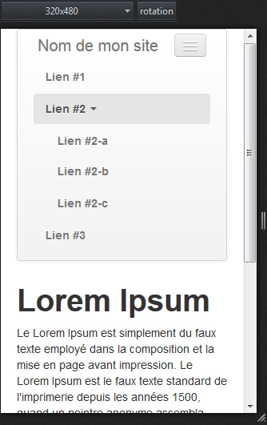

Twitter Bootstrap est un framework CSS qui reprend les aspects graphiques de Twitter (boutons, formulaires, etc) et qui permet de rendre votre site responsive à l'aide d'un système de grillage (ligne comportant une ou plusieurs grilles). Le code présenté dans cet article est issue de la version 2.3.2 du framework.

## Téléchargement & préparation

Téléchargez le framework à l'adresse suivante : [http://getbootstrap.com/2.3.2](http://getbootstrap.com/2.3.2)  
Dans le header de votre fichier html :

```html
<meta name="viewport" content="width=device-width" />
<link href="css/bootstrap.min.css" rel="stylesheet" />
<link href="css/bootstrap-responsive.min.css" rel="stylesheet" />
```

Dans le footer :

```html
<script src="js/jquery.min.js"></script>
<script src="js/bootstrap.min.js"></script>
```

Dans le corps :

```html
<div class="navbar">
    <div class="navbar-inner">
        <div class="container">
            <button class="btn btn-navbar" data-target=".nav-collapse" data-toggle="collapse" type="button">
                <span class="icon-bar"></span>
                <span class="icon-bar"></span>
                <span class="icon-bar"></span>
            </button>
            <a class="brand" href="#">
                Nom de mon site
            </a>
            <nav class="nav-collapse" role="navigation">
                <ul class="nav">
                    <li><a href="#">Lien #1</a></li>
                    <li class="divider-vertical"></li>
                    <li class="dropdown">
                        <a data-toggle="dropdown" class="dropdown-toggle" href="#">Lien #2 <b class="caret"></b></a>
                        <ul class="dropdown-menu">
                            <li><a href="#">Lien #2-a</a></li>
                            <li><a href="#">Lien #2-b</a></li>
                            <li><a href="#">Lien #2-c</a></li>
                        </ul>
                    </li>
                    <li class="divider-vertical"></li>
                    <li><a href="#">Lien #3</a></li>
                    <li class="divider-vertical"></li>
                    <li><a href="#">Lien #4</a></li>
                </ul>
            </nav>
        </div><!-- end of .container -->
    </div><!-- end of .navbar-inner -->
</div><!-- end of .navbar .navbar -->
```

## Aperçu



Avec Firefox (CTRL+SHIFT+M), vous pouvez voir que le menu est parfaitement responsive sur une résolution de 320*480.

## Aller plus loin

* Documentation officielle de Twitter Boostrap : [http://getbootstrap.com/2.3.2/getting-started.html](http://getbootstrap.com/2.3.2/getting-started.html) ;
* Des thêmes gratuits : [http://bootswatch.com](http://bootswatch.com) ;
* "Flat UI" thême flat design : [http://designmodo.com/demo/flat-ui](http://designmodo.com/demo/flat-ui).
