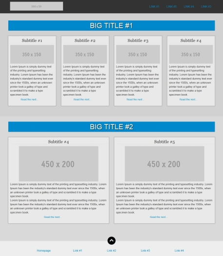
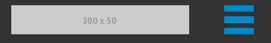
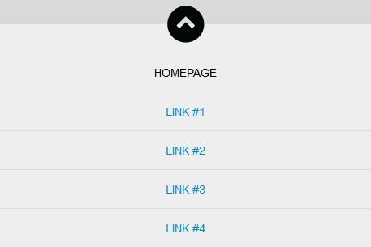

De plus en plus de sites se développent en responsive afin de répondre à la demande du marché de la navigation mobile. Créer un menu responsive permet de rendre la navigation de votre site Web agréable sur support mobile. Concevoir un menu de navigation responsive est juste une question de bonne pratique des media queries en CSS.

## Objectif

Le menu du header sera cachée et remplacé par une image cliquable qui permettra d'accéder au menu du footer. Quant au liens du menu du footer, initialement disposés horizontalement, il passeront à un dispositif de liens positionnés verticalement les uns au dessus des autres.  
Explication en image :  
version desktop



version mobile, menu du header



version mobile, menu du footer




## Partie HTML

```html
<header id="header">
	<h1>
		<a href="#">
			
		</a>
	</h1>
	<nav>
		<ul>
			<li>
				<a href="#">Link #1</a>
			</li>
			<li>
				<a href="#">Link #2</a>
			</li>
			<li>
				<a href="#">Link #3</a>
			</li>
			<li>
				<a href="#">Link #4</a>
			</li>
		</ul>
	</nav>
	<div class="anchor-nav">
		<a id="top" href="#bottom">
			
		</a>
	</div>
</header>
<!-- contenu de la page -->
<footer>
	<div class="anchor-nav">
		<a id="bottom" href="#header">
			
		</a>
	</div>
	<ul>
		<li id="current">
			<a href="#">Homepage</a>
		</li>
		<li>
			<a href="#">Link #1</a>
		</li>
		<li>
			<a href="#">Link #2</a>
		</li>
		<li>
			<a href="#">Link #3</a>
		</li>
		<li>
			<a href="#">Link #4</a>
		</li>
	</ul>
</footer>
```

## Partie CSS

Version desktop (prévoir un reset CSS) :

```css
#logo{
	margin: 10px 0 0 10px;
}
nav{
	float: right;
}
nav ul li{
	float: left;
}
nav ul li a{
	line-height: 75px;
	margin: 0 10px 0 10px;
	padding: 0 10px 0 10px;
	text-transform: uppercase;
}
a#top{
	display: none;
}
```

Version mobile avec media queries :

```css
@media only screen and (max-device-width: 960px), only screen and (max-width: 960px){
	nav{
		display: none;
	}
	a#top{
		display: block;
		float: right;
		height: 50px;
		margin: 10px 20px;
		text-transform: uppercase;
		width: 50px;
	}
	footer{
		padding: 0;
	}
	footer ul{
		float: none;
	}
	footer ul li{
		display: block;
		margin: 0;
		width: 100%;
	}
	footer ul li a{
		border-top: 1px solid #ddd;
		float: none;
		padding: 15px 0 15px 0;
		text-align: center;
		text-transform: uppercase;
	}
	footer ul li a:hover,{
		background: #000;
		color: #fff;
		text-decoration: none;
	}
	footer ul li#current a{
		color: #000;
	}
	a#bottom{
		margin: -32px 0 0;
	}
}
```

## Partie jQuery

Pour rajouter un coté "smoothcroll" ("défilement régulier") lors des clics entre les 2 anchors (image de menu du haut et celui du menu du bas) :

```javascript
<script src="http://code.jquery.com/jquery-1.8.0.min.js"></script>
<script src="http://gsgd.co.uk/sandbox/jquery/easing/jquery.easing.1.3.js"></script>
<script>
    $(function() {
        $('.anchor-nav a').bind('click',function(event){
            var $anchor = $(this);
            
            $('html, body').stop().animate({
                scrollTop: $($anchor.attr('href')).offset().top
            }, 1500,'easeInOutExpo');
            event.preventDefault();
        });
    });
```