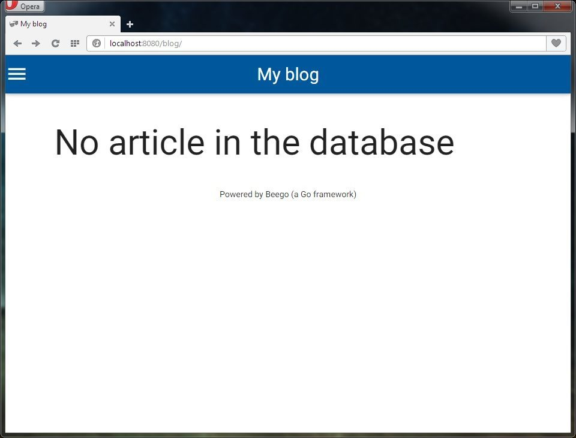
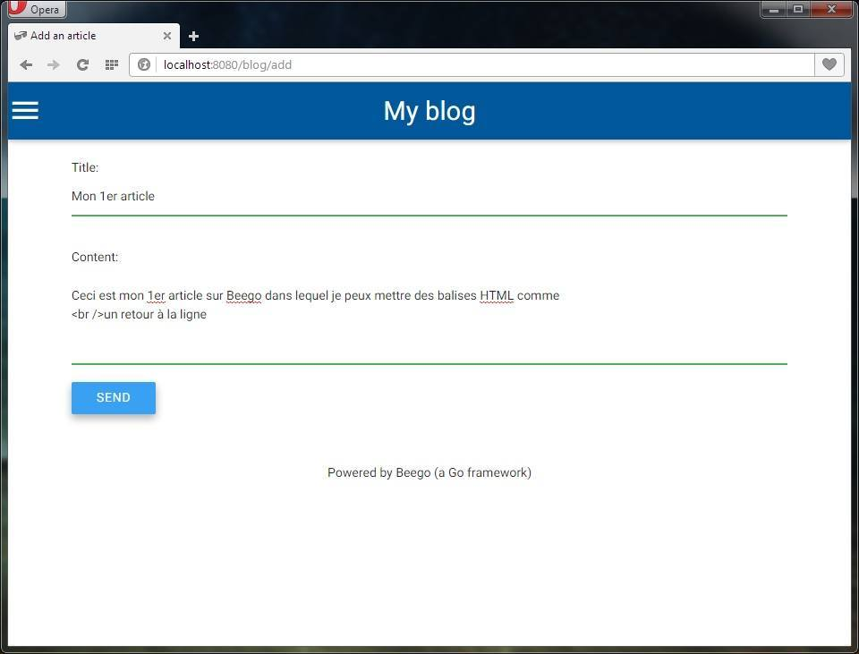
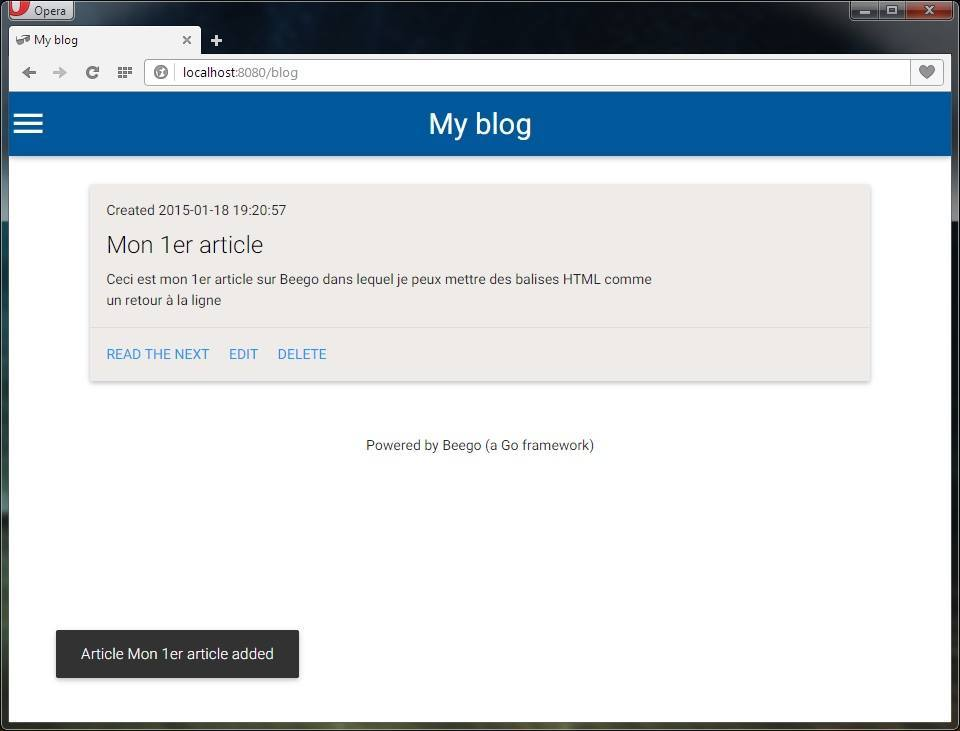
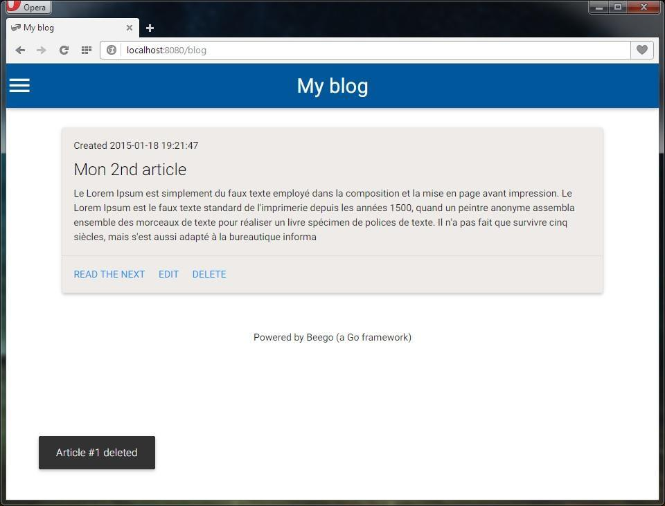

Maintenant que l'on sait se connecter à une BDD, on va pouvoir s'attaquer au CRUD (Create Read Update Delete). Concrètement, on va pouvoir lire, créer, éditer et supprimer des données à travers un mini blog très basique. Ce tutoriel va vous montrer comment mettre en place un système de contenus d'articles afin de vous servir de base pour vos futurs projets sur Beego.

## Templating

Avant d'attaquer le côté purement Golang, on va se contenter de préparer le terrain coté front.  
Le framework CSS utilisé est Materialize ([http://materializecss.com](http://materializecss.com)).  
Dans le dossier "views", créez un dossier "blog".  
Créez un nouveau fichier que vous nommez "layout_blog.tpl" :

```html
<!DOCTYPE html>
<html>
<head>
    <title>{{.title}}</title>
    <link rel="stylesheet" href="/static/css/materialize.min.css">
</head>
<body>

    <nav class="nav-wrapper light-blue darken-4">
        <a href="/blog" class="brand-logo">My blog</a>
        <ul id="nav-mobile" class="right side-nav">
            <li>
                <a href="/blog/add">Add an article</a>
            </li>
        </ul>
        <a class="button-collapse" href="#" data-activates="nav-mobile">
            <i class="mdi-navigation-menu"></i>
        </a>
    </nav>

    <br /><!-- Not pretty :( -->

    <div class="container">

        <div class="row">
            {{if .flash.notice}}
            <div id="toast-container">
                <div class="toast">{{.flash.notice}}</div>
            </div>
            {{end}}
            {{.LayoutContent}}
        </div>

        <div class="valign-demo valign-wrapper">
            Powered by Beego (a Go framework)
        </div>

    </div>

    <script src="http://code.jquery.com/jquery-2.1.3.min.js"></script>
    <script src="/static/js/materialize.min.js"></script>
    <script>
        $(document).ready(function(){
            $("input[type='text']")
                .addClass("validate")
                .wrapAll('<div class="input-field"></div>');
            $("textarea")
                .addClass("materialize-textarea validate")
                .wrapAll('<div class="input-field"></div>');
            $(".button-collapse").sideNav({edge: "left"});
        });
    </script>

</body>
</html>
```

Mais à quoi sert `{{.LayoutContent}}` ?  
À appeler le layout des pages concernées depuis le contrôleur. Dans notre cas, cela va correspondre aux futures pages ci-dessus.  

Un second fichier template "listing.tpl" :

```html
{{range $article := .articles}}
<article class="row">
    <div class="col s12 m12">
        <div class="card brown blue lighten-5">
            <div class="card-content">
                <p>Created {{date $article.Created "Y-m-d H:i:s"}}</p>
                <span class="card-title black-text">{{$article.Title}}</span>
                <p>{{substr $article.Content 0 400 | str2html}}</p>
            </div>
            <div class="card-action">
                <a class="blue-text" href="/blog/article/{{$article.Id}}">Read the next</a>
                <a class="blue-text" href="/blog/edit/{{$article.Id}}">Edit</a>
                <a class="blue-text" href="/blog/delete/{{$article.Id}}">Delete</a>
            </div>
        </div>
    </div>
</article>
{{end}}
```

On utilise dans ce layout, 4 fonctions de templating :

* `range` : boucle des données à partir d'un tableau (à l'image de `foreach` en PHP).
* `date` : permet de modifier l'écriture de la date.
* `substr 0 400` : limite le nombre de caractères à 400.
* `str2html` : interpréte les balises HTML comme du HTML.

Un troisième pour afficher le contenu d'un article "content.tpl" :

```html
<h1>{{.title}}</h1>
<p>{{.content | str2html}}</p>
<a href="/blog/" class="waves-effect waves-light btn">Back to articles</a>
```

Un quatrième pour afficher le formulaire "form.tpl" :

```html
{{range $error := .errors}}
    {{$error.Key}}
    {{$error.Message}}
{{end}}
<div class="row">
    <form id="articles" method="POST">
        {{.Form | renderform}}
        <button type="submit" class="waves-effect waves-light btn">Send</button>
    </form>
</div>
```

Un cinquième et dernier pour afficher d'éventuelles erreurs "error.tpl" :

```html
<h1>{{.error}}</h1>
```

## Préparation du nouveau contrôleur

Dans le dossier "controllers", créez un nouveau contrôleur que vous nommez "blog.go" ayant pour entête :

```go
package controllers

import (
    "github.com/astaxie/beego"
    "github.com/astaxie/beego/orm"
    models "myapp/models"
    "github.com/astaxie/beego/validation"
    "strconv"
)

type BlogController struct {
    beego.Controller
}
```

On appelle bien le modèle ainsi que l'ORM et la validation pour le formulaire d'ajout ou de modification d'article.

### Afficher tous les articles

Dans un premier temps, on va se contenter de lister toutes les données présentent dans la table "articles" :

```go
func (this *MainController) Get() {
    flash := beego.ReadFromRequest(&this.Controller)

    if _,ok:=flash.Data["notice"];ok{
    }

    o := orm.NewOrm()
    o.Using("default")

    var articles []*models.Articles

    num, err := o.QueryTable("Articles").OrderBy("-id").All(&articles)

    if err != orm.ErrNoRows && num > 0 {
        this.TplNames         = "blog/listing.tpl"
        this.Data["articles"] = articles
    } else {
        // No result
        this.TplNames      = "blog/error.tpl"
        this.Data["error"] = "No article in the database"
    }

    this.Data["title"] = "My blog"
    this.Layout        = "blog/layout_blog.tpl"
}
```

Avant de charger l'ORM, on initialise la variable `flash` où seront stockés les messages de succès dans les futures fonctions concernées.  
Puis, on charge la structure de la table "articles". On fait notre requête SQL via l'ORM en prenant soin d'afficher les articles par ordre décroissant.  
Et pour finir, on charge le layout (rappelez-vous de `{{.LayoutContent}}` dans le fichier "layout_blog.tpl") et son template associé.  

On appel cette fonction dans le fichier de routage ("router/router.go") :

```go
beego.Router("/blog", &controllers.BlogController{},"get:Get")
```

[http://localhost:8080/blog](http://localhost:8080/blog)  
Par défaut, votre table est vide, ce qui affichera donc le message d'erreur.



### Afficher un article en particulier

Dans notre contrôleur "blog.go", à la suite :

```go
func (this *MainController) GetOne() {
    o := orm.NewOrm()
    o.Using("default")

    // Get the ID page
    articlesId := this.Ctx.Input.Param(":id")

    var articles []*models.Articles

    err := o.QueryTable("articles").Filter("id", articlesId).One(&articles)

    if err == orm.ErrNoRows {
        // No result
        this.TplNames      = "blog/error.tpl"
        this.Data["title"] = "Error :("
        this.Data["error"] = "No available article"
    } else {
        this.TplNames = "blog/content.tpl"
        for _, data := range articles {
            this.Data["title"]   = data.Title
            this.Data["content"] = data.Content
        }

    }

    this.Layout = "blog/layout_blog.tpl"
}
```

Même principe que pour lister tous les articles, excepté que l'on récupère l'ID de l'article pour l'insérer dans la requête SQL.

Puis dans le fichier de routage ("router/router.go"), on ajoute la route suivante :

```go
beego.Router("/blog/article/:id([0-9]+)", &controllers.BlogController{}, "get:GetOne")
```

[http://localhost:8080/blog/article/1](http://localhost:8080/blog/article/1)

A noter : dans la fonction, on a mis en place un message personnalisé dans le cas où un article n'existe pas ou n'a jamais existé. Si vous souhaitez afficher la page 404 par défaut, à la place du code existant dans la condition placez ceci : `this.Abort("404")`.

### Insérer un article

On reste dans le même contrôleur :

```go
    o := orm.NewOrm()
    o.Using("default")

    articles := models.Articles{}

    this.Data["Form"] = &articles

    if err := this.ParseForm(&articles); err != nil {
        beego.Error("Couldn't parse the form. Reason: ", err)
    } else {
        valid := validation.Validation{}
        valid.Required(articles.Title, "Title")
        valid.Required(articles.Content, "Content")
        isValid, _ := valid.Valid(articles)

        if this.Ctx.Input.Method() == "POST" {

            if !isValid {
                this.Data["errors"] = valid.ErrorsMap
                for _, err := range valid.Errors {
                    beego.Error(err.Key, err.Message)
                }
            } else {
                _, err := o.Insert(&articles)
                flash := beego.NewFlash()

                if err == nil {
                    flash.Notice("Article "+ articles.Title +" added")
                    flash.Store(&this.Controller)
                    this.Redirect("/blog", 302)
                } else {
                    beego.Debug("Couldn't insert new article. Reason: ", err)
                }
            }

        }

    }

    this.Layout        = "blog/layout_blog.tpl"
    this.TplNames      = "blog/form.tpl"
    this.Data["title"] = "Add an article"
```

On fait appel à la bibliothèque ("validation"), celle appelée dans les imports de notre contrôleur ("blog.go"). On met donc en place une validation sur nos 2 champs : "Title" et "Content".
Si ces 2 derniers sont bien renseignés par l'utilisateur, on insère les données dans la BDD et on redirige l'utilisateur vers la page des articles sinon on affiche un message d'erreur.  
On n'oublie pas de stocker notre message de "succès" en mémoire (malgré la redirection 302) dans `Flash.Notice`, cela afin d'avertir l'utilisateur que l'insertion a bien été effectué.

Info : les fonctions (facultatives) `beego.Error` et `beego.Debug` permettent d'afficher une erreur dans la console du serveur.

Dans le fichier de routage ("router/router.go"), on ajoute la route suivante :

```go
beego.Router("/blog/add", &controllers.BlogController{}, "get,post:Add")
```

[http://localhost:8080/blog/add](http://localhost:8080/blog/add)



Lorsque le formulaire est bien rempli, Beego nous redirige vers la page des articles :



### Editer un article

Comme pour l'insertion des données, on a besoin d'un formulaire mais avec les champs pré-remplis :

```go
func (this *MainController) Edit() {
    o := orm.NewOrm()
    o.Using("default")

    articlesId, _ := strconv.Atoi(this.Ctx.Input.Param(":id"))

    articles := models.Articles{}

    flash := beego.NewFlash()

    err := o.QueryTable("articles").Filter("id", articlesId).One(&articles)

    if err != orm.ErrNoRows {

        this.Data["Form"] = &articles

        if err := this.ParseForm(&articles); err != nil {
            beego.Error("Couldn't parse the form. Reason: ", err)
        } else {
            valid := validation.Validation{}
            valid.Required(articles.Title, "Title")
            valid.Required(articles.Content, "Content")
            isValid, _ := valid.Valid(articles)

            if this.Ctx.Input.Method() == "POST" {

                if !isValid {
                    this.Data["errors"] = valid.ErrorsMap
                    beego.Error("Form didn't validate.")
                } else {
                    _, err := o.Update(&articles)

                    if err == nil {
                        flash.Notice("Article "+ articles.Title +" updated")
                            flash.Store(&this.Controller)

                        this.Redirect("/blog", 302)
                    } else {
                        beego.Debug("Couldn't update new article. Reason: ", err)
                    }
                }

            }

        }

        this.Data["title"] = "Edit this article"
        this.Layout        = "blog/layout_blog.tpl"
        this.TplNames      = "blog/form.tpl"

    } else {
        flash.Notice("Article #%d doesn't exists", articlesId)
        flash.Store(&this.Controller)
        this.Redirect("/blog", 302)
    }

}
```

On récupère l'id de l'article que l'on convertit en string via `strconv.Atoi`. Ensuite, on éxécute avec la mème logique que dans l'insertion des données, excepté la requête SQL qui diffère.

Dans le fichier de routage ("router/router.go"), on ajoute la route suivante :

```go
beego.Router("/blog/edit/:id([0-9]+)", &controllers.BlogController{}, "get,post:Edit")
```

[http://localhost:8080/blog/edit/1](http://localhost:8080/blog/edit/1)

### Supprimer un article

Dernière fonction de notre contrôleur "blog.go" :

```go
func (this *MainController) Delete() {
    o := orm.NewOrm()
    o.Using("default")

    articlesId, _ := strconv.Atoi(this.Ctx.Input.Param(":id"))

    articles := models.Articles{}

    flash := beego.NewFlash()

    if exist := o.QueryTable(articles.TableName()).Filter("Id", articlesId).Exist(); exist {

        if num, err := o.Delete(&models.Articles{Id: articlesId}); err == nil {
            beego.Info("Record Deleted. ", num)
            flash.Notice("Article #%d deleted", articlesId)
        } else {
            beego.Error("Record couldn't be deleted. Reason: ", err)
        }

    } else {
        flash.Notice("Article #%d doesn't exists", articlesId)
    }

    flash.Store(&this.Controller)

    this.Redirect("/blog", 302)
}
```

On récupère l'id de l'article concerné. On vérifie que ce dernier existe bien dans la BDD. Si c'est le cas on le supprime et on redirige l'utilisateur sur la page des articles sinon on fait pareil mais avec un message d'avertissement différent.

Et on n'oublie pas notre dernière route ~~pour la route~~ ("router/router.go") :

```go
beego.Router("/blog/delete/:id([0-9]+)", &controllers.MainController{}, "get:Delete")
```

[http://localhost:8080/blog/delete/1](http://localhost:8080/blog/delete/1)



## Conclusion

Désormais, vous avez dès à présent, un système de CRUD et de templating opérationnel. Il ne manque plus qu'un espace d'authentification pour effectuer les opérations d'ajout, de modification et de suppression d'articles.

## Sources

* Documentation officiel de Beego : [http://beego.me/docs](http://beego.me/docs) ;
* Documentation complète de la bibliothèque "validation" : [https://gowalker.org/github.com/astaxie/beego/validation].
