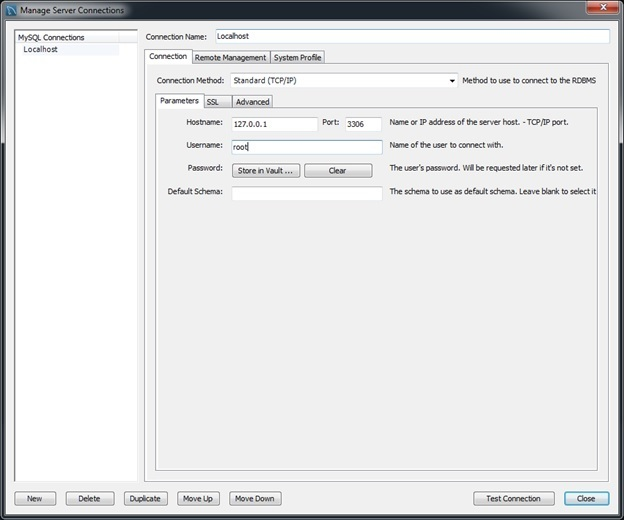
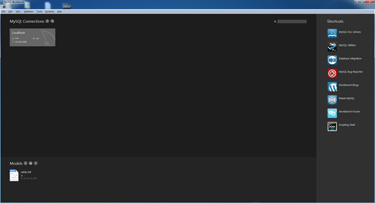
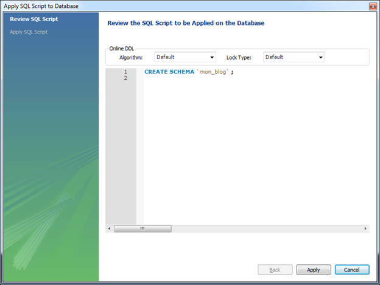
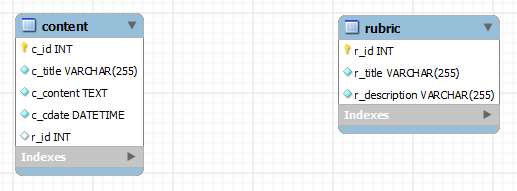
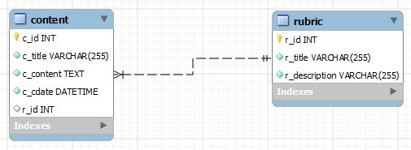
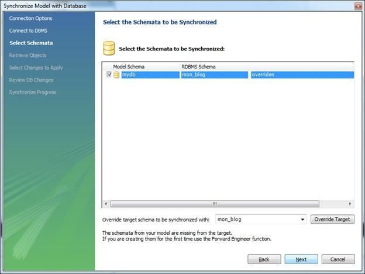
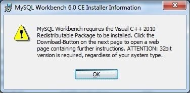

MySQL Workbench est un logiciel développé par Oracle (éditeur de MySQL) permettant de gérer et d'administrer ses bases de données MySQL. Beaucoup plus complet que PHP My Admin, MySQL Workbench de par son interface graphique, offre la possibilité de modéliser dans un premier temps un schéma de table reliées entre elles. Puis, dans un second temps de l'importer directement dans MySQL sous forme de requêtes SQL.

## Installation

Si nous ne l'avez pas encore installé, le logiciel est disponible gratuitement sur le site officiel : [http://dev.mysql.com/downloads/tools/workbench](http://dev.mysql.com/downloads/tools/workbench)  
Sélectionnez la version Windows (x86, 32-bit), MSI Installer si vous êtes sur Windows et cliquez sur "Download" puis sur "No thanks, just start my download".  
Dès que MySQL Workbench est lancé, n'oubliez pas de démarrer votre serveur MySQL présent sur votre machine ou à distance (de type WAMP, LAMP ou MAMP).

## Connexion au serveur MySQL

Dans la barre des menus, cliquez sur "Database" > "Manage Server Connections".  
Si vous avez un mot de passe sur votre serveur MySQL, cliquez à droite de "Password" sur "Store in Vault", entrez votre mot de passe et validez.

## Modélisation du schéma (création de la nouvelle base de données)

Cliquez sur le 4ème icone en haut à droite "Create a new schema in the connected server".  
Dans le champ "Name" rentrez le nom de votre nouvelle base de donnée (dans ce tuto, nous l'appellerons "mon_blog").

Puis cliquez sur "Apply".  
La fenêtre "Apply SQL Script to Database" apparait, cliquez de nouveau sur "Apply" puis sur "Finish".

La nouvelle base ("mon_blog") est disponible.

Passons maintenant au diagramme EER (Entity-Relationship Diagram ou Modèle entité-association dans le monde francophone) pour créer notre schéma.  
Allez dans "File" > "New Model" (CTRL+N) et doubles cliquez sur "Add Diagram".

Pour placer une table, maintenez la touche T de votre clavier enfoncée puis faites un clic gauche.  
Doubles cliquez sur votre nouvelle table. En dessous de votre diagramme, vous avez les propriétés de votre table, ajoutez les entités.  
Dans le champ :

* "Table name" : le nom de votre table
* "Colums Name ": le nom de votre entité
* "Datatype" : le type de champ (INT, VARCHAR, TEXT, DATETIME, etc...)
* "PK" : Primary Key
* "NN" : Not Null (coché par défaut)
* "UQ" : Unique Key
* "AI" : Auto Increment

Vous pouvez aussi commenter l'entité dans le champ "Comments" à droite.

Dans l'exemple ci-dessous, on va créer 2 tables "content" et "rubric" que l'on va ensuite mettre en relation par le biais d'une clef étrangère.  
La clef "content" contient les champs suivant :

* c_id
* c_title
* c_content
* c_cdate
* r_id

Quant à la clef "rubric" :

* r_id
* r_title
* r_description

Comme en cours de MERISE, on rajoute la liaison 1, n partant du principe qu'un article est contenu dans une et une seule rubrique tandis qu'une rubrique peut contenir 1 ou plusieurs article(s).  
Cliquez sur l'icône "1:n" avec une pipette (le dernier de la liste), c'est-à-dire une relation avec des entités déjà existante puis sélectionnez "r_id" dans "Content" puis "r_id"  dans "rubric". MySQL Workbench fait la liaison automatiquement.

## Importation du schéma dans la base de données

Maintenant que notre schéma est fini, on peut exporter les données dans notre base "mon_blog".  
Dans la barre des menus, cliquez sur "Database" > "Synchronize Model".  
Cliquez sur "Next".  
Cliquez de nouveau sur "Next".  
Sélectionnez votre Model Schema.  
Changez de base dans "Override target schema to be synchronized" puis cliquez sur "Override Target" et cochez au-dessus votre Model Schema.  
Arrivé(e) à l'étape "Review DB Changes" vous pouvez voir le SQL généré pour exécuter votre schéma. Cliquez sur "Execute" pour générer les tables.

## Problème rencontré lors de l'installation de MySQL Workbench

"MySQL Workbench requires the Visual C++ 2010 Redistribuale Package to be installed"

Téléchargez et installez Visual C++ 2010 Redistribuale à l'adresse suivante :

[http://www.microsoft.com/fr-fr/download/details.aspx?id=14632](http://www.microsoft.com/fr-fr/download/details.aspx?id=14632)
