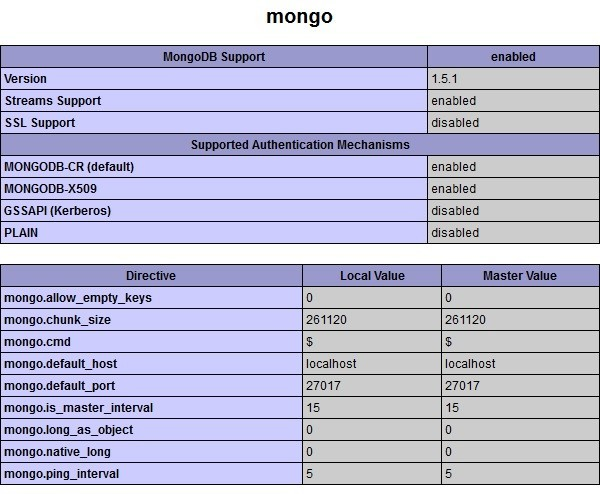
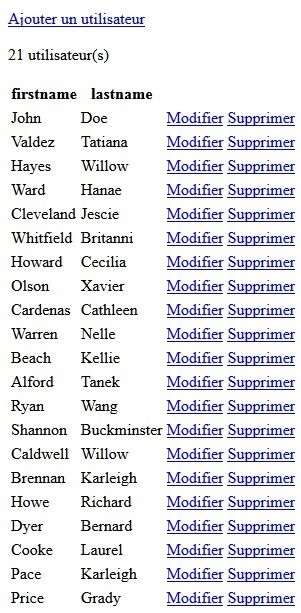
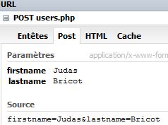

Vous souhaitez développer une application PHP avec la base de données NoSQL MongoDB. Il existe bel et bien une classe pour travailler dessus. Mais pour ce faire, il faut au préalable disposer du driver officiel sur votre serveur. Par défaut, ce dernier est rarement installé sur les serveurs aussi bien en local qu'en production.

## Installation

* Sur Windows : https://s3.amazonaws.com/drivers.mongodb.org/php/index.html  
Avec WAMP : dans le fichier "wamp/bin/php/votre_version_php/php.ini", ajoutez la ligne suivante :   
`extension=php_mongo.dll`  
Lancez WAMP puis cliquez sur l'icone de WAMP (en bas à droite), allez dans "PHP", "PHP extensions", cliquez sur "php_mongo".
* Sur Mac : http://php.net/manual/fr/mongo.installation.php#mongo.installation.osx
* Sur Linux : http://php.net/manual/fr/mongo.installation.php#mongo.installation.nix

Pour savoir si vous avez bien installé le driver, faites un `phpinfo();`, vous devriez avoir dans votre listing "mongo".



## Connexion

Dans un nouveau fichier "mongodb.php", on se connecte au serveur MongoDB.

```php
<?php
    // Ouverture de la connexion (localhost par défaut)
    $mongo = new MongoClient();

    // Sélection de la database "test"
    $db = $mongo->selectDB("test");

    // Sélection de la collection "Users"
    $c_users = new MongoCollection($db, "Users");

    // Obtenir tous les utilisateurs
    $get_users = $c_users->find();

    // Obtenir le nombre d'utilisateurs
    $count_users = $c_users->count();

    // Fermeture de la connexion
    $mongo->close();
?>
```
 
Si le driver n'est pas installé ou activé sur votre serveur, ce dernier vous renverra une erreur car il ne trouvera pas la classe "MongoClient".  
`Fatal error: Class 'MongoClient' not found`

Ou si, votre serveur Mongo n'est pas démarré :  
`Fatal error: Uncaught exception 'MongoConnectionException' with message '`

C'est pour cela que l'on va améliorer notre fichier de connexion "mongodb.php" avec une gestion des messages d'erreurs ci-dessous.

```php
<?php
    if ( ! class_exists('Mongo')) {
        echo "<h1>Le driver Mongo n'est pas installé sur ce serveur :(</h1>";
    } else {

        try {
            // Ouverture de la connexion
            $mongo = new MongoClient('mongodb://localhost');

            // Sélection de la database "test"
            $db = $mongo->selectDB("test");

            // Sélection de la collection "Users"
            $c_users = new MongoCollection($db, "Users");

            // Obtenir tous les utilisateurs
            $get_users = $c_users->find();

            // Obtenir le nombre d'utilisateurs
            $count_users = $c_users->count();

            // Fermeture de la connexion
            $mongo->close();

        } catch (MongoConnectionException $exception) {
            echo "<h1>Impossible de se connecter au serveur MongoDB :(</h1>";
        }
    }
?>
```

## Utilisation des données (CRUD)

### Lecture des données avec find

Dans un nouveau fichier "users.php".

```php
<?php
    // Appel de la connexion
    require_once('mongodb.php');

    var_dump($count_users);
    var_dump(iterator_to_array($get_users));
?>
```

On remarque que la variable `$get_users` n'est autre qu'un tableau. On peut donc appeler nos données dans une boucle `foreach`.

```php
<?php
    // Appel de la connexion
    require_once('mongodb.php');

    if (isset($count_users)) {

        echo '<a href="form_users.php">Ajouter un utilisateur</a>';
        if ($count_users > 0){
            echo '<p>' . $count_users . ' utilisateur(s)</p>';
            echo '<table>';
            echo '<tr><th>firstname</th><th>lastname</th><th></th><th></tr>';
            foreach ($get_users as $user) {
                echo '<tr>';
                echo '<td>' . $user['firstname'] . '</td>';
                echo '<td>' . $user['lastname'] . '</td>';
                echo '<td><a href="form_users.php?edit=' . $user['_id'] . '">Modifier</td>';
                echo '<td><a href="users.php?delete=' . $user['_id'] . '">Supprimer</td>';
                echo '</tr>';
            }
            echo '</table>';

        } else {
            echo "Pas d'utilisateurs";
        }

    }
?>
```

Ce qui nous donne, cette ~~magnifique~~ interface dépouillée :  


## Insertion des données avec "insert"

On créé un nouveau fichier "form_users.php" qui va nous servir de formulaire.

```html
<form action="users.php" method="POST" />

	<div>
		<label for="firstname">Firstname</label>
		<br /><input type="text" id="firstname" name="firstname" value="" required />
	</div>

	<div>
		<label for="lastname">Lastname</label>
		<br /><input type="text" id="lastname" name="lastname" value="" required />
	</div>

	<div>
		<input type="submit" value="Envoyer" />
	</div>

</form>
```

Puis, on édite le fichier sur lequel le formulaire envoie les données au format "POST", "users.php".

```php
<?php
    # [Connexion à la base]

    if (isset($_POST) && !empty($_POST)) {
        $c_users->insert(array('firstname' => $_POST['firstname'], 
                               'lastname'  => $_POST['lastname']));

        header('Location: users.php');
        exit;
    }

    # [Tableau des données]
?>
```

On récupère les données présentes dans la super variable `$_POST` pour les insérer dans le tableau de la requête `insert`.



## Modification des données avec "update"

On commence par modifier le formulaire "form_users.php" (dans sa version finale).

```php
<?php
    // Appel de la connexion
    require_once('mongodb.php');

    // Cas d'une édition
    if ( isset($_GET['edit']) && !empty($_GET['edit']) ) {
        // Récupération de l'ObjectID au format ...
        $id       = new MongoId($_GET['edit']);
        // Lecture du document concerné
        $get_user = $c_users->findOne(array("_id" => $id));
    }

    if ( isset($_GET['edit']) && !empty($_GET['edit']) && !isset($get_user) ) {
        echo "Impossible de modifier cet utilisateur car il n'existe plus ou n'a jamais existé";
    } else {
?>
<form action="users.php" method="POST" />
    <label for="firstname">Firstname</label>
    <br /><input type="text" id="firstname" name="firstname" value="<?php if (isset($_GET['edit']) && !empty($_GET['edit'])) echo $get_user['firstname']; ?>" required />
    <br /><label for="lastname">Lastname</label>
    <br /><input type="text" id="lastname" name="lastname" value="<?php if (isset($_GET['edit']) && !empty($_GET['edit'])) echo $get_user['lastname']; ?>" required />
    <?php if (isset($_GET['edit']) && !empty($_GET['edit'])) { ?>
        <input type="hidden" name="user_id" value="<?php echo $id; ?>" />
    <?php }; ?>
    <br /><input type="submit" value="Envoyer" />
</form>
<?php
    }
?>
```

On se connecte au serveur pour récupérer les données présentes dans la collection "Users", puis on n'oublie pas de déclarer le champ caché contenant l'ObjectId du document concerné.

Ensuite, on édite le fichier "users.php".

```php
<?php
    # [Connexion à la base]

    if (isset($_POST) && !empty($_POST)) {

        if (isset($_POST['user_id'])) {
            $id      = new MongoId($_POST['user_id']);
            $newdata = array('$set' => array('firstname' => $_POST['firstname'], 
                                             'lastname'  => $_POST['lastname']));
            $c_users->update(array("_id" => $id), $newdata);
        } else {
            $c_users->insert(array('firstname' => $_POST['firstname'], 
                                   'lastname'  => $_POST['lastname']));
        }

        header('Location: users.php');
        exit;
    }

    # [Tableau des données]
?>
```

Comme pour l'insertion des données, on récupère les données du formulaire pour mettre à jour les données dans le tableau de la requête `update`.

## Suppression des données avec "remove"

Dans le fichier "users.php", on ajoute la condition ci-dessous.

```php
<?php
    # [Connexion à la base]

    # [Conditions modification / ajout]

    if (isset($_GET['delete']) && !empty($_GET['delete'])) {
        $id = new MongoId($_GET['delete']);
        $c_users->remove(array('_id' => $id));
        header('Location: users.php');
        exit;
    }

    # [Tableau des données]
?>
```

On supprime le document concerné via son ObjectId.

## Sources

* La classe MongoDB PHP: http://php.net/manual/fr/class.mongodb.php
* Site officiel de MongoDB : http://www.mongodb.org