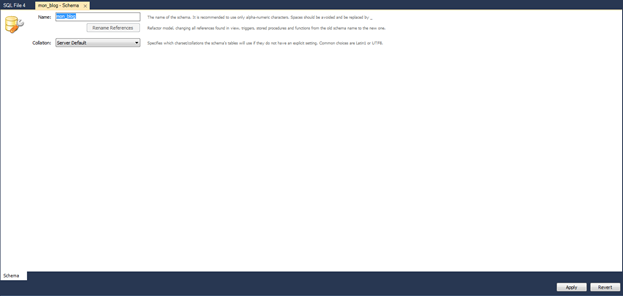
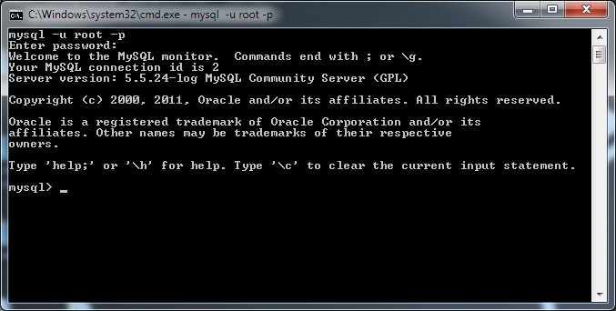
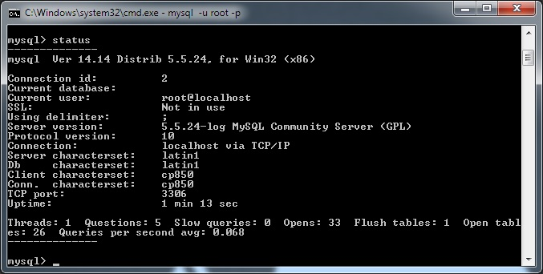
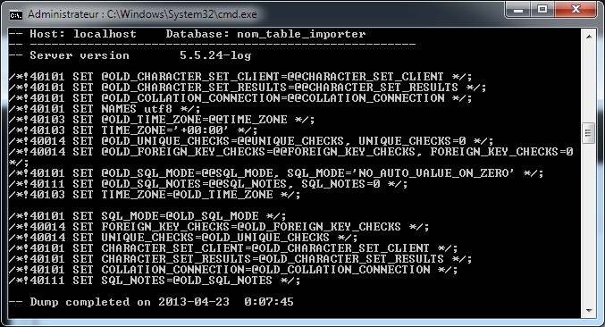

MySQL par le bias de PHP My Admin permet de faire de la manipulation de données SQL sur une interface graphique. Hélas, cette dernière est en partie bridée dans l'importation de données.  
Par défaut l'importation de données est limitée à 1Mo sur PMA. Il est possible de s'affranchir de cette limite en partant directement à la source, sur MySQL.

## Variable d'environnement

Allez dans "Système", "Paramètres système avancé", "Variables d'environnement".  
Dans "Variable systèmes", doubles cliquez sur la variable "Path". A la suite de la "Valeur de la variable", indiquez l'emplacement du dossier de MySQL :  
`;C:\wamp\bin\mysql\mysql5.5.24\bin`



Validez et redémarrez votre ordinateur.

NB : vous pouvez sauter cette partie et directement passer à la partie 2 si vous ne souhaitez pas rajouter cette variable d'environnement sur votre machine.  
Lancez l'exécution (Windows + R > cmd) de MySQL : `C\:wamp\bin\mysql\mysql5.5.24\bin\mysql.exe -u root -p`

## Lancement de la console

Lancez votre serveur Wamp puis l'invité de commande (Windows + R, "cmd").  
Tapez `mysql -u root -p`<b>- u</b> correspond à l'utilisateur  
<b>- p</b> correspond au mot de passe (par défaut vide)  
Le message suivant apparaît :  
"Enter password"



Ne tapez rien si vous n'avez pas de mot de passe par défaut, pressez la touche Entrée de votre clavier pour valider.  
Vous devriez avoir le message suivant :  
**Welcome to the Mysql monitor [...] mysql>**  
Si vous avez le message suivant :  
**'mysql' n'est pas reconnu en tant que commande interne ou externe, un programme exécutable ou un fichier de commandes.**  
Cela signifie que le chemin de votre variable d'environnement est erroné.  
Ou si vous avez le message ci-dessous :

```
ERROR 2003 <HY000> : Can't connect to MySQL server on 'localhost' (10061)
```
c'est que votre serveur MySQL, par le bias de WAMP, n'est pas allumé.  

Une fois connecté, dans l'invité de commande, tapez "status".  
Vous pouvez voir votre version de MySQL, l'utilisateur en cours d'utilisation, le temps depuis que votre serveur est allumé, etc...



## Les commandes pour bien démarrer :</h2>

### Naviguer

`show databases` : affiche toutes les bases.  
`use nom_table (ou u nom_table)` : sélectionne la base (affiche "Database changed" lors de l'exécution de la commande).  
`show tables` : affiche toutes les tables présentes dans la base (après avoir sélectionné une table).

### Utilisateurs

`select user()` : affiche les utilisateurs.  
`select current_user()` : affiche l'utilisateur en cours d'utilisation.

### Insertion / exportation

Il faut directement aller dans la console de Windows et non dans celle de MySQL.  
**Importer<** : `mysql -u root nom_table_importer < C:\chemin_fichierdump.sql`  
La table a été créée au préalable par vos soins dans la console MySQL (`create database nom_table_import`).



**Exporter** : `mysql -u root nom_table_exporter > C:\backup.sql`  
A noter : en cas de succès de la tache effectuée, contrairement à l'opération d'import, aucun message ne sera affiché.  
Si le message "Accès refusé" apparaît cela peut signifier que vous avez besoin des droits d'administrateur de Windows pour pouvoir créer un fichier. Changez l'emplacement du fichier ou bien lancez la console en tant qu'administrateur (Windows > "cmd.exe", clic droit > "Exécuter en tant qu'administrateur").