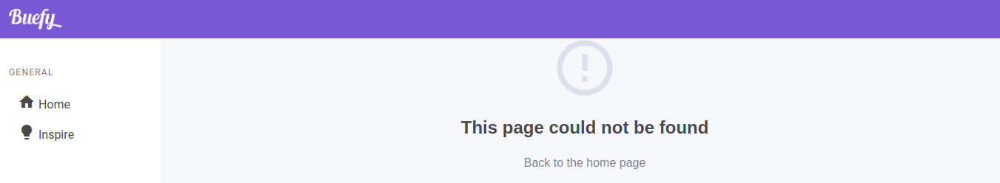
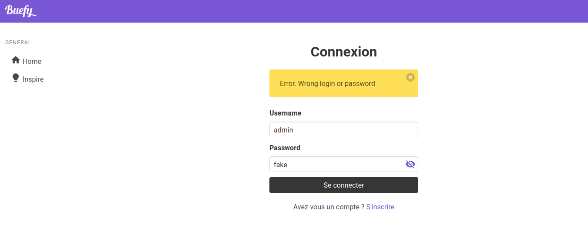
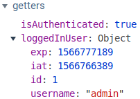
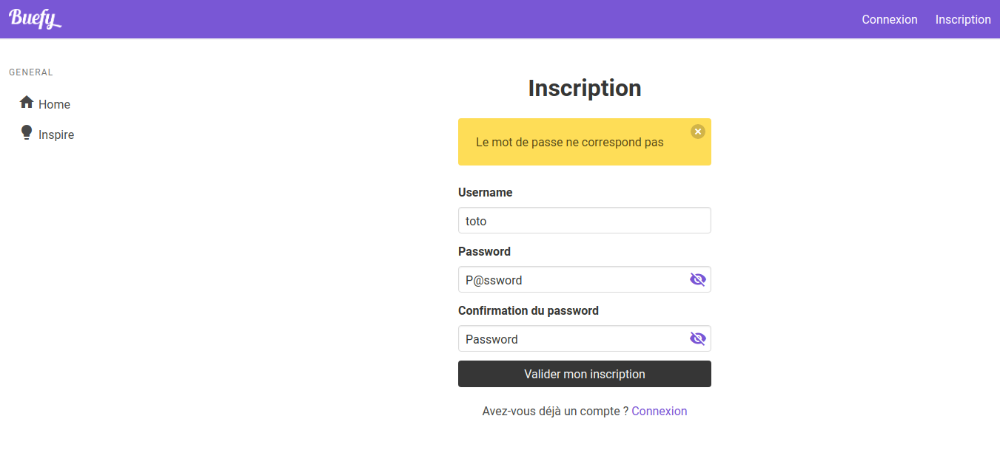

Après avoir créé une API avec une authentification JWT, on peut s'attaquer à la partie front avec le framework Nuxt basé sur Vue. Pour cela, nous allons utiliser le framework CSS Buefy (basé sur Bulma) et le module Nuxt intitulé Auth Module. Pour la suite, veillez à avoir votre serveur d'API allumé.

## Génération application Nuxt

Dans un terminal, générez un nouveau projet Nuxt à l'aide de la commande suivante `npx create-nuxt-app front`.
Point important pour la suite, sélectionnez le framework "Buefy", le module "axios" et spécificiez que l'application est "Universal" A la fin de l'installation, suivez les instructions en vous placant dans le dossier `cd front`. Installez le module d'authentification `npm install @nuxtjs/auth` et par la suite, lancez le serveur de développement avec la commande `npm run dev`.

Remarque : la version de Nuxt utilisée lors de la rédaction de ce tutoriel est la 2.9.1.

## Configuration du module d'authentification

Dans le dossier **store**, créez une nouveau fichier **index.js**. Puis ouvrez le fichier **nuxt.config.js** et ajoutez la ligne `@nuxtjs/auth`, dans `modules` puis le code ci-dessous.

```javascript
axios: {
  baseURL: 'http://localhost:1234/'
},
auth: {
  localStorage: false,
  cookie: {
    prefix: 'auth.',
    options: {
      path: '/',
      maxAge: 10800
    }
  },
  strategies: {
    local: {
      endpoints: {
        login: { url: 'login', method: 'post', propertyName: 'access_token' },
        user: { url: 'me', method: 'get', propertyName: 'content' },
        logout: false
      }
    }
  }
},
```

Dans Axios, on spécifie l'URL de notre API. Puis dans le module `auth`, on déclare vouloir utiliser des cookie et non le localStorage. Ensuite, dans `strategies` pour la connexion locale (`local`), on spécifie 2 endpoints, le premier pour la connexion et le second pour récupérer les informations de l'utilisateur.

| Page Nuxt (dossier pages) | URL API | Méthode | Données |
| - | - | - | - |
| login.vue | login | POST | token |
| user.vue | me | GET | data |

La colonne "Données" correspond au nom du champ retourné par l'API d'authentification.

Dès l'enregistrement des modifications, Nuxt va "rebuilder" tout seul l'application pour prendre en compte les changements de configuration.

## Page protégée coté front

Dans le fichier de la page "inspire" (dans le dossier **pages/inspire.vue**), spécifiez le middleware **auth** dans la partie JavaScript.

```html
<script>
export default {
  middleware: 'auth'
}
</script>
```



Cette page protégée affiche une erreur 404...

## Page d'authentification

En effet, la page "login" n'existant pas, la présence de cette erreur 404 est justifiée. Pour la faire disparaitre, dans le dossier **pages**, créez le fichier **login.vue** avec un formulaire comportant un champ pour renseigner le nom d'utilisateur et un second pour le mot de passe.

```html
<template>
  <section class="section">
    <div class="container">
      <div class="columns">
        <div class="column is-4 is-offset-4">
          <h2 class="title has-text-centered">Connexion</h2>

          <b-notification v-if="error" type="is-warning">
            {{ error }}
          </b-notification>

          <form method="post" @submit.prevent="login">
            <b-field label="Username" label-for="username">
              <b-input id="username" v-model="username"></b-input>
            </b-field>
            <b-field label="Password" label-for="password">
              <b-input
                id="password"
                v-model="password"
                type="password"
                password-reveal
              >
              </b-input>
            </b-field>
            <div class="control">
              <button type="submit" class="button is-dark is-fullwidth">
                Se connecter
              </button>
            </div>
          </form>

          <div class="has-text-centered" style="margin-top: 20px">
            <p>
              Avez-vous un compte ?
              <nuxt-link to="/register">S'inscrire</nuxt-link>
            </p>
          </div>
        </div>
      </div>
    </div>
  </section>
</template>
```

Désormais, la page [http://localhost:3000/inspire](http://localhost:3000/inspire) redirige bien vers [http://localhost:3000/login](http://localhost:3000/login)
. Puis dans la partie JavaScript de cette page.

```javascript
export default {
  data() {
    return {
      username: '',
      password: '',
      error: ''
    }
  },
  methods: {
    async login() {
      try {
        await this.$auth.loginWith('local', {
          data: {
            username: this.username,
            password: this.password
          }
        })

        this.$router.push('/inspire')
      } catch (e) {
        this.error = e.response.data.message
      }
    }
  }
}
```

On récupère la valeur des champs `username` et `password` via la fonction `login` définit dans `methods` lors de l'envoi du formulaire. S'il y a une erreur alors, c'est la valeur "error" qui affichera un message.



Remarque : si vous avez l'erreur `_context.t0.response is undefined`, c'est que le serveur de votre API n'est pas démarré.

## VueX : Getters

Dans le dossier **store**, créez un nouveau fichier **index.js** avec les 2 getters ci-dessous.

```javascript
export const getters = {
  isAuthenticated(state) {
    return state.auth.loggedIn
  },

  loggedInUser(state) {
    return state.auth.user
  }
}
```



La première fonction renvoit un booléen. Lorsque l'utilisateur n'est pas connecté, la valeur est égale à `false` et `true` si connecté. Quant à la seconde, elle retourne les données fournies par le endpoint "/me" de l'API JWT (ou `null` si non connecté).

## Modification de la navbar

Dans le fichier layout **default.vue**, ajoutez le code ci-dessous avant la fermeture de la nav.

```html
<div class="navbar-menu">
  <div v-if="isAuthenticated" class="navbar-end">
    <span class="navbar-item">
      {{ loggedInUser.username }}
    </span>
    <a class="navbar-item" @click="logout">Déconnexion</a>
  </div>
  <div v-else class="navbar-end">
    <nuxt-link class="navbar-item" to="login">Connexion</nuxt-link>
    <nuxt-link class="navbar-item" to="register">Inscription</nuxt-link>
  </div>
</div>
```

Ainsi, à l'aide d'une condition, on peut afficher le nom de l'utilisateur et ajouter le bouton de déconnexion. Mais avant de tester, il faut appeler les 2 getters de Vuex dans la partie JavaScript de notre layout (todo: le nom du fichier) ainsi que la fonction de déconnexion.

```javascript
import { mapGetters } from 'vuex'

export default {
  computed: {
    ...mapGetters(['isAuthenticated', 'loggedInUser'])
  },
  methods: {
    async logout() {
      await this.$auth.logout().then(() => {
          message: 'Vous êtes desormais déconnecté(e)',
          type: 'is-info'
        })
      })
    }
  }
}
```

## Création d'un utilisateur

De retour dans le dossier **pages**, créez un nouveau fichier **register.vue** afin de créer un formulaire d'inscription.

```html
<template>
  <section class="section">
    <div class="container">
      <div class="columns">
        <div class="column is-4 is-offset-4">
          <h2 class="title has-text-centered">Inscription</h2>

          <b-notification v-if="error" type="is-warning">
            {{ error }}
          </b-notification>

          <form method="post" @submit.prevent="register">
            <b-field label="Username" label-for="username">
              <b-input id="username" v-model="username"></b-input>
            </b-field>
            <b-field label="Password" label-for="password">
              <b-input
                id="password"
                v-model="password"
                type="password"
                password-reveal
              ></b-input>
            </b-field>
            <b-field
              label="Confirmation du password"
              label-for="password_confirm"
            >
              <b-input
                id="password_confirm"
                v-model="password_confirm"
                type="password"
                password-reveal
              ></b-input>
            </b-field>
            <div class="control">
              <button type="submit" class="button is-dark is-fullwidth">
                Valider mon inscription
              </button>
            </div>
          </form>

          <div class="has-text-centered" style="margin-top: 20px">
            <p>
              Avez-vous déjà un compte ?
              <nuxt-link to="/login">Connexion</nuxt-link>
            </p>
          </div>
        </div>
      </div>
    </div>
  </section>
</template>
```

Et pour la partie JavaScript.

```javascript
export default {
  data() {
    return {
      username: '',
      email: '',
      password: '',
      password_confirm: '',
      error: ''
    }
  },
  methods: {
    async register() {
      if (this.password === this.password_confirm) {
        try {
          // Enregistrement de l'utilisateur
          await this.$axios.post('register', {
            username: this.username,
            password: this.password
          })

          // Connexion immédiate
          await this.$auth.loginWith('local', {
            data: {
              username: this.username,
              password: this.password
            }
          })

          this.$router.push('/inspire')
        } catch (e) {
          this.error = e.response.data.message
        }
      } else {
        this.error = 'Le mot de passe ne correspond pas'
      }
    }
  }
}
```

On récupère la valeur des champs `username`, `email`, `password` et `password_confirm` via la fonction `register` définit dans `methods` lors de l'envoi du formulaire. S'il y a un erreur alors, c'est la valeur "error" qui affichera un message.



## Observation des cookies

Lors de la connexion sur la page, un cookie est créé et se nomme "auth.strategy" avec la valeur "local". Une fois la connexion établie, 2 autres cookies font leurs apparitions :

- "auth_token.local" avec pour valeur le token JWT ;
- "auth.refresh_token_local" avec pour valeur "false" car aucune route n'a été établie.

Puis lors de la déconnexion, le cookie "auth_token.local" aura pour valeur "false".

Le cookie n'est pas spécifié comme étant sécurisé. Rien d'anormal, par défaut, on est en HTTP et non en HTTPS. En revanche si vous avez du HTTPS, il est fort recommandé d'ajouter aux paramètres du cookie la ligne ci-dessous.

```javascript
secure: true
```

## Conclusion

N'oubliez pas en production de spécifier que votre application utilise des cookies...

- [https://auth.nuxtjs.org](https://auth.nuxtjs.org) ;
- [https://scotch.io/tutorials/implementing-authentication-in-nuxtjs-app](https://scotch.io/tutorials/implementing-authentication-in-nuxtjs-app) ;
- [https://en.wikipedia.org/wiki/JSON_Web_Token](https://en.wikipedia.org/wiki/JSON_Web_Token) ;
- [Liste de course pour Nuxt](https://github.com/nuxt-community/awesome-nuxt)
