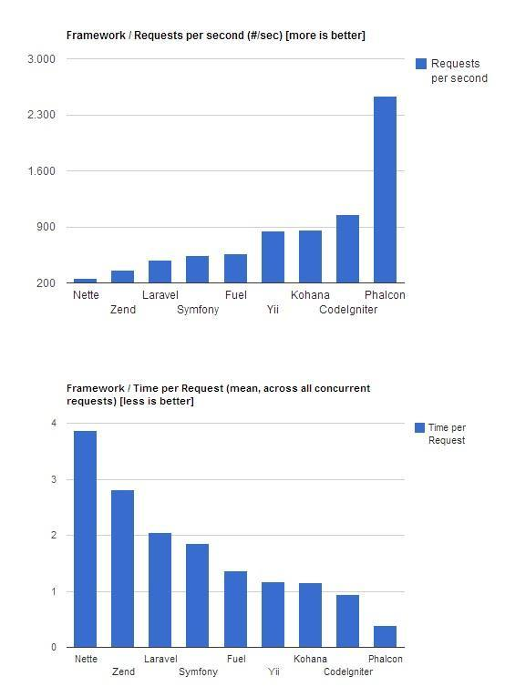
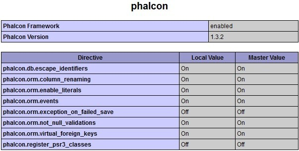
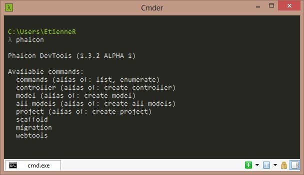
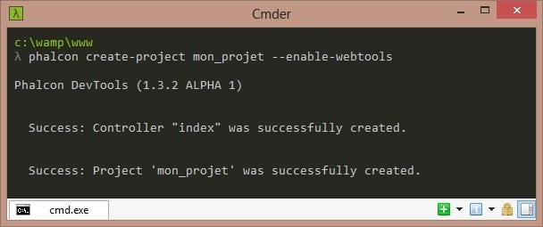
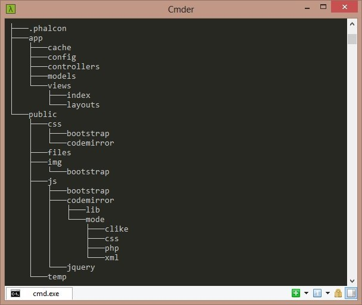
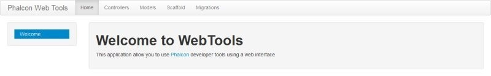

Phalcon est un framework PHP ayant la particularité d'avoir son moteur écrit en Zephir ce qui le rend plus rapide que les autres framework PHP traditionnels. En effet, Zephir est un langage open-source de bas niveau conçu pour faciliter la création d'extensions PHP en les compilant en langage C.



## Installation et configuration sur WAMP

Afin de faire fonctionner Phalcon sur votre serveur WAMP, il faut télécharger l'extension qui permettra à votre serveur d'interpréter l'ensemble des librairies de Phalcon compilées en C.  
1. Allez sur la page de téléchargement officielle :http://docs.phalconphp.com/fr/latest/reference/wamp.html  
Téléchargez la version correspondant à votre version de WAMP 32 ou 64 bits mais aussi de la version de votre PHP.  
Allez dans le dossier "C://bin/php/php5.4.12/ext" et placez le fichier dll que vous venez de télécharger.  
2. Puis, ouvrez le fichier de configuration php.ini présent dans le dossier de PHP :  
"C://bin/php/php5.4.12/php.ini" et ajoutez à la fin du fichier :  
 `extension=php_falcon.dll `  
3. Faites de même pour celui d'Apache : "C://bin/apache/Apache2.4.4/bin/php.ini"

Démarrez (ou redémarrez) votre serveur WAMP.  
En faisant un  `<?php echo phpinfo(); ?> `, on voit que l'extension "phalcon" est chargée.




## Téléchargement et installation de l'outil phalcon-devtools

A l'heure actuelle, en version alpha, le phalcon-devtools reprend le même principe que le Zend Tool pour ZendFramework, générer un nouveau projet, un nouveau contrôleur, un nouveau model, etc…  
Allez à l'adresse : https://github.com/phalcon/phalcon-devtools  
Ou via GIT :  `git clone https://github.com/phalcon/phalcon-devtools.git `  
Editez le fichier "phalcon.bat" en modifiant la ligne suivante :  
 `set PTOOLSPATH="%~dp0/" `  
Par le chemin correct où se situe "phalcon-devtools" :  
 `set PTOOLSPATH=C:/phalcon-devtools/ `  
Ajoutez dans la variable d'environnement "Path" le chemin de PHP et de phalcon-devtools :  `;C:\wamp\bin\php\php5.4.12;C:\phalcon-devtools ` et validez.  
Tapez la ligne de commande ci-dessous :  
 `phalcon `
 


On va s'intéresser à la commande "project" afin de générer un nouveau projet Phalcon.  
Pour cela, placez-vous dans le dossier de développement de Wamp :  
 `cd C://www `  
Puis lancez la commande "create-project" ci-dessous :  
 `phalcon create-project mon_projet --enable-webtools `  
Les fichiers sont générés dans un nouveau dossier nommé "mon_projet".



Avec une architecture MVC classique :




## Configurer l'accès à la base de données

Par défaut, Phalcon introduit le nom de la table concernée par le nom du projet ("mon_projet" dans notre cas).  
Pour le modifier, c'est très simple, ouvrez le fichier "config.php" présent dans le dossier "app/config" et éditez les lignes concernées.

```php
'database' => array(
        'adapter'  => 'Mysql',
        'host'     => 'localhost',
        'username' => 'root',
        'password' => '',
        'dbname'   => 'mon_projet',
    ),
```

Ensuite ces informations seront traitées dans le fichier "service.php" dans le dossier "app/config" (ligne 56).

## Le WebTools

On accède au WebTools à l'adresse suivante : http://localhost/mon_projet/webtools.php



Vous pouvez désormais éditer vos controllers, vos models, le scaffold et les migrations (ces 3 derniers après avoir configuré l'accès à votre base de données) en vous passant des lignes de commandes...  
Oui mais n'importe qui peut se connecter sur cet outil de gestion en connaissant l'url ?  
Non, car si vous allez dans le fichier de configuration de webtools, c'est-à dire "public/webtools.config.php", vous pouvez voir que l'accès à ce service est restreint ligne 30 :

```php
define('PTOOLS_IP', '192.168.');
```

## Accéder au site

Pour accéder au site : http://localhost/mon_projet  
Par défaut, c'est le contrôleur "IndexController" qui se charge de l'index du site  
Comment savoir quelle vue ce contrôleur charge ?  
Le nom du contrôleur "IndexController" correspond au dossier "index"  
La fonction  `indexAction ` correspondant au nom du fichier de la vue "index"  
Les vues étant par défaut chargées dans le dossier "app/views (cf : app/config/config.php)", on peut en conclure que le chemin est :  
"app/views/index/index.volt"  
En ce qui concerne le layout, il se trouve à la racine du répertoire des vues :  
"app/views/layouts/index.volt"

```html
<html>
    <head>
        <title>{{title}}</title>
    </head>
    <body>
        {{ content() }}
    </body>
</html>
```

La vue précédente, index/index.volt s'affiche par défaut dans la fonction  `content() `.  
Pour charger la feuille de style de Twitter Bootstrap présente dans le dossier "public", placez cette ligne sous la balise title :

```html
<link rel="stylesheet" href="public/css/bootstrap/bootstrap.min.css" />
```

## Conclusion

Phalcon permet via son outil de générer un projet rapidement malgré la configuration initiale qui peut sembler laborieuse pour les moins téméraires. Mais il ne déçoit pas au niveau performance et de son poids (moins d'1Mo du fait que le moteur du framework est présent dans le dll).

## Sources

* Site officiel de Phalcon PHP : http://www.phalconphp.com
* Site officiel du langage Zephir : http://www.zephir-lang.com
* Cmder est une alternative à CMD et PowerShell (onglets et coloration syntaxique) : http://bliker.github.io/cmder