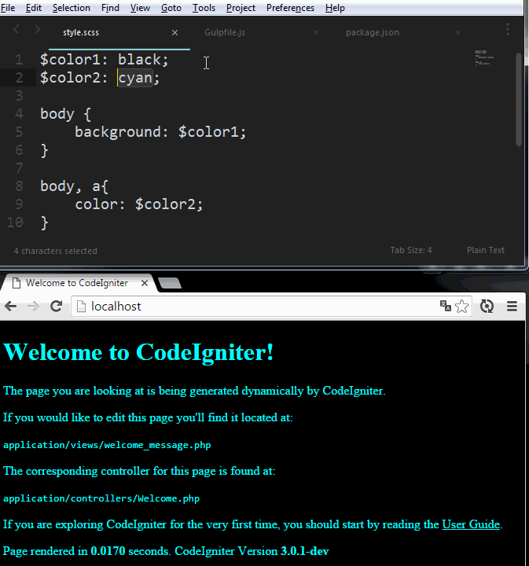

Gulp est un "task manager", littéralement un gestionnaire de tâches. Il nous offre la possibilité de faire le lien avec PHP et Gulp pour ainsi se passer d'Apache ou de Nginx avec moins d'options mais suffisament pour un projet de petite envergure. Par la suite, on utilisera "Livereload" via "gulp-livereload" et le SASS via "gulp-sass".

Avant de commencer, il faut PHP installé sur votre PC (`php -v`). Ainsi que le "package manager" (gestionnaire de paquets) NPM sous NodeJS (`npm -v`). Pour le serveur PHP, on va utiliser la dépendance "gulp-connect-php".

## Préparation du serveur

Dans un répertoire quelconque, créez un fichier Gulpfile.js.

```javascript
var gulp = require('gulp'),
    php  = require('gulp-connect-php');

gulp.task('serve', function() {
    php.server();
});
```

Puis, téléchargez les 2 dépendances suivantes dans un terminal (placé dans le même répertoire que le Gulpfile) :

- `npm install gulp`
- `npm install gulp-connect-php``

Créez un fichier "index.php" :

```php
<?php echo phpinfo(); ?>
```

Toujours dans le terminal, lancez la commande pour lancer le serveur `gulp serve`.

Sur votre navigateur Web, lancez [http://127.0.0.1:8000](http://127.0.0.1:8000). Le contenu du fichier "index.php" s'affiche car le serveur PHP fonctionne. Par la suite, on va voir qu'il est possible de changer le port par défaut 8000 par un autre.

Plus intéressant, on installe le framework PHP Codeigniter à partir de Github (de la branche "stable") `git clone https://github.com/bcit-ci/CodeIgniter.git`. Codeigniter est téléchargé dans un dossier "CodeIgniter". Il faut donc changer la base du serveur et optionnellement son port.

```javascript
var gulp = require('gulp'),
    php  = require('gulp-connect-php');

gulp.task('serve', function() {
    php.server({
        port: 80,                      // Port (8000 par défaut)
        base: './CodeIgniter' // Base du projet
    });
});
```

L'application Codeigniter est désormais disponible sur [http://127.0.0.1](http://127.0.0.1).

## Livereload

Dans notre fichier de configuration, on va ajouter une nouvelle fonctionnalité dans Gulp pour recharger automatiquement le navigateur lorsqu'un fichier PHP est modifié. Pour cela, on va utiliser la dépendance "gulp-livereload".

Avant de modifier le Gulpfile, installez l'extension pour Chrome ou Safari : [http://livereload.com/extensions](http://livereload.com/extensions)

```javascript
var gulp       = require('gulp'),
    php        = require('gulp-connect-php'),
    livereload = require('gulp-livereload');

gulp.task('serve', function() {
    php.server({
        port: 80,             // Port (8000 par défaut)
        base: './CodeIgniter' // Base du projet
    });

    livereload({start: true});

    var livereloadPage = function () {
        livereload.reload();
    };

    gulp.watch('**/*.php', livereloadPage);
});
```

On demande à Livereload de surveiller les fichiers PHP. Si un fichier est modifié, alors on reload la page. N'oubliez pas d'installer la dernière dépendance appelée `npm install gulp-livereload`. Puis tapez `gulp serve`.

Sur Chrome, connectez-vous sur [http://localhost](http://localhost) et activez le Livereload (un clic sur l'icone de l'extension)

## SASS

On part du principe que dans le dossier "assets" présent à la racine de l'application CodeIgniter, sont présents 2 dossiers : "css" et "sass".

`cd Codeigniter && mkdir assets && cd assets && mkdir css && mkdir sass`

Ensuite, on demande à Gulp de convertir les fichiers SCSS en CSS dans une tâche spécifique.

```javascript
var gulp       = require('gulp'),
    php        = require('gulp-connect-php'),
    livereload = require('gulp-livereload'),
    sass       = require('gulp-sass');

gulp.task('serve', ['sass'], function() {
    php.server({
        port: 80,             // Port (8000 par défaut)
        base: './CodeIgniter' // Base du projet
    });

    var livereloadPage = function () {
        livereload({start: true});
        livereload.reload();
    };

    gulp.watch("./CodeIgniter/assets/sass/*.scss", ['sass']);
    gulp.watch('**/*.php', livereloadPage);
});

gulp.task('sass', function () {
    gulp.src('./CodeIgniter/assets/sass/*.scss')
        .pipe(sass.sync().on('error', sass.logError))
        .pipe(gulp.dest('./CodeIgniter/assets/css'))
        .pipe(livereload({start: true}));
});

gulp.task('sass:watch', function () {
    gulp.watch('./CodeIgniter/assets/sass/*.scss', ['sass']);
});

gulp.task('default', ['serve', 'sass:watch']);
```

Sans oublier d'installer la dépendance `npm install gulp-sass` et de relancer le serveur avec la commande `gulp`.

Pour avoir un résultat flagrant, ouvrez le fichier de vue "application/views/welcome_message.php", supprimez toutes les lignes de CSS et ajoutez la ligne d'appel dans le header du fichier.

```html
<link rel="stylesheet" href="../assets/css/style.css">
```

Puis dans le dossier "assets/css/sass", créez un nouveau fichier "style.scss" contenant les propriétés ci-dessous :

```css
$color1: black;
$color2: cyan;

body {
    background: $color1;
}

body, a{
    color: $color2;
}
```



Si vous faites une erreur en SASS, Gulp vous informe de l'erreur sans pour autant couper le serveur. Par exemple, avec un oubli du point virgule à la fin de la 1ère ligne, il renverra le message d'avertissement suivant :

```bash
> 2:1 top-level variable binding must be terminated by ';'
```

## Astuces

### Manifeste des dépendances

On peut regrouper toutes nos dépendances dans un fichier Json afin d'éviter d'avoir à taper manuellement les commandes d'installation au cas par cas. A la racine du projet, créez un fichier "package.json".

```javascript
{
  "devDependencies": {
    "gulp": "^3.8.11",
    "gulp-connect-php": "*",
    "gulp-livereload": "*",
    "gulp-sass": "*"
  }
}
```

Ainsi, vous pouvez installer toutes ces dépendances en une seule commande `npm install`.

### Tâche par défaut

Ajoutez à la fin du Gulpfile la ligne de tâche par défaut ci-dessous :

```javascript
gulp.task('default', ['serve', 'sass:watch']);
```

Cela permet de taper "gulp" au lieux de "gulp serve" mais également de générer du CSS après modification du fichier SCSS sans lancer le serveur via la commande `gulp sass`.

### gitignore

Une fois les dépendances téléchargées, elle prennent de la place dans le dossier "node_modules". Pour ne pas les envoyer sur votre dépot Git, créez un fichier ".gitignore" afin d'ignorer ce dossier.

```bash
# Node
node_modules
npm-debug.log
```

"npm-debug.log" est un fichier de log d'erreur propre à NPM.

### Bonus : code complet avec notification

Il est possible d'afficher une notification d'erreur en dehors de la console avec Gulp.

```javascript
var gulp          = require('gulp'),
    php           = require('gulp-connect-php'),
    livereload    = require('gulp-livereload'),
    sass          = require('gulp-sass'),
    errorNotifier = require('gulp-error-notifier');

gulp.task('serve', ['sass'], function() {
    php.server({
        port: 80,
        base: './CodeIgniter'
    });

    var livereloadPage = function () {
        livereload({start: true});
        livereload.reload();
    };

    gulp.watch("./CodeIgniter/assets/sass/*.scss", ['sass']);
    gulp.watch('**/*.php', livereloadPage);
});

gulp.task('sass', function () {
    gulp.src('./CodeIgniter/assets/sass/*.scss')
        .pipe(errorNotifier.handleError(sass()))
        .pipe(gulp.dest('./CodeIgniter/assets/css'))
        .pipe(livereload({start: true}));
});

gulp.task('sass:watch', function () {
    gulp.watch('./CodeIgniter/assets/sass/*.scss', ['sass']);
});

gulp.task('default', ['serve', 'sass:watch']);
```

Et le "package.json".

```javascript
{
  "devDependencies": {
    "gulp": "^3.8.11",
    "gulp-connect-php": "*",
    "gulp-livereload": "*",
    "gulp-sass": "*",
    "gulp-util": "*",
    "gulp-sync": "*",
    "gulp-error-notifier": "*",
    "node-notifier": "*"
  }
}
```

En effet, "gulp-error-notifier" fonctionne avec "node-notifier".

## Sources

- Gulp Connect : [https://www.npmjs.com/package/gulp-connect-php](https://www.npmjs.com/package/gulp-connect-php) ;
- Gulp Livereload : [https://www.npmjs.com/package/gulp-livereload](https://www.npmjs.com/package/gulp-livereload) ;
- Gulp SASS : [https://www.npmjs.com/package/gulp-sass](https://www.npmjs.com/package/gulp-sass) ;
- Gulp-error-notifier : [https://www.npmjs.com/package/gulp-error-notifier](https://www.npmjs.com/package/gulp-error-notifier) ;
- Node-notifier : [https://www.npmjs.com/package/node-notifier](https://www.npmjs.com/package/node-notifier).
