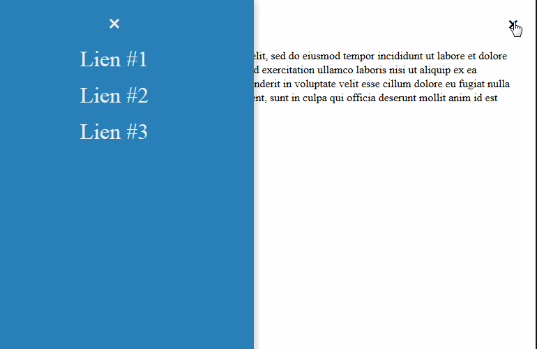

Depuis l'apparition du responsive design ainsi que l'évolution de CSS (version 3), les sites ont mué avec des menus cachés accessibles depuis un simple bouton. Les fameux menus surnomés "burger" mais qui devrait se nommer "trigram" et facilement intégrable avec jQuery ou simplement Javascript en jouant avec l'ajout et la suppression de classes. Hors il est possible de se passer de Javascript et de gérer les actions (afficher / masquer le menu) en CSS 3. On va voir avec 2 exemples que cela peut fonctionner avec 2 pseudos classes différentes : `:checked` et `:target`.



## Code commun

Pour éviter de copier-coller du code, je vous met ci-dessous le code commun en HTML et CSS. Ce qui n'est pas identique est commenté (il s'agit du bouton de fermeture dans le menu et du menu "burger").

### HTML

```html
<!-- Ici le menu caché par défaut -->
<nav id="nav-left" role="navigation">
    <ul>
        <li>
            <!-- Bouton de fermeture suivant l'exemple -->
        </li>
        <li>
            <a href="#1">Lien #1</a>
        </li>
        <li>
            <a href="#2">Lien #2</a>
        </li>
        <li>
            <a href="#3">Lien #3</a>
        </li>
    </ul>
</nav>

<div id="wrapper">

    <!-- Menu "burger" suivant l'exemple -->

    <article>
        <h1>Titre de la page</h1>
        <p>
            Lorem ipsum dolor sit amet, consectetur adipisicing elit, sed do eiusmod
            tempor incididunt ut labore et dolore magna aliqua. Ut enim ad minim veniam,
            quis nostrud exercitation ullamco laboris nisi ut aliquip ex ea commodo
            consequat. Duis aute irure dolor in reprehenderit in voluptate velit esse
            cillum dolore eu fugiat nulla pariatur. Excepteur sint occaecat cupidatat non
            proident, sunt in culpa qui officia deserunt mollit anim id est laborum.
        </p>
    </article>

</div>
```

Remarque : pour que l'exemple fonctionne sur un appareil mobile, n'oubliez pas d'ajouter la ligne ci-dessous entre les balises `<head></head>`.

```html
<meta name="viewport" content="width=device-width, maximum-scale=1" />
```

### CSS

On commence par styliser notre menu caché par défaut avec ses listes à puces.

```css
a {
    color: #000;
    text-decoration: none;
}

nav {
    background: #2980b9;
    left: 0;
    position: fixed;
    height: 100%;
    top: 0;
    left: -395px;
    width: 400px;
    z-index: 999;

    transition: left 0.75s;
    box-shadow: 3px 0 10px rgba(0,0,0,0.2); 
}

#nav-left ul {
    list-style-type: none;
    padding: 0;
}

#nav-left ul li a,
#nav-left ul li span {
    color: #ecf0f1;
    display: block;
    font-size: 2em;
    line-height: 1em;
    margin-bottom: 20px;
    outline: none;
    text-decoration: none;
    text-align: center;
}
```

Puis l'apparence de notre wrapper.

```css
#wrapper {
    margin: 0 auto;
    padding: 0 5px;
    position: relative;
    width: 950px;
}
```

On le met en position relative car on va mettre le lien du menu en position absolue afin de le positionner en haut à droite du wrapper.

Et en bonus, la partie responsive

```css
@media only screen and (max-width: 960px) {

    #wrapper {
        width: 96%;
        margin: 0 1%;
        padding: 0 1%;
    }

}

@media only screen and (max-width: 400px) {

    nav {
        width: 100%;
    }

}
```

## Avec checked

La pseudo classe `:checked` gère les input tels que les `radio`, `checkbox` ou `option`. On peut modifier un ou plusieurs élements lorsque l'input est coché ou décoché. Pour se faire, on cache ce dernier et on affiche un `label` qui fera office de bouton cliquable.

### Exemple

Un exemple avec une todolist.

```html
<div>
    <input type="checkbox" id="todolist-1"> 
    <label for="todolist-1">Acheter du pain</label>
</div>
<div>
    <input type="checkbox" id="todolist-2"> 
    <label for="todolist-2">Nettoyer la tour du PC</label>
</div>
<div>
    <input type="checkbox" id="todolist-3"> 
    <label for="todolist-3">Réserver un billet pour la Lune</label>
</div>
```

Puis on ajoute l'action sur les input de type checkbox dans le CSS.

```css
input[type=checkbox] + label {
  font-style: italic;
}
input[type=checkbox]:checked + label {
  color: #f00;
  font-style: normal;
  text-decoration:line-through;
}
```

### HTML

On commence en douceur avec le code HTML en mettant un input avec un id que l'on tachera de masquer en CSS juste après la balise d'ouverture `<body>`.

```html
<!-- Ici l'input caché par défaut -->
<input type="checkbox" id="menu-left">
```

Puis notre bouton de fermeture est un label.

```html
<!-- Ici le menu caché par défaut (#nav-left)-->
    <!-- Bouton de fermeture suivant l'exemple -->
    <li>
        <label for="menu-left" id="menu-left">
            <span aria-label="Close Navigation">&#10799;</span>
        </label>
    </li>
```

Et notre menu "burger" est également contenu dans un label.

```html
<!-- Menu "burger" dans la balise #wrapper -->
<label for="menu-left" id="menu-left">
    <!-- Affiché par défaut -->
    <span class="open-menu" aria-label="Open Navigation">&#9776;</span>
    <!-- Caché par défaut -->
    <span class="close-menu" aria-label="Close Navigation">&#10799;</span>
</label>
````

### CSS

```css
#wrapper #menu-left {
    position: absolute;
    right: 1%;
    top: 0;
    font-size: 28px;
    line-height: 28px;
}

#menu-left {
    cursor: pointer;

    /* Evite la séléction du texte au double clic */
    -webkit-user-select: none;
    -moz-user-select: none;
    -khtml-user-select: none;
    -ms-user-select: none;
}

#menu-left[type="checkbox"],
#menu-left[type="checkbox"]:checked ~ * .open-menu,
.close-menu {
    display: none;
}

#menu-left[type="checkbox"]:checked ~ nav {
    left: 0;
    transition: left 0.75s;
}

#menu-left[type="checkbox"]:checked ~ * .close-menu {
    display: block;
}
```

On cache les élements :

- L'input checkbox ;
- L'icone de fermeture par défaut (menu fermé) ;
- Lorsque le menu est ouvert, l'icone d'ouverture du menu.

On affiche la transition lorsque la checkbox est sélectionnée (le bloc du menu transite de la gauche vers la droite avec un délai de 0.75 secondes).

Lorsque le menu est ouvert, on affiche l'icone de fermeture. Le code est disponible sur [JSFiddle](https://web.archive.org/web/20180828160705/https://jsfiddle.net/c6ddarsf).

Globalement, l'interaction fonctionne correctement sauf que... le lien n'est pas accessible avec la tabulation du clavier. :(


## Avec target

La pseudo classe `:target` est mieux taillée pour cet exercice. En effet, elle permet de gérer l'action au clic sur les liens préfixés d'un dièse (ou "hashtag") avec le nom de l'id associé.

### Exemple

Ci-dessous un aperçu avec l'affichage d'un contenu caché par défaut et affichable depuis un lien.

```html
<a href="#result">Afficher le résultat</a>
<div id="result">
    <h1>42 !</h1>
    <a href="#">Cacher le résultat</a>
</div>
```

L'objectif est d'afficher le résultat la balise "#result" depuis le lien "Afficher le résultat".

```css
#result:not(:target) {
    display: none;
}

#result:target {
    display: block;
}
```

A la première ligne, le combo des 2 pseudos classes `:not(:target)` annule l'action lorsqu'il n'y a pas de clic sur le lien.

### HTML

Le bouton de fermeture devient un simple lien.

```html
<!-- Ici le menu caché par défaut (#nav-left)-->
    <!-- Bouton de fermeture suivant l'exemple -->
    <li>
        <a href="#" aria-label="Close Navigation">&#10799;</a>
    </li>
```

Quant au menu "burger", on met en place 2 liens dont le premier lien pointe vers l'anchor "#nav-left" et le second est masqué par défaut.

```html
<div id="menu-left">
    <!-- Affiché par défaut -->
    <a href="#nav-left" class="open-menu" aria-label="Open Navigation">&#9776;</a>
    <!-- Masqué par défaut -->
    <a href="#" class="close-menu" aria-label="Close Navigation">&#10799;</a>
</div>
```

### CSS

Le code CSS est plus léger.

```css
#menu-left:not(target) {
    position: absolute;
    cursor: pointer;
    top: 0;
    right: 1%;

    /* Evite la séléction du texte au double clic */
    -webkit-user-select: none;
    -moz-user-select: none;
    -khtml-user-select: none;
    -ms-user-select: none;

    font-size: 28px;
    line-height: 28px;  
}

#nav-left:target {
    left: 0;
    transition: left 0.75s;
}

.open-menu,
#nav-left:target ~ * .close-menu {
    display: block;
}

.close-menu,
#nav-left:target ~ * .open-menu {
    display: none;
}
```

Contairement à la méthode :checked, le lien du menu est bien accessible avec la tabulation du clavier.

Le code est disponible sur [JSFiddle](https://jsfiddle.net/wfgndLa5).


## Conclusion

Ces 2 exemples affichent le même résultat excepté la navigation par tabulation qui n'est possible qu'avec `:target`. Quant à `:checked`, il sera plus utilisé pour la gestion des formulaires. Bien entendu le menu n'est pas 100% accessible notamment pour fermer le menu avec la touche Echap du clavier.

## Sources

- Compatiblité navigateurs [http://caniuse.com/#search=%3Achecked](http://caniuse.com/#search=%3Achecked) et |[http://caniuse.com/#search=%3Atarget](http://caniuse.com/#search=%3Atarget)
- Caractères au format Unicode : [http://graphemica.com](http://graphemica.com)
