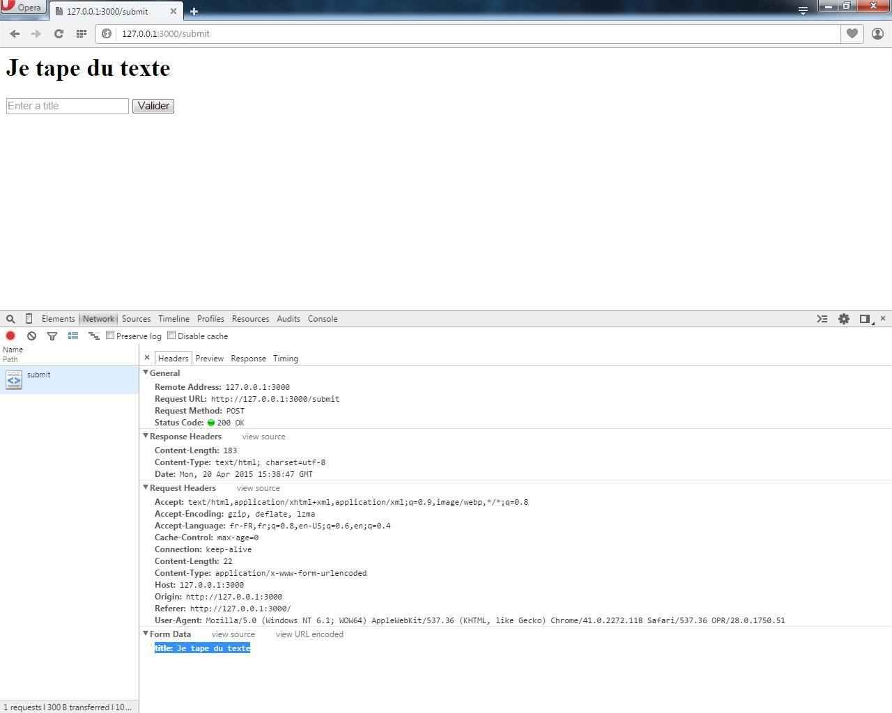
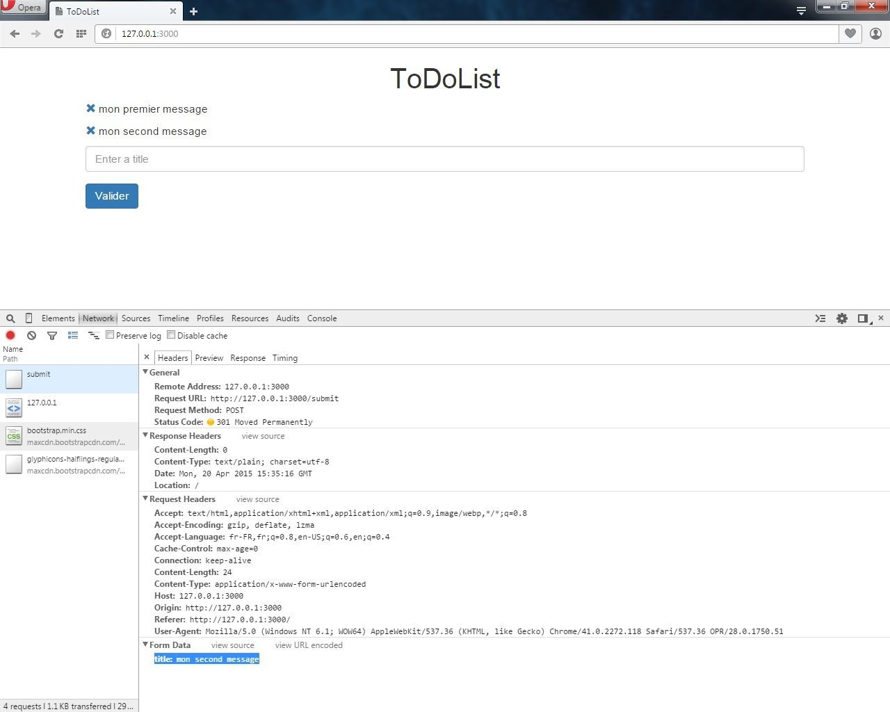
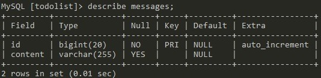

A l'aide d'un micro framework, Gin, on va créer une application "todolist" en Go.
On va mettre en place sur une page, un formulaire pour poster des messages. Ces derniers seront listés sur cette même page.
Il sera également possible de les supprimer.
Après un cours aperçu de Gin, ces messages seront stockés dans une base de données MySQL avec l'aide d'un ORM, Gorp.

## Préparation et installation

Structure de notre dossier "todolist".

```bash
│   main.go
│
├───db
│       db.go
│
└───views
        index.html
```

Sur votre serveur MySQL, créez uniquement une nouvelle table "todolist".

```sql
CREATE DATABASE IF NOT EXISTS todolist;
```

Installez les librairies suivantes.

`go get github.com/gin-gonic/gin`
`go get gopkg.in/gorp.v1`
`go get github.com/go-sql-driver/mysql`

## Aperçu de Gin

Dans le fichier "main.go".

```go
package main

import (
    "github.com/gin-gonic/gin"
    "net/http"
)

func main() {
    r := gin.Default()

    r.LoadHTMLGlob("views/*")

    r.GET("/", func(c *gin.Context) {
        obj := gin.H{"title": "My Title"}
        c.HTML(http.StatusOK, "index.html", obj)
    })

    r.POST("/submit", func(c *gin.Context) {
        c.Request.ParseForm()

        title := c.Request.Form.Get("title")

        obj := gin.H{"title": title}
        c.HTML(http.StatusOK, "index.html", obj)
    })

    r.Run(":3000")

}
```

On déclare Gin ainsi que la librairie native de Golang "net/http".  
Dans l'unique fonction "main()", on effectue les étapes ci-dessous.

1. Initialise la fonction "gin.default()" ;
2. Définit le répertoire de templating "views" ;
3. Déclare une première route. Celle ci est la racine ("/"). Sa fonction a pour but d'afficher le contenu de la valeur "title" présente dans le fichier de templating "index.html". Cette route renvoit un code HTTP 200 ;
4. Déclare une seconde route de type POST. Celle ci pointe sur "/submit" (destination de notre futur formulaire). Dans un premier temps, on demande à Gin de parser le fomulaire afin de récupérer la valeur contenue dans le champ "title" renseigné par l'utilisateur. Puis, on stocke cette valeur dans la variable "title" pour le fichier de templating "index.html". Cette route renvoit également un code HTTP 200 ;
5. Exécute notre serveur sur le port 3000.

Dans notre vue "index.html", on met en place le formulaire ci-dessous.

```html
<h1>
    {{ .title }}
</h1>

<form action="submit" method="post">

    <input type="text" name="title" placeholder="Enter a title" />
    <input type="submit" />

</form>
```

On affiche la valeur "title" dans notre fichier de templating.



On réédite notre fichier "main.go" plus propremement en déclarant une fonction pour chaque route (et par la même occasion, mieux s'y retrouver...).

```go
package main

import (
    "github.com/gin-gonic/gin"
)

func main() {
    r := gin.Default()

    r.LoadHTMLGlob("views/*")

    r.GET("/", indexHandler)
    r.POST("/submit", postHandler)

    r.Run(":3000")
}

func indexHandler(c *gin.Context) {
    obj := gin.H{"title": "Main website"}
    c.HTML(200, "index.html", obj)
}

func postHandler(c *gin.Context) {
    c.Request.ParseForm()

    title := c.Request.Form.Get("title")

    obj := gin.H{"title": title}
    c.HTML(200, "index.html", obj)
}
```

Remarque : on en a également profité pour se débarrasser de la librairie native "net/http".

## Configuration de connexion à MySQL

Dans notre fichier "db.go".

```go
package db

import (
    "database/sql"
    _ "github.com/go-sql-driver/mysql"
    "gopkg.in/gorp.v1"
    "log"
)

type Messages struct {
    Id    int64  `db:"id"`
    Title string `db:"title"`
}

func InitDb() *gorp.DbMap {
    db, err := sql.Open("mysql", "root:@/todolist")
    checkErr(err, "sql.Open failed")

    dbmap := &gorp.DbMap{Db: db, Dialect: gorp.MySQLDialect{"InnoDB", "UTF8"}}
    dbmap.AddTableWithName(Messages{}, "messages").SetKeys(true, "Id")
    err = dbmap.CreateTablesIfNotExists()
    checkErr(err, "Create table failed")

    return dbmap
}

func checkErr(err error, msg string) {
    if err != nil {
        log.Fatalln(msg, err)
    }
}
```

On déclare une structure "Messages".  
Ensuite, dans le fonction "InitDb()" (qu'on a prit soin de nomme avec une majuscule), on initialise la connexion à notre serveur MySQL.
Ensuite, on initialise la connexion à notre serveur MySQL dans la fonction "InitDb()" (dont on a prit soin de la nommer avec une majuscule afin de pouvoir l'exporter par la suite).  
Avec Gorp, on définit la future table comme étant de type InnoDB au format UFT-8. On lui demande également de créer une nouvelle table "messages" basée sur la structure "Messages" si la table n'existe pas.  
On lui demande aussi d'afficher une erreur si le serveur MySQL n'est pas accessible ou qu'il n'est pas possible de créer une nouvelle table via la foncton "checkErr".

Remarque : si vous avez un mot de passe pour vous connecter à votre BDD, ajoutez-le dans le DSN :  
`sql.Open("mysql", "root:my_password@/todolist")`

Cela marche également avec MariaDB (testé depuis un container Docker) :  
`db, err := sql.Open("mysql", "root:@tcp(192.168.59.103:3306)/todolist")`

## Communiquons avec la base de données

On va pouvoir se connecter à la BDD dans notre fichier "main.go".

```go
package main

import (
    "github.com/gin-gonic/gin"
    "todolist/db"
)

var dbmap = db.InitDb()

func main() {
    r := gin.Default()

    r.LoadHTMLGlob("views/*")

    r.GET("/", indexHandler)
    r.POST("/submit", postHandler)
    r.GET("/delete/:id", deleteHandler)

    r.Run(":3000")
}

func indexHandler(c *gin.Context) {
    messages := []db.Messages{}

    _, err := dbmap.Select(&messages, "SELECT * FROM messages")

    if err != nil || len(messages) == 0 {
        obj := gin.H{"error": "No message in the database"}
        c.HTML(200, "index.html", obj)
    } else {
        obj := gin.H{"title": messages}
        c.HTML(200, "index.html", obj)
    }
}

func postHandler(c *gin.Context) {
    c.Request.ParseForm()

    title := c.Request.Form.Get("title")

    if title != "" {
        data := &db.Messages{0, title}
        dbmap.Insert(data)
    }

    c.Redirect(301, "/")
}

func deleteHandler(c *gin.Context) {
    id := c.Params.ByName("id")
    dbmap.Exec("DELETE FROM messages WHERE id=?", id)

    c.Redirect(301, "/")
}
```

On appelle notre fichier "db.go" via "package db" dans l'import des bibiliothèques. On déclare la variable globale "dbmap" qui pointe vers la fonction "InitDb" présente dans le fichier "db.go". De ce fait, on peut désormais exécuter des requêtes SQL dans les fonctions concernées.

Il ne nous reste plus qu'à modifier notre vue "index.html" avec le templating adéquatet ya d (et un peu de CSS par la même occasion...).

```html
<!DOCTYPE html>
<html>
<head>
    <title>ToDoList</title>
    <link rel="stylesheet" href="//maxcdn.bootstrapcdn.com/bootstrap/3.3.4/css/bootstrap.min.css">
</head>
<body class="container">

    <h1 class="text-center">ToDoList</h1>

    {{if .error}}
    <p class="alert alert-warning" role="alert">{{.error}}</p>
    {{end}}

    {{range $message := .title}}
    <ul class="list-unstyled">
        <li>
            <a href="delete/{{$message.Id}}"><i class="glyphicon glyphicon-remove"></i></a>
            {{$message.Title}}
        </li>
    </ul>
    {{end}}

    <form action="submit" method="post">
        <div class="form-group">
            <input type="text" class="form-control" name="title" placeholder="Enter a title" />
        </div>
        <input type="submit" class="btn btn-primary" />
    </form>

</body>
</html>
```



Lorsque vous lancez votre serveur pour la première fois, la table "messages" est créée automatiquement.



## Sources

* Gin : [https://github.com/gin-gonic/gin](https://github.com/gin-gonic/gin) ;
* Gorp : [https://github.com/go-gorp/gorp](https://github.com/go-gorp/gorp) ;
* Driver SQL : [https://github.com/go-sql-driver/mysql](https://github.com/go-sql-driver/mysql).
